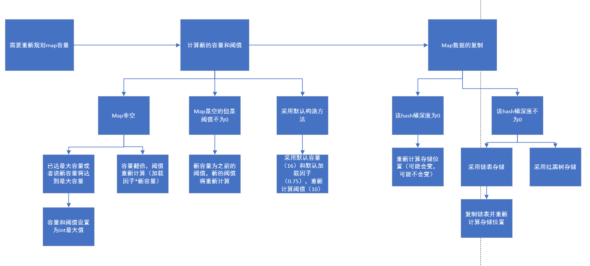

# JDK源码（2）数据结构

- ## ArrayList

  - Collection接口

    - 继承了迭代器接口，定义了大量集合操作相关类

  - ArrayList本身继承了AbstractList

  - 基本变量

    ```java
    //默认容量
    private static final int DEFAULT_CAPACITY = 10;
    //空实例的数组
    
        private static final Object[] EMPTY_ELEMENTDATA = {};
    //默认大小的实例数组
    
        private static final Object[] DEFAULTCAPACITY_EMPTY_ELEMENTDATA = {};
    //数组缓冲区（不可序列化）
        transient Object[] elementData; // non-private to simplify nested class access
    
        private int size;
    ```

    

  - 构造方法

    ```java
        public ArrayList(int initialCapacity) {
            if (initialCapacity > 0) {
                this.elementData = new Object[initialCapacity];
            } else if (initialCapacity == 0) {
                this.elementData = EMPTY_ELEMENTDATA;
            } else {
                throw new IllegalArgumentException("Illegal Capacity: "+
                                                   initialCapacity);
            }
        }
    
        /**
         * Constructs an empty list with an initial capacity of ten.
         */
        public ArrayList() {
            //默认创建采用空实例的数组
            this.elementData = DEFAULTCAPACITY_EMPTY_ELEMENTDATA;
        }
    //通过现有集合创建
        public ArrayList(Collection<? extends E> c) {
            Object[] a = c.toArray();
            if ((size = a.length) != 0) {
                if (c.getClass() == ArrayList.class) {
                    elementData = a;
                } else {
                    //Arrays.copyOf底层采用本地方法复制数组
                    elementData = Arrays.copyOf(a, size, Object[].class);
                }
            } else {
                // replace with empty array.
                elementData = EMPTY_ELEMENTDATA;
            }
        }
    ```

  - trimToSize方法（将当前ArrayList数组的容量调整位当前列表的大小）

    ```java
    //用于记录列表在结构上被修改的次数
    protected transient int modCount = 0;
    public void trimToSize() {
        //
        modCount++;
        if (size < elementData.length) {
            //如果当前列表中有元素则创建新的数组并复制
            elementData = (size == 0)
                ? EMPTY_ELEMENTDATA
                : Arrays.copyOf(elementData, size);
        }
    }
    ```

  - ensureCapacity（容量增加）

    ```java
    //minCapacity为所需最小容量
    public void ensureCapacity(int minCapacity) {
        //当前最小容量获取（如果不是采用默认构造方法构造则最小容量为0，默认的最小容量是默认容量）
        int minExpand = (elementData != DEFAULTCAPACITY_EMPTY_ELEMENTDATA)
            ? 0
            : DEFAULT_CAPACITY;
    
        if (minCapacity > minExpand) {
            ensureExplicitCapacity(minCapacity);
        }
    }
    
    private void ensureCapacityInternal(int minCapacity) {
        ensureExplicitCapacity(calculateCapacity(elementData, minCapacity));
    }
    //如果当前list采用默认构造方法构造则返回默认容量和指定的最小容量的最大值
    private static int calculateCapacity(Object[] elementData, int minCapacity) {
        if (elementData == DEFAULTCAPACITY_EMPTY_ELEMENTDATA) {
            return Math.max(DEFAULT_CAPACITY, minCapacity);
        }
        return minCapacity;
    }
    private void ensureExplicitCapacity(int minCapacity) {
        modCount++;
        //容量不足需要扩充
        if (minCapacity - elementData.length > 0)
            grow(minCapacity);
    }
    ```
    
    - grow方法
    
      ```java
      //数组最大容量（不一定数组最大容量为该值最大仍然可能取Integer.MAX_VALUE）
      private static final int MAX_ARRAY_SIZE = Integer.MAX_VALUE - 8;
      
      private void grow(int minCapacity) {
          // overflow-conscious code
          int oldCapacity = elementData.length;
          //新容量为当前容量*3/2
          int newCapacity = oldCapacity + (oldCapacity >> 1);
          //如果小于最小指定容量则新容量为最小容量
          if (newCapacity - minCapacity < 0)
              newCapacity = minCapacity;
          if (newCapacity - MAX_ARRAY_SIZE > 0)
              newCapacity = hugeCapacity(minCapacity);
          // minCapacity is usually close to size, so this is a win:
          elementData = Arrays.copyOf(elementData, newCapacity);
      }
      
      private static int hugeCapacity(int minCapacity) {
          if (minCapacity < 0) // 容量溢出
              throw new OutOfMemoryError();
          return (minCapacity > MAX_ARRAY_SIZE) ?
              Integer.MAX_VALUE :
          MAX_ARRAY_SIZE;
      }
      ```
    
  - contains方法和indexOf方法
  
    ```java
    public boolean contains(Object o) {
        return indexOf(o) >= 0;
    }
    //找到第一个指定元素并返回索引值，找不到返回-1，lastIndexOf可以找到最后一个
    public int indexOf(Object o) {
        if (o == null) {
            for (int i = 0; i < size; i++)
                if (elementData[i]==null)
                    return i;
        } else {
            for (int i = 0; i < size; i++)
                if (o.equals(elementData[i]))
                    return i;
        }
        return -1;
    }
    ```
  
  - clone方法
  
    ```java
    public Object clone() {
        try {
            ArrayList<?> v = (ArrayList<?>) super.clone();
            v.elementData = Arrays.copyOf(elementData, size);
            v.modCount = 0;
            return v;
        } catch (CloneNotSupportedException e) {
            // this shouldn't happen, since we are Cloneable
            throw new InternalError(e);
        }
    }
    ```
  
    - 本质采用深拷贝（数组内的引用不同，但是数组内的引用依旧相同）
  
  - toArray方法
  
    ```java
    public Object[] toArray() {
        return Arrays.copyOf(elementData, size);
    }
    @SuppressWarnings("unchecked")
    public <T> T[] toArray(T[] a) {
        if (a.length < size)
           //根据当前list大小复制数组
            return (T[]) Arrays.copyOf(elementData, size, a.getClass());
        //直接复制到a中，大小仍然是list的当前大小
        System.arraycopy(elementData, 0, a, 0, size);
        if (a.length > size)
            a[size] = null;
        return a;
    }
    ```
  
  - add方法
  
    ```java
    public boolean add(E e) {
        ensureCapacityInternal(size + 1);  // Increments modCount!!
        elementData[size++] = e;
        return true;
    }
    
    public void add(int index, E element) {
        rangeCheckForAdd(index);
    
        ensureCapacityInternal(size + 1);  // Increments modCount!!
        System.arraycopy(elementData, index, elementData, index + 1,
                         size - index);
        elementData[index] = element;
        size++;
    }
    ```
  
    - 如果采用默认构造则第一次添加元素采用默认容量（如果所需容量大于默认容量则使用指定容量）
    - 每次添加都会增加modCount
      - modCount的作用是检测迭代器迭代过程中的修改
  
  - remove方法
  
    ```java
    public E remove(int index) {
        rangeCheck(index);
    
        modCount++;
        E oldValue = elementData(index);
    //移动次数
        int numMoved = size - index - 1;
        //如果需要移动则通过拷贝后半部分
        if (numMoved > 0)
            System.arraycopy(elementData, index+1, elementData, index,
                             numMoved);
        elementData[--size] = null; // 设置为null便于GC回收
    
        return oldValue;
    }
    ```
  
    - 每次删除都会增加modCount
  
- ## LinkedList

  - 内部变量

    ```java
    transient int size = 0;
    //链表头指针
    transient Node<E> first;
    //链表尾指针
    transient Node<E> last;
    ```

    - 内部类Node

    ```java
    private static class Node<E> {
        E item;
        //下一个
        Node<E> next;
        //上一个
        Node<E> prev;
    
        Node(Node<E> prev, E element, Node<E> next) {
            this.item = element;
            this.next = next;
            this.prev = prev;
        }
    }
    ```

    

  - addFirst方法

    ```java
    public void addFirst(E e) {
        linkFirst(e);
    }
    private void linkFirst(E e) {
        final Node<E> f = first;
        final Node<E> newNode = new Node<>(null, e, f);
        first = newNode;
        if (f == null)
            last = newNode;
        else
            f.prev = newNode;
        size++;
        modCount++;
    }
    ```

  - addLast

    ```java
    public void addLast(E e) {
        linkLast(e);
    }
    
    void linkLast(E e) {
        final Node<E> l = last;
        final Node<E> newNode = new Node<>(l, e, null);
        last = newNode;
        if (l == null)
            first = newNode;
        else
            l.next = newNode;
        size++;
        modCount++;
    }
    ```

  - removeFirst

    ```java
    public E removeFirst() {
        final Node<E> f = first;
        if (f == null)
            throw new NoSuchElementException();
        return unlinkFirst(f);
    }
    
    private E unlinkFirst(Node<E> f) {
        // assert f == first && f != null;
        final E element = f.item;
        final Node<E> next = f.next;
        f.item = null;
        f.next = null; // help GC
        first = next;
        //已经没有元素了，设置last指针
        if (next == null)
            last = null;
        else
            //设置前指针
            next.prev = null;
        size--;
        modCount++;
        return element;
    }
    
    ```

  - removeLast基本类似removeFirst

  - Spliterator

    - 一个可分流的迭代器，通常分类器只能顺序访问，Spliterator可以分为多个迭代器，方便执行并行操作

    - 主要方法

      ```java
      public interface Spliterator<T> {
      	//如果有下一个元素则对其进行action操作
          boolean tryAdvance(Consumer<? super T> action);
      	//对Spliterator之后的所有元素进行操作
          default void forEachRemaining(Consumer<? super T> action) {
              do { } while (tryAdvance(action));
          }
      	//尝试分为两个Spliterator（一般分为两半）
          Spliterator<T> trySplit();
      	//预估该Spliterator之后的元素数量
          long estimateSize();
          //如果能确定元素数量则返回size否则返回-1
          default long getExactSizeIfKnown() {
              return (characteristics() & SIZED) == 0 ? -1L : estimateSize();
          }
      }
      ```

    - Spliterator特征

      ```java
      //有序的
      public static final int ORDERED    = 0x00000010;
      //无重复
      public static final int DISTINCT   = 0x00000001;
      //可排序
      public static final int SORTED     = 0x00000004;
      //可确定大小
      public static final int SIZED      = 0x00000040;
      //无空元素
      public static final int NONNULL    = 0x00000100;
      //因此在遍历期间不能发生此类更改。
      public static final int IMMUTABLE  = 0x00000400;
      ```

      - 特征相关方法

        ```java
        int characteristics();//多个特征做或运算
        
        default boolean hasCharacteristics(int characteristics) {
            return (characteristics() & characteristics) == characteristics;
        }
        ```

  - ArrayListSpliterator

    ```java
    static final class ArrayListSpliterator<E> implements Spliterator<E> {
        private final ArrayList<E> list;
        private int index; // 当前值
        private int fence; // 最后一个元素的索引值，初始化值为-1
        private int expectedModCount; //修改次数，防并发修改
    
    
        ArrayListSpliterator(ArrayList<E> list, int origin, int fence,
                             int expectedModCount) {
            this.list = list; // OK if null unless traversed
            this.index = origin;
            this.fence = fence;
            this.expectedModCount = expectedModCount;
        }
    
        private int getFence() { // initialize fence to size on first use
            int hi; // (a specialized variant appears in method forEach)
            ArrayList<E> lst;
            if ((hi = fence) < 0) {//未初始化则初始化
                if ((lst = list) == null)//list为空则初始化为0
                    hi = fence = 0;
                else {//修改次数设置
                    expectedModCount = lst.modCount;
                    hi = fence = lst.size;//设置fence为当前list大小
                }
            }
            return hi;
        }
    
        public ArrayListSpliterator<E> trySplit() {
            int hi = getFence(), lo = index, mid = (lo + hi) >>> 1;
            return (lo >= mid) ? null : // divide range in half unless too small
            new ArrayListSpliterator<E>(list, lo, index = mid,
                                        expectedModCount);//如果可分则分一半
        }
    	//如果有下一个元素则进行操作
        public boolean tryAdvance(Consumer<? super E> action) {
            if (action == null)
                throw new NullPointerException();
            int hi = getFence(), i = index;
            if (i < hi) {
                index = i + 1;
                @SuppressWarnings("unchecked") E e = (E)list.elementData[i];
                action.accept(e);
                if (list.modCount != expectedModCount)
                    throw new ConcurrentModificationException();
                return true;
            }
            //没有下一个元素了
            return false;
        }
    
        public void forEachRemaining(Consumer<? super E> action) {
            int i, hi, mc; // hoist accesses and checks from loop
            ArrayList<E> lst; Object[] a;
            if (action == null)
                throw new NullPointerException();
            if ((lst = list) != null && (a = lst.elementData) != null) {
                if ((hi = fence) < 0) {
                    mc = lst.modCount;
                    hi = lst.size;
                }
                else
                    mc = expectedModCount;
                //逐个遍历操作
                if ((i = index) >= 0 && (index = hi) <= a.length) {
                    for (; i < hi; ++i) {
                        @SuppressWarnings("unchecked") E e = (E) a[i];
                        action.accept(e);
                    }
                    if (lst.modCount == mc)
                        return;
                }
            }
            throw new ConcurrentModificationException();
        }
    
        public long estimateSize() {
            return (long) (getFence() - index);
        }
        //有序，可确定大小，子Spliterator都可确定大小
        public int characteristics() {
            return Spliterator.ORDERED | Spliterator.SIZED | Spliterator.SUBSIZED;
        }
    }
    ```

- ## CopyOnWriteArrayList

  - 基本描述

    - 线程安全的List
    - 所有元素修改操作都通过拷贝一个副本来实现
    - 当遍历操作次数远多于修改操作次数时该集合效率较高
    - 迭代器将不会抛出ConcurrentModificationException异常，不支持迭代器本身的元素更改操作(删除、设置和添加)。这些方法会抛出UnsupportedOperationException异常。

    - 允许NULL

  - 成员变量

    ```java
    //可重入锁
    final transient ReentrantLock lock = new ReentrantLock();
    
    //内置数组，只能通过getArray/setArray访问。
    //使用volatile修饰数组引用
    private transient volatile Object[] array;
    ```

  - 构造方法

    ```java
    public CopyOnWriteArrayList() {
        setArray(new Object[0]);
    }
    
    public CopyOnWriteArrayList(Collection<? extends E> c) {
        Object[] elements;
        if (c.getClass() == CopyOnWriteArrayList.class)
            elements = ((CopyOnWriteArrayList<?>)c).getArray();
        else {
            elements = c.toArray();
            //ArrayList底层的toArray()直接采用Arrays.copyOf返回数组的拷贝副本
            if (c.getClass() != ArrayList.class)
                elements = Arrays.copyOf(elements, elements.length, Object[].class);
        }
        setArray(elements);
    }
    //深拷贝复制
    public CopyOnWriteArrayList(E[] toCopyIn) {
        setArray(Arrays.copyOf(toCopyIn, toCopyIn.length, Object[].class));
    }
    ```

  - 基本方法

    ```java
    public int size() {
        //采用getArray方法获取到最新的内置数组引用并返回其长度
        return getArray().length;
    }
    
    public boolean isEmpty() {
        return size() == 0;
    }
    ```

    - clone方法

      ```java
      public Object clone() {
          try {
              @SuppressWarnings("unchecked")
              CopyOnWriteArrayList<E> clone =
                  (CopyOnWriteArrayList<E>) super.clone();
              //重置锁（重新创建一个锁）
              clone.resetLock();
              return clone;
          } catch (CloneNotSupportedException e) {
              // this shouldn't happen, since we are Cloneable
              throw new InternalError();
          }
      }
      ```

      - 重置锁方法

        ```java
        private void resetLock() {
            UNSAFE.putObjectVolatile(this, lockOffset, new ReentrantLock());//直接操作内存（在lockOffset位置放一个ReentrantLock）
        }
        private static final sun.misc.Unsafe UNSAFE;
        private static final long lockOffset;
        static {
            try {
                UNSAFE = sun.misc.Unsafe.getUnsafe();//初始化Unsafe
                Class<?> k = CopyOnWriteArrayList.class;
                lockOffset = UNSAFE.objectFieldOffset//获取到lock该成员变量在内存中的偏移地址
                    (k.getDeclaredField("lock"));
            } catch (Exception e) {
                throw new Error(e);
            }
        }
        ```
    
        - Unsafe含有大量本地方法可以直接访问内存和class文件并提供一个底层的方法（CAS、内存屏障等）
        - Unsafe详解：https://blog.csdn.net/weixin_42073629/article/details/104489155
    
    - set方法
    
      ```java
      public E set(int index, E element) {
          final ReentrantLock lock = this.lock;
          lock.lock();
          try {
              Object[] elements = getArray();
              E oldValue = get(elements, index);
      		//如果设置的元素和之前的元素不同则采用数组复制
              if (oldValue != element) {
                  int len = elements.length;
                  Object[] newElements = Arrays.copyOf(elements, len);
                  newElements[index] = element;
                  setArray(newElements);//设置数组引用
              } else {
                  // Not quite a no-op; ensures volatile write semantics
                  setArray(elements);//否则没必要设置该元素
              }
              return oldValue;
          } finally {//解锁
              lock.unlock();
          }
      }
      ```
    
    - add方法
    
      ```java
      public boolean add(E e) {
          final ReentrantLock lock = this.lock;
          lock.lock();
          try {
              Object[] elements = getArray();
              int len = elements.length;//同样采用复制的方式
              Object[] newElements = Arrays.copyOf(elements, len + 1);
              newElements[len] = e;
              setArray(newElements);
              return true;
          } finally {
              lock.unlock();
          }
      }
      ```
    
    - remove操作
    
      ```java
      public E remove(int index) {
          final ReentrantLock lock = this.lock;
          lock.lock();
          try {
              Object[] elements = getArray();
              int len = elements.length;
              E oldValue = get(elements, index);//获取被删除的元素
              int numMoved = len - index - 1;//计算移动次数
              if (numMoved == 0)//不需要移动则直接复制
                  setArray(Arrays.copyOf(elements, len - 1));
              else {
                  Object[] newElements = new Object[len - 1];//两次复制
                  System.arraycopy(elements, 0, newElements, 0, index);
                  System.arraycopy(elements, index + 1, newElements, index,
                                   numMoved);
                  setArray(newElements);
              }
              return oldValue;
          } finally {
              lock.unlock();
          }
      }
      ```
    
    - 移除指定元素
    
      ```java
      public boolean remove(Object o) {
          Object[] snapshot = getArray();
          int index = indexOf(o, snapshot, 0, snapshot.length);
          return (index < 0) ? false : remove(o, snapshot, index);
      }
      
      /**
               * A version of remove(Object) using the strong hint that given
               * recent snapshot contains o at the given index.
               */
      private boolean remove(Object o, Object[] snapshot, int index) {
          final ReentrantLock lock = this.lock;
          lock.lock();
          try {
              Object[] current = getArray();
              int len = current.length;
              //如果数组已修改则
              if (snapshot != current) findIndex: {
                  int prefix = Math.min(index, len);//当前数组长度和index取最小值
                  //循环比对index之前所有值（）
                  for (int i = 0; i < prefix; i++) {
                      //之前的值已被修改但是需要被删除的元素还在
                      if (current[i] != snapshot[i] && eq(o, current[i])) {
                          index = i;
                          //找到被删除的元素的新的索引并退出
                          break findIndex;
                      }
                  }
                  //该元素已被删除
                  if (index >= len)
                      return false;
                  //如果需要被删除的元素的索引没有变化则跳出
                  if (current[index] == o)
                      break findIndex;
                  //否则重新获取索引
                  index = indexOf(o, current, index, len);
                  //找不到返回false
                  if (index < 0)
                      return false;
              }
             	//执行删除
              Object[] newElements = new Object[len - 1];
              System.arraycopy(current, 0, newElements, 0, index);
              System.arraycopy(current, index + 1,
                               newElements, index,
                               len - index - 1);
              setArray(newElements);
              return true;
          } finally {
              lock.unlock();
          }
      }
      ```
    
      - 标签代码块
    
        ```java
        //普通代码块(可以放在方法中)
        {
            int a=1;
        }
        
        a:{
        	int a=2;
        }
        b:{
        	int a=2;
        }
        ```
    
        - 带有标记的代码块可以在循环中使用
    
          ```java
          find:
          for (int i = 0; i < 10; i++){
              for (int j = 0; j < 10; j++) {
                  //直接跳出当i==1时的外层循环执行i==2时的外层循环
                  if (i==1 && j==5)
                  {
                      continue find;
                  }
              }
              System.out.println(i);
          }
          ```
    
    - addIfAbsent方法
    
      ```java
      public boolean addIfAbsent(E e) {
          Object[] snapshot = getArray();
          return indexOf(e, snapshot, 0, snapshot.length) >= 0 ? false :
          addIfAbsent(e, snapshot);
      }
      
      private boolean addIfAbsent(E e, Object[] snapshot) {
          final ReentrantLock lock = this.lock;
          lock.lock();
          try {
              Object[] current = getArray();
              int len = current.length;
              //数组已被修改,开始尝试找到需要被添加的元素
              if (snapshot != current) {
                  // Optimize for lost race to another addXXX operation
                  int common = Math.min(snapshot.length, len);
                  for (int i = 0; i < common; i++)
                  //找到了已被添加了，无需添加直接返回
                      if (current[i] != snapshot[i] && eq(e, current[i]))
                          return false;
                  //indexOf找到了已被添加了，无需添加直接返回
                  if (indexOf(e, current, common, len) >= 0)
                      return false;
              }
              //执行添加
              Object[] newElements = Arrays.copyOf(current, len + 1);
              newElements[len] = e;
              setArray(newElements);
              return true;
          } finally {
              lock.unlock();
          }
      }
      ```
    
    - forEach方法
    
      ```java
      public void forEach(Consumer<? super E> action) {
          if (action == null) throw new NullPointerException();
          Object[] elements = getArray();
          int len = elements.length;
          for (int i = 0; i < len; ++i) {
              @SuppressWarnings("unchecked") E e = (E) elements[i];
              action.accept(e);
          }
      }
      ```

      - 与ArrayList不同的是，CopyOnWriteArrayList允许遍历时修改

        ```java
        @Override
        //ArrayList版本
        public void forEach(Consumer<? super E> action) {
            Objects.requireNonNull(action);
            final int expectedModCount = modCount;
            @SuppressWarnings("unchecked")
            final E[] elementData = (E[]) this.elementData;
            final int size = this.size;
            for (int i=0; modCount == expectedModCount && i < size; i++) {
                action.accept(elementData[i]);
            }
            //产生了修改则会抛出异常
            if (modCount != expectedModCount) {
                throw new ConcurrentModificationException();
            }
        }
        ```
    
      - 原因也是因为CopyOnWriteArrayList的所有修改方法都含有锁,是线程安全的
    
    - 序列化方法
    
      ```java
      private void writeObject(java.io.ObjectOutputStream s)
          throws java.io.IOException {
      
          s.defaultWriteObject();
      
          Object[] elements = getArray();
          // Write out array length
          //第一个int是长度
          s.writeInt(elements.length);
      
          // Write out all elements in the proper order.
          for (Object element : elements)
              s.writeObject(element);
      }
      private void readObject(java.io.ObjectInputStream s)
          throws java.io.IOException, ClassNotFoundException {
      
          s.defaultReadObject();
      
          // 绑定一个新锁
          resetLock();
      
          //读取数组长度
          int len = s.readInt();
          SharedSecrets.getJavaOISAccess().checkArray(s, Object[].class, len);
          Object[] elements = new Object[len];
      
          //读取所有元素并设置
          for (int i = 0; i < len; i++)
              elements[i] = s.readObject();
          setArray(elements);
      }
      ```
    
      - [ ] 不会有线程安全问题吗?
    
    - 迭代器
    
      - COWIterator
    
        - 构造方法
    
          ```java
          private final Object[] snapshot;
          //指向下一个可被访问的元素
          private int cursor;
          
          
          private COWIterator(Object[] elements, int initialCursor) {
              cursor = initialCursor;
              snapshot = elements;
          }
          ```
    
        - next方法
    
          ```java
          public E next() {
              if (! hasNext())
                  throw new NoSuchElementException();
              return (E) snapshot[cursor++];
          }
          ```
    
          - 直接返回cursor指向的元素
    
        - hasNext方法
    
          ```java
          public boolean hasNext() {
              return cursor < snapshot.length;
          }
          ```
    
        - 修改元素的方法
    
          ```java
          public void remove() {
              throw new UnsupportedOperationException();
          }
          
          /**
                   * Not supported. Always throws UnsupportedOperationException.
                   * @throws UnsupportedOperationException always; {@code set}
                   *         is not supported by this iterator.
                   */
          public void set(E e) {
              throw new UnsupportedOperationException();
          }
          
          /**
                   * Not supported. Always throws UnsupportedOperationException.
                   * @throws UnsupportedOperationException always; {@code add}
                   *         is not supported by this iterator.
                   */
          public void add(E e) {
              throw new UnsupportedOperationException();
          }
          ```
    
          - 不支持修改元素，直接抛出UnsupportedOperationException异常
    
        - forEachRemaining方法
    
          ```java
          public void forEachRemaining(Consumer<? super E> action) {
              Objects.requireNonNull(action);
              Object[] elements = snapshot;
              final int size = elements.length;
              for (int i = cursor; i < size; i++) {
                  @SuppressWarnings("unchecked") E e = (E) elements[i];
                  action.accept(e);
              }
              cursor = size;
          }
          ```
    
          - 从当前cursor开始逐个访问
    
    - COWSubList
    
      - COW的子列表
    
      - 构造方法
    
        ```java
        private final CopyOnWriteArrayList<E> l;
        private final int offset;
        private int size;
        private Object[] expectedArray;//直接使用原数组的引用，但是通过offset和size限制访问
        
        // 只在持有COW的锁时才能创建
        COWSubList(CopyOnWriteArrayList<E> list,
                   int fromIndex, int toIndex) {
            l = list;
            expectedArray = l.getArray();
            offset = fromIndex;
            size = toIndex - fromIndex;
        }
        ```
    
      - 通过COW创建SubList
    
        ```java
        public List<E> subList(int fromIndex, int toIndex) {
            final ReentrantLock lock = l.lock;
            lock.lock();
            try {
                checkForComodification();
                if (fromIndex < 0 || toIndex > size || fromIndex > toIndex)
                    throw new IndexOutOfBoundsException();
                return new COWSubList<E>(l, fromIndex + offset,
                                         toIndex + offset);//可以看出来只有持有可重入锁时才能创建
            } finally {
                lock.unlock();
            }
        }
        ```
    
      - 检查并发修改
    
        ```java
        // 只在持有COW的锁时才能创建，且只监视数组引用是否有变化，但其实似乎很难发生
        private void checkForComodification() {
            if (l.getArray() != expectedArray)
                throw new ConcurrentModificationException();
        }
        ```
    
      - get和set方法
    
        ```java
        public E set(int index, E element) {
            final ReentrantLock lock = l.lock;
            lock.lock();
            try {
                rangeCheck(index);
                checkForComodification();//每次执行前判断是否已修改如果已修改则失败
                E x = l.set(index+offset, element);//COW执行set
                expectedArray = l.getArray();//重新获取数组引用
                return x;
            } finally {
                lock.unlock();
            }
        }
        
        public E get(int index) {
            final ReentrantLock lock = l.lock;
            lock.lock();
            try {
                rangeCheck(index);
                checkForComodification();//会检查并发修改
                return l.get(index+offset);
            } finally {
                lock.unlock();
            }
        }
        ```
    
        - 持有COW锁实现同步
    
      - size和add方法
    
        ```java
        public int size() {
            final ReentrantLock lock = l.lock;
            lock.lock();
            try {
                checkForComodification();
                return size;
            } finally {
                lock.unlock();
            }
        }
        //和set方法基本类似
        public void add(int index, E element) {
            final ReentrantLock lock = l.lock;
            lock.lock();
            try {
                checkForComodification();
                if (index < 0 || index > size)
                    throw new IndexOutOfBoundsException();
                l.add(index+offset, element);
                expectedArray = l.getArray();
                size++;
            } finally {
                lock.unlock();
            }
        }
        ```
    
      - forEach方法
    
        ```java
        public void forEach(Consumer<? super E> action) {
            if (action == null) throw new NullPointerException();
            int lo = offset;
            int hi = offset + size;
            Object[] a = expectedArray;
            if (l.getArray() != a)//检查数组引用
                throw new ConcurrentModificationException();
            if (lo < 0 || hi > a.length)
                throw new IndexOutOfBoundsException();
            for (int i = lo; i < hi; ++i) {
                @SuppressWarnings("unchecked") E e = (E) a[i];
                action.accept(e);
            }
        }
        ```
    
      - COWSublist迭代器
    
        - 创建迭代器
    
          ```java
          public Iterator<E> iterator() {
              final ReentrantLock lock = l.lock;
              lock.lock();
              try {
                  checkForComodification();
                  return new COWSubListIterator<E>(l, 0, offset, size);
              } finally {
                  lock.unlock();
              }
          }
          ```
    
        - 该迭代器不支持所有修改操作
    
          ```java
          public void remove() {
              throw new UnsupportedOperationException();
          }
          
          public void set(E e) {
              throw new UnsupportedOperationException();
          }
          
          public void add(E e) {
              throw new UnsupportedOperationException();
          }
          ```
    
        - 构造方法
    
          ```java
          private final ListIterator<E> it;
          private final int offset;
          private final int size;
          
          COWSubListIterator(List<E> l, int index, int offset, int size) {
              this.offset = offset;
              this.size = size;
              it = l.listIterator(index+offset);//偏移量设置
          }
          ```
    
        - hasNext和Next
    
          ```java
          public boolean hasNext() {
              return nextIndex() < size;//通过size限制访问
          }
          
          public E next() {
              if (hasNext())
                  return it.next();
              else
                  throw new NoSuchElementException();
          }
          ```
    
  
- ## HashMap

  - 内部接口实现类Node（Entry实现类）,键值对的实现

    ```java
    static class Node<K,V> implements Map.Entry<K,V> {
        final int hash;
        final K key;
        V value;
        Node<K,V> next;
    
        Node(int hash, K key, V value, Node<K,V> next) {
            this.hash = hash;
            this.key = key;
            this.value = value;
            this.next = next;
        }
    
        public final K getKey()        { return key; }
        public final V getValue()      { return value; }
        public final String toString() { return key + "=" + value; }
    
        public final int hashCode() {
            return Objects.hashCode(key) ^ Objects.hashCode(value);
        }
    
        public final V setValue(V newValue) {
            V oldValue = value;
            value = newValue;
            return oldValue;
        }
    
        public final boolean equals(Object o) {
            if (o == this)
                return true;
            if (o instanceof Map.Entry) {
                Map.Entry<?,?> e = (Map.Entry<?,?>)o;
                if (Objects.equals(key, e.getKey()) &&
                    Objects.equals(value, e.getValue()))
                    return true;
            }
            return false;
        }
    }
    ```

  - 构造方法

    ```java
    int threshold;//扩容阈值，容量达到该值时进行扩容，应该等于容量*负载因子
    
    final float loadFactor;//负载因子
    
    static final int DEFAULT_INITIAL_CAPACITY = 1 << 4; // aka 16
    
    //第一个参数位初始容量值，第二个为负载因子
    public HashMap(int initialCapacity, float loadFactor) {
        if (initialCapacity < 0)
            throw new IllegalArgumentException("Illegal initial capacity: " +
                                               initialCapacity);
        if (initialCapacity > MAXIMUM_CAPACITY)//容量不能超过2^30
            initialCapacity = MAXIMUM_CAPACITY;
        if (loadFactor <= 0 || Float.isNaN(loadFactor))
            throw new IllegalArgumentException("Illegal load factor: " +
                                               loadFactor);
        this.loadFactor = loadFactor;//负载因子设置
        this.threshold = tableSizeFor(initialCapacity);//设置新的阈值
    }
    
    public HashMap(int initialCapacity) {
        this(initialCapacity, DEFAULT_LOAD_FACTOR);//默认负载因子为0.75
    }
    //默认容量为16
    public HashMap() {
        this.loadFactor = DEFAULT_LOAD_FACTOR; // all other fields defaulted
    }
    
    public HashMap(Map<? extends K, ? extends V> m) {
        this.loadFactor = DEFAULT_LOAD_FACTOR;
        putMapEntries(m, false);//见下文
    }
    
    ```

    - tableSizeFor方法

      ```java
      static final int tableSizeFor(int cap) {
          int n = cap - 1;
          n |= n >>> 1;
          n |= n >>> 2;
          n |= n >>> 4;
          n |= n >>> 8;
          n |= n >>> 16;
          return (n < 0) ? 1 : (n >= MAXIMUM_CAPACITY) ? MAXIMUM_CAPACITY : n + 1;
      }
      ```

      - 该方法主要目的是获取比cap更大的最近的2的整数次幂（2^k）,比如4会得到4本身，6会得到8，具体实现方法解析可看https://blog.csdn.net/ywb201314/article/details/120022308

    - putMapEntries方法

      ```java
      final void putMapEntries(Map<? extends K, ? extends V> m, boolean evict) {
          int s = m.size();//获取传入的map大小
          if (s > 0) {
              if (table == null) { //当前map尚未初始化
                  float ft = ((float)s / loadFactor) + 1.0F;//size/加载因子+1扩容
                  int t = ((ft < (float)MAXIMUM_CAPACITY) ?
                           (int)ft : MAXIMUM_CAPACITY);//最大容量判断
                  if (t > threshold)//下一个扩容大小重新计算
                      threshold = tableSizeFor(t);
              }
              else if (s > threshold)//如果传入的map大小大于当前map的大小则扩容
                  resize();//重新设置大小
              for (Map.Entry<? extends K, ? extends V> e : m.entrySet()) {
                  K key = e.getKey();
                  V value = e.getValue();
                  putVal(hash(key), key, value, false, evict);
              }
          }
      }
      ```

    - resize方法

      ```java
      final Node<K,V>[] resize() {
          Node<K,V>[] oldTab = table;//获取当前map
          int oldCap = (oldTab == null) ? 0 : oldTab.length;//获取之前的容量大小
          int oldThr = threshold;//旧阈值
          int newCap, newThr = 0;
          if (oldCap > 0) {//之前有元素
              if (oldCap >= MAXIMUM_CAPACITY) {//之前容量已达到最大值
                  threshold = Integer.MAX_VALUE;//新的阈值设置为int最大值
                  return oldTab;//无法扩容直接返回
              }
              else if ((newCap = oldCap << 1) < MAXIMUM_CAPACITY &&
                       oldCap >= DEFAULT_INITIAL_CAPACITY)//新的容量为旧的容量的2倍，要求新容量小于最大容量大于默认容量（16）
                  newThr = oldThr << 1; // 新阈值为之前的两倍
          }
          else if (oldThr > 0) // 有阈值但是map为空
              newCap = oldThr;//新容量为旧阈值
          else {               // 零初始阈值表示使用默认值，零阈值只有采用默认构造方法才会使用的
              newCap = DEFAULT_INITIAL_CAPACITY;//采用默认容量
              newThr = (int)(DEFAULT_LOAD_FACTOR * DEFAULT_INITIAL_CAPACITY);//新阈值为加载因子*默认容量=10
          }
          if (newThr == 0) {//map之前为空或者容量即将超过最大容量或者新容量小于默认容量
              float ft = (float)newCap * loadFactor;//计算新阈值
              newThr = (newCap < MAXIMUM_CAPACITY && ft < (float)MAXIMUM_CAPACITY ?
                        (int)ft : Integer.MAX_VALUE);//如果容量和阈值即将达到最大值则设置新阈值为int最大值
          }
          threshold = newThr;//新阈值设置
          @SuppressWarnings({"rawtypes","unchecked"})
          Node<K,V>[] newTab = (Node<K,V>[])new Node[newCap];
          table = newTab;
          if (oldTab != null) {//map不为空则开始复制旧值
              for (int j = 0; j < oldCap; ++j) {
                  Node<K,V> e;
                  if ((e = oldTab[j]) != null) {//该健非空
                      oldTab[j] = null;//应该是方便GC
                      if (e.next == null)//该hash桶中没有其他值（只有一个）
                          newTab[e.hash & (newCap - 1)] = e;// TODO 分配新位置, 类似于求余操作？一般的容量为2的整数次幂，newcap-1刚好是二进制全一，此时低位1被保留，高位1被抹去
                      else if (e instanceof TreeNode)//如果该节点是用红黑树存储则尝试分割
                          ((TreeNode<K,V>)e).split(this, newTab, j, oldCap);
                      else { // 只是普通的链表
                          Node<K,V> loHead = null, loTail = null;//这里的low和high并不是两条链表只是为了模拟hash是否需要重新计算
                          Node<K,V> hiHead = null, hiTail = null;//如果之前的hash值大于旧容量，那么之前该Node的存储位置必然是经过取余操作的，但是如果容量扩增之后就不需要取余了，直接可以放入
                          Node<K,V> next;
                          do {//执行链表的复制操作
                              next = e.next;
                              if ((e.hash & oldCap) == 0) {
                                  if (loTail == null)
                                      loHead = e;
                                  else
                                      loTail.next = e;
                                  loTail = e;
                              }
                              else {
                                  if (hiTail == null)
                                      hiHead = e;
                                  else
                                      hiTail.next = e;
                                  hiTail = e;
                              }
                          } while ((e = next) != null);
                          if (loTail != null) {//low和high之间只有一个能够放入到新的map中
                              loTail.next = null;
                              newTab[j] = loHead;
                          }
                          if (hiTail != null) {
                              hiTail.next = null;
                              newTab[j + oldCap] = hiHead;//新的map位置
                          }
                      }
                  }
              }
          }
          return newTab;
      }
      ```

    - 数组索引计算规则

      - 假设容量为n，且假设n永远为2的整数次幂,则hash为h，(n-1)&h=h%n
      
    - 总的来看HashMap的容量变化为下图

      
  
  - put方法
  
    ```java
    public V put(K key, V value) {
        return putVal(hash(key), key, value, false, true);
    }
    
    //hash方法
    static final int hash(Object key) {
        int h;
        return (key == null) ? 0 : (h = key.hashCode()) ^ (h >>> 16);//hash右移16位增加高位的影响力
    }
    ```
  
    - putVal方法
  
      ```java
      final V putVal(int hash, K key, V value, boolean onlyIfAbsent,
                         boolean evict) {
              Node<K,V>[] tab; Node<K,V> p; int n, i;
              if ((tab = table) == null || (n = tab.length) == 0)//map是空的
                  n = (tab = resize()).length;//扩容
              if ((p = tab[i = (n - 1) & hash]) == null)//(n - 1) & hash为hash取余后得到的存储的数组索引位置，如果当前位置没有元素则放入
                  tab[i] = newNode(hash, key, value, null);
              else {
                  Node<K,V> e; K k;
                  if (p.hash == hash &&
                      ((k = p.key) == key || (key != null && key.equals(k))))//原本存储的位置的key的hash和要存储的key的hash相同但是value不同则覆盖
                      e = p;
                  else if (p instanceof TreeNode)//如果是红黑树存储则
                      e = ((TreeNode<K,V>)p).putTreeVal(this, tab, hash, key, value);
                  else {//如果是链表存储
                      for (int binCount = 0; ; ++binCount) {
                          if ((e = p.next) == null) {//已达到链表末尾则添加
                              p.next = newNode(hash, key, value, null);
                              if (binCount >= TREEIFY_THRESHOLD - 1) // 达到链表存储阈值，之后该结构需要转换为红黑树
                                  treeifyBin(tab, hash);//转换为红黑树
                              break;//跳出
                          }
                          if (e.hash == hash &&
                              ((k = e.key) == key || (key != null && key.equals(k))))//找到重复键跳出循环
                              break;
                          p = e;
                      }
                  }
                  if (e != null) { // 找到可插入位置
                      V oldValue = e.value;
                      if (!onlyIfAbsent || oldValue == null)//检查参数
                          e.value = value;
                      afterNodeAccess(e);//调用回调方法
                      return oldValue;//返回旧值（可能为null）
                  }
              }
              ++modCount;//并发修改检查
              if (++size > threshold)//容量阈值检查
                  resize();//重新调整容量
              afterNodeInsertion(evict);//节点插入后的回调方法
              return null;
          }
      ```
  
  - get方法
  
    ```java
    public V get(Object key) {
        Node<K,V> e;
        return (e = getNode(hash(key), key)) == null ? null : e.value;
    }
    ```
  
    - getNode方法
  
      ```java
      final Node<K,V> getNode(int hash, Object key) {
          Node<K,V>[] tab; Node<K,V> first, e; int n; K k;
          if ((tab = table) != null && (n = tab.length) > 0 &&
              (first = tab[(n - 1) & hash]) != null) {//计算数组索引值
              if (first.hash == hash && //检查找到的node是否符合需要查找的key
                  ((k = first.key) == key || (key != null && key.equals(k))))
                  return first;//找到返回
              if ((e = first.next) != null) {//如果第一个不是则进入hash桶查找
                  if (first instanceof TreeNode)//如果是红黑树结构则查找红黑树
                      return ((TreeNode<K,V>)first).getTreeNode(hash, key);
                  do {
                      if (e.hash == hash &&
                          ((k = e.key) == key || (key != null && key.equals(k))))
                          return e;
                  } while ((e = e.next) != null);//遍历链表进行查找
              }
          }
          return null;//没找到
      }
      ```
  
  - remove方法
  
    ```java
    public V remove(Object key) {
        Node<K,V> e;
        return (e = removeNode(hash(key), key, null, false, true)) == null ?
            null : e.value;
    }
    ```
  
    - removeNode方法
  
      ```java
      final Node<K,V> removeNode(int hash, Object key, Object value,
                                 boolean matchValue, boolean movable) {
          Node<K,V>[] tab; Node<K,V> p; int n, index;
          if ((tab = table) != null && (n = tab.length) > 0 &&
              (p = tab[index = (n - 1) & hash]) != null) {//找到该节点对应的hash桶
              Node<K,V> node = null, e; K k; V v;
              if (p.hash == hash &&
                  ((k = p.key) == key || (key != null && key.equals(k))))
                  node = p;//就是hash桶的第一个，进行赋值
              else if ((e = p.next) != null) {
                  if (p instanceof TreeNode)//红黑树查找
                      node = ((TreeNode<K,V>)p).getTreeNode(hash, key);
                  else {//链表查找
                      do {
                          if (e.hash == hash &&
                              ((k = e.key) == key ||
                               (key != null && key.equals(k)))) {
                              node = e;
                              break;
                          }
                          p = e;
                      } while ((e = e.next) != null);
                  }
              }
              if (node != null && (!matchValue || (v = node.value) == value ||
                                   (value != null && value.equals(v)))) {//检查value是否匹配（如果有必要的话）
                  if (node instanceof TreeNode)
                      ((TreeNode<K,V>)node).removeTreeNode(this, tab, movable);//红黑树删除
                  else if (node == p)//链表删除
                      tab[index] = node.next;
                  else//头节点删除
                      p.next = node.next;
                  ++modCount;//并发检查
                  --size;//size减少
                  afterNodeRemoval(node);//删除后的回调方法
                  return node;//返回被删除的节点
              }
          }
          return null;
      }
      
      ```
  
  - computeIfAbsent(如果键对应的值不存在或者键不存在则通过mappingFunction和key值计算对应value)
  
    ```java
    public V computeIfAbsent(K key,
                             Function<? super K, ? extends V> mappingFunction) {
        if (mappingFunction == null)
            throw new NullPointerException();
        int hash = hash(key);
        Node<K,V>[] tab; Node<K,V> first; int n, i;
        int binCount = 0;
        TreeNode<K,V> t = null;
        Node<K,V> old = null;
        if (size > threshold || (tab = table) == null ||
            (n = tab.length) == 0)//未初始化则resize初始化
            n = (tab = resize()).length;
        if ((first = tab[i = (n - 1) & hash]) != null) {//找到对应hash桶
            if (first instanceof TreeNode)//如果是红黑树则获取
                old = (t = (TreeNode<K,V>)first).getTreeNode(hash, key);
            else {
                Node<K,V> e = first; K k;//链表查找
                do {
                    if (e.hash == hash &&
                        ((k = e.key) == key || (key != null && key.equals(k)))) {
                        old = e;
                        break;
                    }
                    ++binCount;//hash桶深度增加
                } while ((e = e.next) != null);
            }
            V oldValue;
            if (old != null && (oldValue = old.value) != null) {//如果找到了对应的Node且value不为空则返回
                afterNodeAccess(old);//调用访问回调函数
                return oldValue;
            }
        }
        V v = mappingFunction.apply(key);//计算对应value
        if (v == null) {
            return null;//如果是空则直接返回
        } else if (old != null) {
            old.value = v;
            afterNodeAccess(old);
            return v;
        }
        else if (t != null)//是红黑树则放入
            t.putTreeVal(this, tab, hash, key, v);
        else {
            tab[i] = newNode(hash, key, v, first);//重新创建hash桶
            if (binCount >= TREEIFY_THRESHOLD - 1)//桶深度超过阈值转换为红黑树
                treeifyBin(tab, hash);
        }
        ++modCount;//并发修改检查
        ++size;
        afterNodeInsertion(true);//插入后的回调函数
        return v;
    }
    ```
  
    - computeIfPresent则是当键值存在时（并且之前该键对应的value不能为null）放入且新的键值通过key和之前的value计算得到
  
    - compute方法则是不管键值对都进行计算并放入（通过key和之前的value，如果value为空同样计算，但是要求该键必须存在）
  
      ```java
      computeIfAbsent-->key不存在时或者key对应的value为null通过key计算value并放入
      computeIfPresent--->key必须存在并且对应value不能为空时通过之前的value和key重新计算
      compute--->key必须存在但不要求value存在，通过key和value计算新的value
      merge-->给定一个value和key，如果key在map中对应的value不为空则通过计算给定value和key对应的value进行计算得到新的value，否则新的value就是给定的value，最后如果value为null则删除该键值对，如果key对应的value不存在则放入（value为参数提供的value，要求不能为空）
      ```
  
    - merge方法
  
      ```java
      @Override
      public V merge(K key, V value,
                     BiFunction<? super V, ? super V, ? extends V> remappingFunction) {
          if (value == null)//value必须非空
              throw new NullPointerException();
          if (remappingFunction == null)
              throw new NullPointerException();
          int hash = hash(key);
          Node<K,V>[] tab; Node<K,V> first; int n, i;
          int binCount = 0;
          TreeNode<K,V> t = null;
          Node<K,V> old = null;
          if (size > threshold || (tab = table) == null ||
              (n = tab.length) == 0)
              n = (tab = resize()).length;//是否初始化
          if ((first = tab[i = (n - 1) & hash]) != null) {//如果有对应hash桶
              if (first instanceof TreeNode)
                  old = (t = (TreeNode<K,V>)first).getTreeNode(hash, key);//红黑树查找
              else {
                  Node<K,V> e = first; K k;
                  do {//链表查找
                      if (e.hash == hash &&
                          ((k = e.key) == key || (key != null && key.equals(k)))) {
                          old = e;
                          break;
                      }
                      ++binCount;//hash桶深度计算
                  } while ((e = e.next) != null);
              }
          }
          if (old != null) {//如果有对应的node则重新计算值
              V v;
              if (old.value != null)//之前的value不为空则计算
                  v = remappingFunction.apply(old.value, value);
              else
                  v = value;//之前的value为null则直接采用指定的value
              if (v != null) {//赋值
                  old.value = v;
                  afterNodeAccess(old);//回调
              }
              else//如果计算得到的值为null则删除该键值对
                  removeNode(hash, key, null, false, true);
              return v;//返回put之后的新值
          }
          if (value != null) {//没有该键
              if (t != null)//红黑树插入
                  t.putTreeVal(this, tab, hash, key, value);
              else {//链表插入
                  tab[i] = newNode(hash, key, value, first);
                  if (binCount >= TREEIFY_THRESHOLD - 1)
                      treeifyBin(tab, hash);
              }
              ++modCount;
              ++size;
              afterNodeInsertion(true);
          }
          return value;//返回put之后的新值
      }
      ```
  
      - 注意该方法要求value为非空
  
  - replaceAll方法
  
    ```java
    @Override
    public void replaceAll(BiFunction<? super K, ? super V, ? extends V> function) {
        Node<K,V>[] tab;
        if (function == null)
            throw new NullPointerException();
        if (size > 0 && (tab = table) != null) {
            int mc = modCount;
            for (int i = 0; i < tab.length; ++i) {
                for (Node<K,V> e = tab[i]; e != null; e = e.next) {
                    e.value = function.apply(e.key, e.value);//所有value都通过key和之前的value重新计算
                }
            }
            if (modCount != mc)
                throw new ConcurrentModificationException();
        }
    }
    ```
  
  - capacity方法
  
    ```java
    final int capacity() {
        return (table != null) ? table.length :
        (threshold > 0) ? threshold :
        DEFAULT_INITIAL_CAPACITY;
    }
    ```
  
    - 如果table不为空则返回数组长度否则如果阈值不为空则返回阈值(见构造方法可知原因)否则返回初始容量
  
  - 序列化
  
    - readObject方法
  
      ```java
      private void readObject(ObjectInputStream s)
          throws IOException, ClassNotFoundException {
      
          ObjectInputStream.GetField fields = s.readFields();
      
          // Read loadFactor (ignore threshold)
          float lf = fields.get("loadFactor", 0.75f);//从流中读取loadFactor字段，没有采用0.75作为默认值
          if (lf <= 0 || Float.isNaN(lf))
              throw new InvalidObjectException("Illegal load factor: " + lf);
      
          lf = Math.min(Math.max(0.25f, lf), 4.0f);//要求加载因子必须在区间[0.25,4.0]之间
          HashMap.UnsafeHolder.putLoadFactor(this, lf);//使用unsafe类直接写入内存给loadFactor重新赋值
      
          reinitialize();//所有字段重新设置
      
          s.readInt();                // 读取并忽略桶数
          int mappings = s.readInt(); // 读取映射数(size字段)
          if (mappings < 0) {
              throw new InvalidObjectException("Illegal mappings count: " + mappings);
          } else if (mappings == 0) {
              // 空map使用默认设置
          } else if (mappings > 0) {
              float fc = (float)mappings / lf + 1.0f;//计算新容量(size/加载因子+1)
              int cap = ((fc < DEFAULT_INITIAL_CAPACITY) ?//计算得到的容量必须在[默认容量（16），最大容量]之间，不在区间内则取边界值，
                         DEFAULT_INITIAL_CAPACITY :
                         (fc >= MAXIMUM_CAPACITY) ?
                         MAXIMUM_CAPACITY :
                         tableSizeFor((int)fc));// 否则再次通过tableSizeFor（找到最近的2次幂）
              float ft = (float)cap * lf;//重新计算阈值
              threshold = ((cap < MAXIMUM_CAPACITY && ft < MAXIMUM_CAPACITY) ?
                           (int)ft : Integer.MAX_VALUE);//阈值和容量必须小于MAXIMUM_CAPACITY否则取int最大值
      
              //
              // 检查Map.Entry[].class，因为它是最接近我们实际创建的公共类型。
              SharedSecrets.getJavaOISAccess().checkArray(s, Map.Entry[].class, cap);
              @SuppressWarnings({"rawtypes","unchecked"})
              Node<K,V>[] tab = (Node<K,V>[])new Node[cap];//重新常见数组
              table = tab;
      
              // Read the keys and values, and put the mappings in the HashMap
              for (int i = 0; i < mappings; i++) {
                  @SuppressWarnings("unchecked")
                  K key = (K) s.readObject();//读取key
                  @SuppressWarnings("unchecked")
                  V value = (V) s.readObject();//读取value
                  putVal(hash(key), key, value, false, false);//放入
              }
          }
      }
      ```
  
    - writeObject方法
  
      ```java
      private void writeObject(java.io.ObjectOutputStream s)
          throws IOException {
          int buckets = capacity();
          // Write out the threshold, loadfactor, and any hidden stuff
          s.defaultWriteObject();
          s.writeInt(buckets);//写入容量
          s.writeInt(size);//写入键值对数量
          internalWriteEntries(s);//遍历Node数组和node的next
      }
      ```
  
    - unsafe类
  
      ```java
      private static final class UnsafeHolder {
          private UnsafeHolder() { throw new InternalError(); }
          private static final sun.misc.Unsafe unsafe
              = sun.misc.Unsafe.getUnsafe();
          private static final long LF_OFFSET;
          static {
              try {//获取loadFactor字段内存地址
                  LF_OFFSET = unsafe.objectFieldOffset(HashMap.class.getDeclaredField("loadFactor"));
              } catch (NoSuchFieldException e) {
                  throw new InternalError();
              }
          }
          static void putLoadFactor(HashMap<?, ?> map, float lf) {
              unsafe.putFloat(map, LF_OFFSET, lf);//内存直接写入
          }
      }
      ```
  
  - 红黑树的实现
  
    - 构造方法
  
      ```java
      static final class TreeNode<K,V> extends LinkedHashMap.Entry<K,V> {
          TreeNode<K,V> parent;  // red-black tree links
          TreeNode<K,V> left;
          TreeNode<K,V> right;
          TreeNode<K,V> prev;    // needed to unlink next upon deletion
          boolean red;
          TreeNode(int hash, K key, V val, Node<K,V> next) {
              super(hash, key, val, next);
          }
      ```
  
    - root方法
  
      ```java
      final TreeNode<K,V> root() {
          for (TreeNode<K,V> r = this, p;;) {//向上遍历找到根节点
              if ((p = r.parent) == null)
                  return r;
              r = p;
          }
      }
      ```
  
    - find方法
  
      ```java
      final TreeNode<K,V> find(int h, Object k, Class<?> kc) {
          TreeNode<K,V> p = this;
          do {
              int ph, dir; K pk;
              TreeNode<K,V> pl = p.left, pr = p.right, q;
              if ((ph = p.hash) > h)//当前节点的hash值大于指定节点的hash值（向左子树寻找）
                  p = pl;//向左子树移动
              else if (ph < h)
                  p = pr;//向右子树移动
              else if ((pk = p.key) == k || (k != null && k.equals(pk)))//hash值相同的情况下比较key的值
                  return p;//找到了指定节点返回该节点
              else if (pl == null)//左为空,进入右子树
                  p = pr;
              else if (pr == null)//右为空进入左子树
                  p = pl;
              else if ((kc != null ||
                        (kc = comparableClassFor(k)) != null) &&//检查key是否可比较（是否实现了Comparable 接口）
                       (dir = compareComparables(kc, k, pk)) != 0)//尝试比较
                  p = (dir < 0) ? pl : pr;//根据比较结果决定走左子树还是右子树
              else if ((q = pr.find(h, k, kc)) != null)//先走右子树
                  return q;//找到了则返回
              else
                  p = pl;//走左子树
          } while (p != null);
          return null;
      }
      ```
  
    - putTreeVal方法
  
      ```java
      final TreeNode<K,V> putTreeVal(HashMap<K,V> map, Node<K,V>[] tab,
                                     int h, K k, V v) {
          Class<?> kc = null;
          boolean searched = false;
          TreeNode<K,V> root = (parent != null) ? root() : this;//找到根节点
          for (TreeNode<K,V> p = root;;) {
              int dir, ph; K pk;
              if ((ph = p.hash) > h)//当前节点的hash值大于指定节点hash值
                  dir = -1;//走左
              else if (ph < h)
                  dir = 1;//走右
              else if ((pk = p.key) == k || (k != null && k.equals(pk)))//如果key相同则直接返回旧节点
                  return p;
              else if ((kc == null &&
                        (kc = comparableClassFor(k)) == null) ||//返回k的可比较的class
                       (dir = compareComparables(kc, k, pk)) == 0) {//尝试直接比较对象,返回0代表两者不是一个class或者当前节点的key为null或者两者相等
                  if (!searched) {//未搜索过，进入该代码块代表class无法比较或者两者相等
                      TreeNode<K,V> q, ch;
                      searched = true;//设置已搜索
                      if (((ch = p.left) != null &&//如果左节点不为空则尝试从左节点开始搜索将要插入的节点
                           (q = ch.find(h, k, kc)) != null) ||
                          ((ch = p.right) != null &&//如果右节点不为空则尝试在右子树上搜索
                           (q = ch.find(h, k, kc)) != null))
                          return q;//如果找到了直接返回旧节点
                  }
                  dir = tieBreakOrder(k, pk);//尝试比较class名称，如果class相等可以比较系统提供的hash值
              }
      
              TreeNode<K,V> xp = p;
              if ((p = (dir <= 0) ? p.left : p.right) == null) {//根据之前比较得出的dir决定将节点放到左子树还是右子树
                  Node<K,V> xpn = xp.next;//如果目标子树为null
                  TreeNode<K,V> x = map.newTreeNode(h, k, v, xpn);//新建一个tree节点
                  if (dir <= 0)//根据方向设置节点
                      xp.left = x;
                  else
                      xp.right = x;
                  xp.next = x;//设置链表形态的该节点的下一个节点
                  x.parent = x.prev = xp;//链表形态的前继节点和树形结构的父节点设置
                  if (xpn != null)
                      ((TreeNode<K,V>)xpn).prev = x;//链表形态前置节点设置
                  moveRootToFront(tab, balanceInsertion(root, x));//balanceInsertion：插入节点调整，tab为整个Map
                  return null;
              }
          }
      }
      ```
      
      - balanceInsertion方法
      
        ```java
        static <K,V> TreeNode<K,V> balanceInsertion(TreeNode<K,V> root,
                                                    TreeNode<K,V> x) {
            x.red = true;//新插入的节点永远是红色的
            for (TreeNode<K,V> xp, xpp, xppl, xppr;;) {
                if ((xp = x.parent) == null) {//如果插入的节点是根节点则颜色变成黑色直接返回
                    x.red = false;
                    return x;
                }
                else if (!xp.red || (xpp = xp.parent) == null)//如果父节点是根节点或者父节点是黑色的则直接返回
                    return root;
                if (xp == (xppl = xpp.left)) {//如果父节点是左节点（是爷爷节点的左节点）
                    if ((xppr = xpp.right) != null && xppr.red) {//如果父节点的兄弟节点不为空且是红节点,这种情况就是爷爷节点的双红情况（爷爷为黑带两个红）
                        xppr.red = false;//父节点的兄弟节点变黑
                        xp.red = false;//父节点变黑
                        xpp.red = true;//爷爷节点变红
                        x = xpp;//需要调整的节点变成爷爷节点
                    }
                    else {//没有叔叔节点
                        if (x == xp.right) {//插入的节点是右节点(LR型)
                            root = rotateLeft(root, x = xp);//左旋
                            xpp = (xp = x.parent) == null ? null : xp.parent;//重新计算xp,xpp
                        }
                        if (xp != null) {//当前节点不是根节点
                            xp.red = false;//父节点为黑（之后的父节点将会上升）
                            if (xpp != null) {//父节点不是根节点
                                xpp.red = true;//爷爷节点为红（之后的爷爷节点将会下降）
                                root = rotateRight(root, xpp);//右旋
                            }
                        }
                    }
                }
                else {//父节点是右节点
                    if (xppl != null && xppl.red) {//父节点的兄弟节点不是空且为红色和上面的第一种情况相同,还是爷爷带两红，爷爷变红，父和叔变黑，继续向上变换
                        xppl.red = false;//父节点和其兄弟节点变黑，爷爷节点变红
                        xp.red = false;
                        xpp.red = true;
                        x = xpp;
                    }
                    else {
                        if (x == xp.left) {//插入的节点是左节点（RL型）
                            root = rotateRight(root, x = xp);//右旋
                            xpp = (xp = x.parent) == null ? null : xp.parent;//重新计算xp和x和xpp
                        }
                        if (xp != null) {//父节点和爷爷节点都不是根节点
                            xp.red = false;//父节点变黑
                            if (xpp != null) {
                                xpp.red = true;//爷爷节点变红
                                root = rotateLeft(root, xpp);//左旋
                            }
                        }
                    }
                }
            }
        }
        ```
      
        - 左旋方法
      
          ```java
          static <K,V> TreeNode<K,V> rotateLeft(TreeNode<K,V> root,
                                                TreeNode<K,V> p) {
              TreeNode<K,V> r, pp, rl;
              if (p != null && (r = p.right) != null) {
                  if ((rl = p.right = r.left) != null)//需要左旋的节点的右子树的左子树变成左旋节点的右子树
                      rl.parent = p;//父节点更新
                  if ((pp = r.parent = p.parent) == null)//r上位
                      (root = r).red = false;//r修改为黑色
                  else if (pp.left == p)//爷爷节点的左子树更新(p之前是左节点)
                      pp.left = r;
                  else
                      pp.right = r;//p之前是右节点
                  r.left = p;//r左子树修改
                  p.parent = r;//p父节点修改
              }
              return root;
          }
          ```
      
          
      
      - moveRootToFront方法（root节点调整）
      
        ```java
        static <K,V> void moveRootToFront(Node<K,V>[] tab, TreeNode<K,V> root) {
            int n;
            if (root != null && tab != null && (n = tab.length) > 0) {//map不为空的情况下
                int index = (n - 1) & root.hash;//计算hash桶下标
                TreeNode<K,V> first = (TreeNode<K,V>)tab[index];//找到第一个元素
                if (root != first) {//指定的root不是hash桶的第一个元素
                    Node<K,V> rn;
                    tab[index] = root;//第一个元素设置
                    TreeNode<K,V> rp = root.prev;//root的前置节点
                    if ((rn = root.next) != null)//如果root的下一个不为空
                        ((TreeNode<K,V>)rn).prev = rp;//root的后置节点的前驱指针指向root的前置节点
                    if (rp != null)//root的前置节点不为空
                        rp.next = rn;//前置节点的next设置为root的next
                    if (first != null)//原先的第一个元素的前置指针指向root
                        first.prev = root;
                    root.next = first;//当前root的next指向之前的first
                    root.prev = null;//前置指针设置为空
                }
                assert checkInvariants(root);
            }
        }
        ```
        
        
