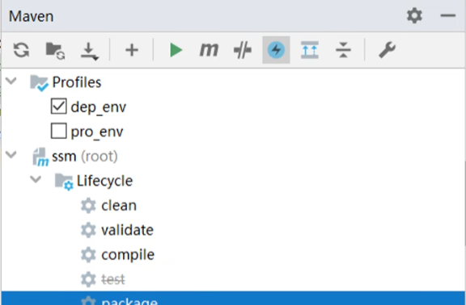

# Maven

- ## 基本概念

  - 仓库

    - 存放jar的文件夹，分有本地仓库，私服仓库，中央仓库

  - 坐标

    - 用来表示jar在仓库中的位置
    - 组成
      - groupId：定义当前Maven隶属组织名称
      - artifactId：定义当前Maven项目名称
      - version：当前项目版本号
      - packaging：定义该项目打包方式

  - ## 基本指令

    - 编译

      ```shell
      mvn compile
      ```

    - 启动测试

      ```shell
      mvn test
      ```

    - 打包项目

      ```shell
      mvn package
      ```

    - 安装

      ```shell
      mvn install
      ```

      - 将项目打包后根据坐标放入本地仓库

  - ## 依赖管理

    - 依赖传递冲突问题

      - 路径优先
      - 声明优先

    - 可选依赖

      ```xml
      <optional>true</optional>
      ```

      - 在坐标中添加以上代码可隐藏jar包所需依赖

    - 排除依赖

      ```xml
      <dependency>
          <!--某个jar包依赖中-->
          <exclusions>
          <exclusion>
              <需要排除的坐标></需要排除的坐标>
          </exclusion>
      </exclusions>
      </dependency>
      ```

    - 依赖范围
    
      ```xml
      <scope>compile</scope>
      ```
    
      - compile
        - 主代码，测试代码，打包
      - test
        - 测试代码
      - provided
        - 主代码，测试代码
      - runtime
        - 打包
    
    - ### 插件依赖
    
      - 在Maven工程的生命周期中添加其他操作
    
        ```xml
        <bulid>
            <plugins>
                <plugin>
                    <groupId></groupId>
                    <artifactId></artifactId>
                    <version></version>
                    <!--执行配置-->
                    <executions>
                        <execution>
                            <!--配置目标，如打包插件就配置jar或者war等-->
                            <goals>
                                <goal>jar</goal>
                                 <!--配置执行时期-->
                                <phase>generate-sources</phase>
                            </goals>
                        </execution>
                    </executions>
                    
                </plugin>
            </plugins>
        </bulid>
        ```

# Maven高级

- ## 分模块开发

  - 将MVC三层拆分为不同模块，如DAO用一个Maven模块，Controller用一个Maven模块，每一个模块都有一个pom.xml文件
  - 不同模块之间需要导入资源可以通过Maven坐标形式导入，比如DAO需要使用domain中的普通类，只需要将domain所在的Maven模块进行install加入到本地仓库中既可以使用domain中的类

- ## 模块聚合

  - 多个模块由一个主项目进行管理，主项目编译，子模块便编译
  
  - 创建项目流程
  
    - 创建一个Maven项目
  
    - 删除Src文件，
  
    - 在pom.xml中的项目jar 坐标下添加
  
      ```xml
      <packaging>pom</packaging>
      ```
  
    - 为该项目添加不同模块
  
      ```xml
      <modules>
          <module>模块项目文件夹相对路径</module>
      </modules>
      ```
  
      - 主项目编译时，Maven会根据依赖关系按照顺序依次编译不同模块
  
- ## 模块继承

  - 不同模块之间依赖相同的jar包可能会产生版本冲突问题，此时让主项目管理项目依赖，这样子模块则无需关注版本问题直接引用即可

  - 在父工程pom.xml中声明依赖管理

    ```xml
    <dependencyManagement>
        <dependencies>
            <!--在此处添加需要依赖-->
        </dependencies>
    </dependencyManagement>
    ```

  - 在子模块中声明父工程

    ```xml
    <parent>
        <!--填写父工程的坐标-->
        <relativePath>填写父工程的pom.xml文件相对路径</relativePath>
    </parent>
    ```

    - 除了普通的依赖可以管理以外，插件也可以进行管理只需要将dependencyManagement更换为pluginManagement

- ### 属性

  - 定义一些变量可供其他文件使用

    ```xml
    <!--定义属性名称-->
    <properties>
        <自定义属性名称>属性值</自定义属性名称>
    </properties>
    <!--使用变量名称-->
    <dependency>
        <groupId></groupId>
    	<version>${自定义属性名称}</version>
    </dependency>
    
    
    ```

  - 除了自定义的属性以外还有许多Maven自带的属性可以直接使用比如当前工程的版本号（${version}）

  - 除了工程中的属性以外，许多系统属性也可以读取，比如Maven中settings文件中的值也可以读取（通过${settings.}），可以通过mvn help:system查询可以获取的属性

- ## 版本管理

  - maven工程版本号默认以snapshot，也就是快照版，release则是发布版本
  - 如果需要更改项目版本号可以直接在pom.xml中的项目坐标中修改版本

- ## 资源配置

  - 配置一些属性供其他配置文件使用

  - 配置项目其他配置文件路径

    ```xml
    <resources>
        <resource>
            <directory>${project.basedir}/src/main/resources</directory>
            <filtering>true</filtering>
        </resource>
    </resources>
    
    <testresources>
        <testresource>
            <directory>${project.basedir}/src/test/resources</directory>
            <filtering>true</filtering>
        </testresource>
    </testresources>
    ```

  - 通过${}可以使用这些属性值

- ## 多环境配置

  - 参见springboot
  - 使用mvn 指令 -p 环境id

- ## 跳过测试

  - 方法一：直接点击跳过测试按钮

    

    方法二： mvn 指令 -D skipTests

  - 方法三： 有选择的跳过某些测试

    ```xml
    <configuration>
        <includes>
            <include>填写需要测试的类文件的路径</include>
        </includes>
        <excludes>
            <exclude>填写不需要测试的类文件的路径</exclude>
        </excludes>
    </configuration>
    ```

    - configuration标签放置在测试功能的插件的标签下

- ## 私服

