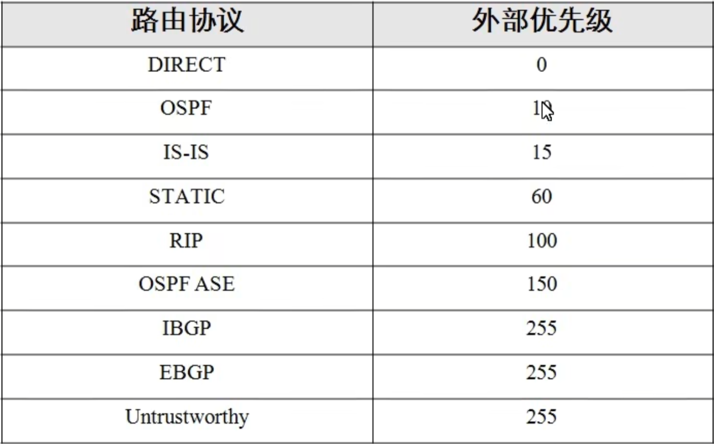
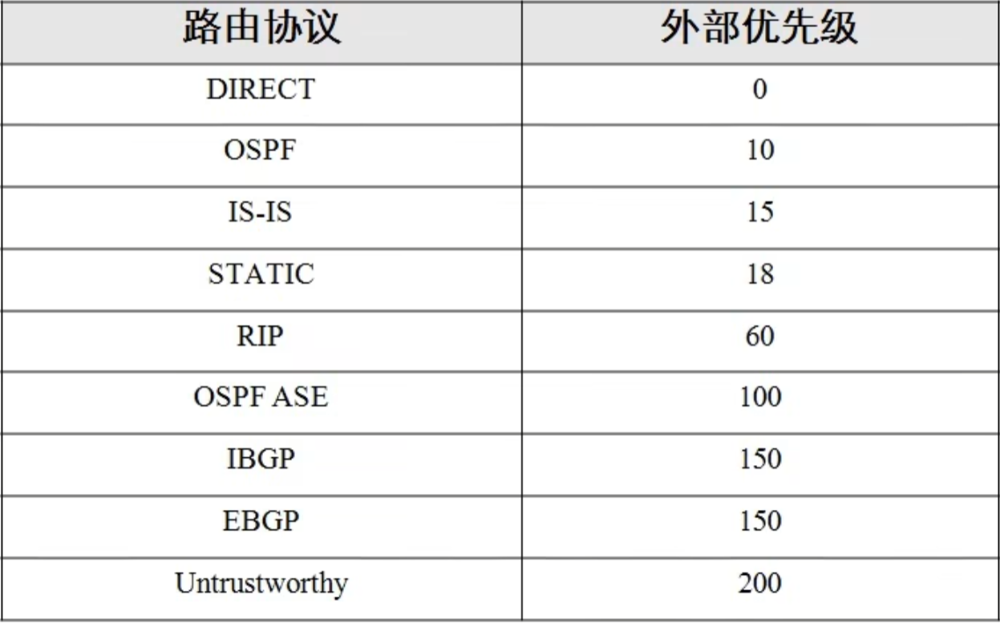
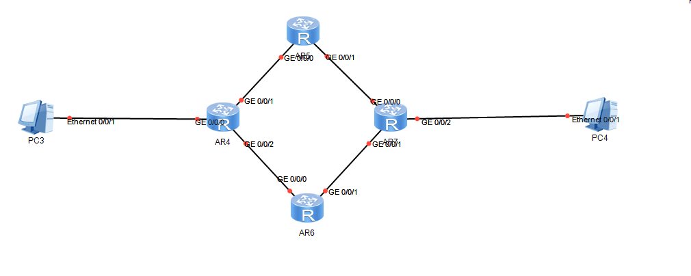
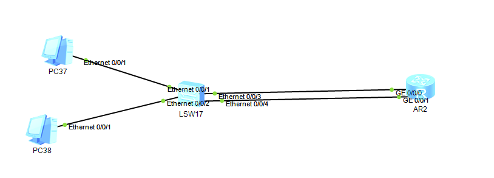
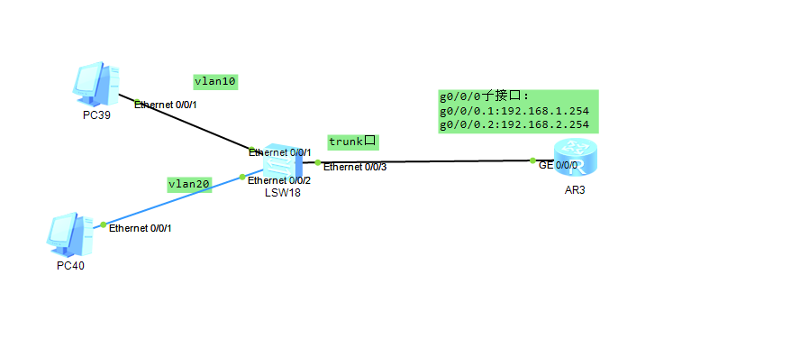
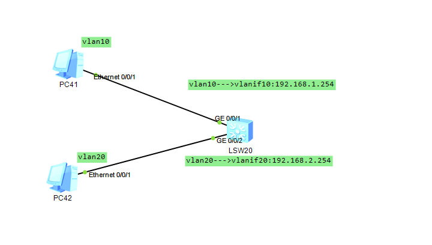
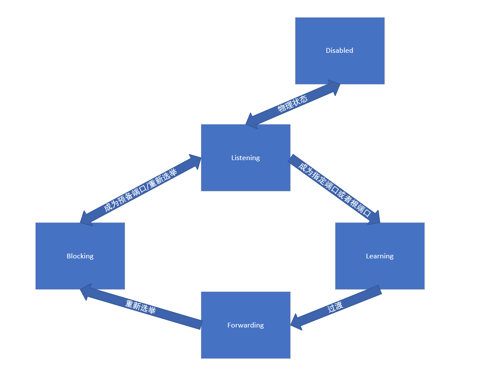

# ENSP

- 入门

  - 基本指令

    ```shell
    tab 键命令补全
    return 返回用户视图
    quit 返回上一层视图
    system-view 进入系统视图
    i？ 查看i开头的命令
    display +空格 + ？显示display后可用的参数
    sysname RouteName 修改路由器名称
    clock datetime 日期 修改日期
    display clock 显示当前时间
    clock timezone 时区
    history-command max-size 20 修改历史命令最大保存数量
    interface LoopBack 1 进入loopback1接口（loopback最大可有1024个）
    ip add IP地址 子网掩码/或者长度
    display ip interface brief 查看接口ip地址（简要信息）
    ```

  - 用户可以通过VTY(telent连接)或者console连接路由器，console只能联一个，VTY可以连接0-4个（可修改），连接可设置密码

  - 简单拓扑

    

    - cloud配置

      

    - route基本命令

      ```shell
      display version 查看路由器基本信息
      display interface g0/0/0  查看g0/0/0基本信息
      display ip routing-table 查看路由表
      display current-configuration 查看当前配置信息
      save 保存配置信息（需要返回到用户视图）
      display save-configuation 查看已保存的配置信息
      reboot 重启
      display this 显示当前接口的配置
      ```

    - 在路由器中可采用telnet+ip远程登录路由器

      ```shell
      telnet ip 远程登录
      user-interface vty 0 4 进入vty0-4接口进行配置
      user-interface con 0 进入console接口进行配置
      authentication-mode password 设置该接口的连接方式为密码登录（随后会设置密码）
      ```

      - 但是通过vty（telnet连接的用户的等级为0，只能执行最基本的命令）

        ```shell
        dis user-interface 查看所有连接接口
        user privilege level 10 设置当前用户等级为10
        ```

- 静态路由配置

  - 基本指令

    ```shell
    ip route-static ip-address {mask} {nexthop|interface-type}#配置静态路由
    display ip interface [brief] #查看路由接口
    display ip routing-table #查看路由表
    ```

    - 配置静态路由时
      - 如果时点对点链路：至少需要配置出接口
      - 采用以太网链路：至少配置下一跳IP地址（只配置IP则需要递归查找路由表，flags为RD）
      - 下一跳可以不是直连的IP地址（同样会递归查找路由表）
      - 最好是两个都写上
  
- 路由优先级

  - 外部优先级（可调整，值越小优先级越高）

    

  - 内部优先级（不可调整,当外部优先级相同时采用）

    

  - 跳数（度量值）

    - 同一协议下的优先级比较

  - 路由条目优选

    - 外部优先级---内部优先级----度量值---负载均衡

  - 最长匹配原则

    - 查找路由表
    - 目的地址和掩码做与运算
    - 比较运算结果和该路由表记录的目的网络
    - 挑选最长的匹配项

  - 缺省路由

    - 目的地址和掩码都为0的特殊路由

  - 负载均衡

    

    - 从PC3到PC4有两条链路可选（根据不同的负载均衡策略选择）
    - 浮动路由
      - 在配置静态路由的时候创建两条相同的路由表记录（但是走不同的链路而且优先级不同）
      - 当优先级高的一条链路仍然能够使用的时候，优先级低的链路不出现，直到优先级高的链路失效（优先级高的链路回来后将会顶替优先级低的）

  - ## 动态路由协议

    - RIP

      - 基于距离矢量协议
    
      - 采用UDP的应用层协议，端口为520
    
      - 适用于小型网络
    
      - 执行流程
        - 路由器启动并开启RIP
        - 向直连路由器发送路由更新请求，收到请求的路由器会将自己的路由表发送过去
        - 网络路由表收敛后周期性的发送路由更新信息（每30秒发送更新请求）
        
      - 路由表更新规则
        - 收到其他路由表
          - 当前本机没有该网络，添加
          - 有但是下一跳地址相同则更新
          - 有且下一跳地址不同但是跳数减少则更新
        - 跳数>15时认为网络不可达（避免环路）
        - 路由表收到更新后转发到其他路由器
        - 超过180秒没有发送更新路由表的路由器，设置为不可达
    
      - 版本
    
        - RIP1
          - 不支持VLSM（可变长子网掩码）和CIDR（无类别域间路由），也就是不支持子网掩码，默认认为所有网络都在同一网段下
          - 广播形式发送报文
          - 不支持认证
        - RIP2
          - 支持VLSM和CIDR
          - 支持广播和组播形式发送
          - 支持明文认证和MD5密文认证
    
      - 使用
    
        ```shell
        rip {进程号（随便，不重复就行）}#启用RIP(默认采用发送RIP1报文，接受时版本1和2都能接受)
        version 2#启用RIP2，配置后只接收或者发送指定版本的RIP报文，版本配置可以在指定接口下进行且优先级比全局更高
        network IP-address #通告网络，RIP1只能通告主类网络（ABC类，带有子网掩码的网络视为ABC类网络的子网），IP-add必须是直连网络
        dis rip {进程号} database #查看指定进程的数据库
        ```

        - network指令的含义是指定需要转发的网络
    
        - 开启RIPdebug模式
    
          ```shell
          debugging rip {进程号} #开启RIPdebug
          terminal monitor #开启监视器
          terminal terminal #开启监视器
          ```
    
        - 接口抑制

          ```shell
          slient-interface {接口号} #进入RIP进程后
          ```

          - 开启后将会不从该接口发送和RIP信息

      - 路由环路问题

        - A可到达N1网络，B可到达N2网络，RIP收敛后，B与N2网络断联，但是A中仍然保存了到达N2网络的错误的路由表记录，在之后的转发后再次发送给B，B会认为N2可通过N1到达则会更新路由表，在此之后B会发送路由表给A，A将N2跳数加一并再次转发给B，循环往复，直到跳数为16

        - 解决方法

          - 水平分割（`RIP2`自带水平分割）
    
            - A从B学习到的路由表记录将不会转发给B

              ```shell
              rip split-horizon
              ```

          - 毒性反转（RIP2默认不采用，也称为路由抑制）

            - 当A从B学习到N2网络的记录后，之后A的更新报文中N2的跳数将会被设置为16（如果B中没有N2的记录，则B仍然认为N2不可达，如果B中含有N2的记录，B则不会更新自己的路由表（B中对于N2跳数必然小于16））

            - 毒性反转的优先级高于水平分割
    
            - 配置

              ```shell
              rip poison-reverse
              ```

          - 触发更新

            - 当路由信息发生变化后立刻向直连设备发送更新报文
    
          - 以上解决方法是否开启可通过以下命令查看

            ```shell
            dis rip {进程号} interface {接口号} verbose
            ```

      - RIP计时器
    
        - 更新计时器（30s）
    
        - 老化计时器（180s）
    
          - 超过180s没有响应的路由视为不可达路由
    
        - 垃圾计时器
    
          - 超过120s没有更新的不可达路由视为垃圾被彻底删除
    
        - 抑制计时器
    
          - 当接受到cost大于16的路由时，该路由进入抑制状态，在此期间内收到任何cost小于16的路由都不接受，持续120s
    
        - 计时器设置
    
          ```shell
          timers rip 30 180 120 #分别是更新计时器，老化计时器，垃圾计时器 
          ```
    
      - RIP跳数增加量配置（metricin）
    
        ```shell
        rip metricin 2 #配置后的指定接口收到路由表信息后对所有路由信息跳数增加2（默认是1）
        rip metricout 2 #配置后RIP转发的路由表中所有跳数都为2
        ```
    
        - 以上两个命令都是在接口下配置的，需要先进入接口
        - metricin是针对自己的接收，metricout是针对向外发送
    
      - 静默接口和RIP禁止接口
    
        ```shell
        slient-interface {接口号}#禁止除单播RIP以外的报文发送，优先级更高
        undo rip output #禁止所有RIP报文发送
        undo rip input #禁止所有RIP报文接受
        ```
    
        - RIP单播更新（只针对指定IP发送RIP包）
    
          ```shell
          int g0/0/0
          peer {IP-address} #只对指定IP发送RIP报文，配置后同时发送广播和单播
          ```
    
          - peer和slient同时配置后可以只发送单播
    
      - Rip网络汇总
    
        - RIP1（RIP2只有在没有使用水平分割、毒性反转的情况下汇总）会在网络边界上做自动汇总（按照主类网络掩码）,自动汇总同样只针对自己接口的网络（对于其他路由发送的记录不影响）
    
          - 处于不同主类网络（主类网络号不同）之间的路由器称为网络边界
    
          - 或许可以这样说当路由器转发自己接口的路由记录的时候采用的子网掩码时自己的子网掩码，但是转发其他人的路由记录的时候不会改变（接受的时候是上面样子发送的时候就是什么样子）
          
          - 开启RIP2自动汇总
          
            ```shell
            summary alwawys
            ```
          
          - 人工手动汇总
          
            ```shell
            rip summary-address IP-add mask
            ```
        
      - RIP不连续网络问题
    
        - 问题如下
    
          
    
          - AR23处于网络边界，RIP自动将loopback网络汇总为172.16，AR25同理，当AR24收到两边的RIP报文后发现两边到达172网络的跳数一样，认为左右两边是负载均衡，这可能会导致本来发向172.16.1.0的包因为负载均衡发向了172.16.2.0
    
        - 解决方法
    
          - 使用RIPv2并去除所有自动汇总
    
      - RIP缺省路由
    
        - 指令
    
          ```shell
          rip #进入RIP进程 
          default-route originate [cost <跳数指定>]
          ```
    
          
    
    - OSPF
    
      - 基于链路状态协议
      - 适用于大型网络
      
      - 使用配置
      
        ```shell
        ospf 1 #开启ospf
        area 1#指定区域
        network ip-address 子网掩码反码#指定开发路由（在区域下配置）
        dis ospf lsdb #查看ospf数据库
        abr-summary [汇总后的网络号] [子网掩码] #在指定区域下配置汇总路由
        ```
      
      - Route-ID
      
        - 除了OSPF之外其他路由协议也可以使用Route-ID（但是可以为OSPF单独指定RouteID）
      
        - 未指定Route-ID则采用最大的loopback接口的IP作为Route-id,如果没有loopback接口则使用该路由上所有接口最大的IP地址作为Route-ID（对于loopback和物理接口哪个先配置就用哪个）
      
        - 指令
      
          ```shell
          ospf 1 router id [id] #可覆盖全局RouterID
          router id [ip-address]#手工配置全局routeID（不会改变OSPFrouterID）
          dis router id
          ```
      
          - OSPF的RouterID不会改变
      
        - 优先级：全局Route-ID>最大环回口>最大物理接口
      
      - OSPF中DR的选举
      
        - 广播型网络（以太网）或者NBMA类型网络且至少含有两个路由器采用DR和BDR机制
      
        - 优先级高的路由器称为DR，默认情况下所有路由器优先级相同，优先级相同比较Router-ID大小
      
          ```shell
          int g0/0/0
          ospf dr-priority [优先级大小]#为0则不会参与DR选举
          ```
      
          - DR选举采用非抢占式，选举完成后更高优先级的路由进入也不会抢占DR
      
        - 选举过程
      
          - 接口有效时DR和BDR暂未出现，此时正在发送hello报文阶段，同时开启一个计数器，计数器的值为40s(四次hello报文，等待建立邻居关系)
          - 计时结束后，路由之间邻居关系确立，检查hello报文中所有to-way状态的邻居的优先级、DR、BDR字段，列出一个具有选举资格的路由器列表
          - 收集完DR和BDR字段后，如果DR未选举但是BDR已选举则从BDR根据优先级等规则选举出DR
          - 如果BDR未选举，则从所有邻居中选举出BDR
          - BDR选举完成后选举DR
  
  - IS-IS协议
    - ISIS直接运行在链路层
    - ISIS基本概念
      - 报文格式
        - 数据链路报文头
        - ISIS固定报文头
        - TLV
          - T：类型
          - L：value字段长度
          - V：value字段，保存报文信息
      - 地址概念
        - 基本概念
          - IS:对标路由器
          - ES：主机
          - DIS：DR
          - SystemID:RouterID
          - PDU:IP报文
          - LSP：对标LSA
          - NSAP:IP 地址
            - 基本组成
              - IDP（类似主网络号）
              - DSP
                - HODSP：子网号
                - SystemID:主机IP
                - NSEL：端口号(在ISIS中一般为0)
            - NET()基本格式为(IDP+HODSP).SystemIP.NSEL
    - ISIS基本流程
      - 邻接关系建立：hello报文发送（也称为IIH）
      - LSDB同步：互相发送LSP
      - SPF路由计算：
      - 路由表生成
    - 网络类型
      - ISIS支持广播型网络（选举DIS），点对点网络，不支持NBMA和点到多点
        - 选举规则
          - 接口优先级：默认64数值越大优先级越高
          - 优先级相同比较链路层地址（SNPA）：在LAN中是MAC地址
          - SNPA相同比较SystemID

- Vlan

  - vlan的作用是为了隔离广播域

  - vlan的基本使用（通过接口划分vlan）

    ```shell
    vlan [编号]#创建vlan
    vlan batch 2 to 100 #创建从2到100的vlan
    int e0/0/0
    port link-type access#修改交换机端口类型为access，默认为hybrid
    port default vlan [vlan编号]#修改默认vlan，所有接口默认都在vlan1中
    dis vlan#查看vlan信息
    
    port trunk allow-pass vlan [vlan编号1][vlan编号2][vlan编号3]#在华为ensp中trunk默认只允许通过vlan1，通过该命令配置可允许通过的vlan
    port trunk pvid vlan [vlan编号]#配置trunk接口的vlan标记
    ```

  - vlan基本原理

    - 在原本的以太网帧格式中添加一个字段用于保存vlan标识，帧在交换机中都是带有vlan标记的（Tagged）,不带有标记的以太网帧（Untagged）来自于对端设备，接受该帧的端口将会给该帧添加上Vlan标识（基于以下五种方法，优先级从上往下依次提高）
      - 通过接口：给接口划分vlan
      
      - 通过协议
      
      - 通过子网：IP信息划分
      
        - 指令
      
          ```shell
          #进入vlan接口
          ip-sub ip [ip-address] [掩码位数]#建立子网和vlan之间关系
          #进入指定接口
          ip-sub enable
          ```
      
      - 通过MAC地址：配置了MAC表和VlanID的映射关系后交换机可通过该表贴上Vlan标记
      
        - 建立MAC和vlan的映射表将MAC地址和vlan绑定
      
          ```shell
          dis mac-address#查看MAC地址表
          vlan 10#进入vlan界面
          mac-vlan mac-address [mac地址] [priority<优先级>]#配置vlan和mac的映射表
          #需要解析mac地址的接口必须是hybrid接口且应该允许该mac地址对应的vlan通过
          mac-vlan enable#在连接了需要mac映射vlan的接口下开启mac-vlan
          ```
      
          
      
      - 通过策略: 可基于MAC+IP、MAC+IP+接口划分vlan
      
    - 链路和端口类型
      - Access Link类型：主机和交换机之间的链接，链路上的帧为不带tag的帧
      - Trunk类型：交换机和交换机之间的链接，一般带有tag，也可以通过不带有Tag的
      - Access Port类型：交换机连接主机的端口，接受帧的时候如果是Untagged则带上tag，发送时去除tag，只允许带有和端口相同的tag的帧通过
      - Trunk Port类型：交换机和交换机相连的端口，允许多个vlan的帧通过，接受时如果帧没有vlan则标记为该接口的vlan，如果有tag则判断该端口是否允许该vlan的帧通过，发送帧时如果该帧的vlan和端口的默认端口一致则剥离tag后发送如果不一致则直接发送
      - hyrid Port类型：既可以连接主机也可以连接交换机，允许多种Vlan帧通过，接收时和Trunk一样，发送时会先判断该vlan是否能通过（tagged和untagged的并集），能通过则判断是否需要tag，如果需要tag则直接发送，如果需要Untagged则去除标签后转发
      
    - 默认端口
      - 每个端口都可以配置一个默认vlan
    
  - vlan间通信
  
    - 方法一：二层交换机
  
      
  
    - 方法二：单臂路由
  
      
  
      - 配置交换机接口001和002为access，003为trunk
  
      - 配置路由：
  
        ```shell
        int g0/0/0.1#进入子接口
        dot1q termination vid 10#配置该子接口对应vlan
        arp broadcast enable#开启arp广播
        ```
  
    - 方法三：三层交换机（更多更好）
  
      
  
      - 在交换机（S3700不行，要S5700）中虚拟一个路由器，该路由有vlanif(vlan interface)接口，vlanif接口可以配置IP地址（模拟路由器）
  
        ```shell
        #配置接口vlan
        int vlanif [vlan编号]#创建vlanif接口
        #配置vlanifip
        ```

- ARP

  - 基本原理

    - 主机发送的IP报文最终会被封装为MAC帧，需要知道MAC地址，为了解析IP对应的MAC地址，主机会先发送一个ARP请求（广播）其中包括目的IP，接收到该报文的主机会检查该报文中的目的IP是否是自己如果是自己则响应（单播）不是则丢弃

      ```shell
      arp static [IP-address] [mac-address]#静态添加ARP表
      ```

  - ARP代理

    - 路由器会隔离广播域，如果路由器接口开启了ARP代理功能则接收到ARP报文时会先检查是否自己是请求的IP不是则查找路由表检查是否有对应的接口可转发到指定网络。、

      ```shell
      arp-proxy enable#进入接口后配置
      ```

  - 免费ARP

    - 将目的IP地址设置为自己的IP地址，如果有响应则代表这个网络中含有和自己相同的IP地址。免费ARP的目的是检测同一网络是否存在IP重复

- STP

  - 环路问题

    - 广播风暴
    - MAC地址表震荡
    - 多帧拷贝

  - 基本概念

    - 桥：交换机

      - 桥ID：由16位的交换机优先级+48位mac地址组成

      - 根桥：桥ID最小的桥生成树的根
    - 端口开销
    
      - 接收无开销，发送和带宽有关
    - 根端口

      - 一个非根交换机（非根节点）到根交换机总开销最小的路径所经过的端口（通俗的说就是二叉树中父子节点之间的边所连接的子节点的端点）
    - 端口ID
    
      - 第一种定义：端口优先级（4bit）+端口编号（12bit）
      - 第二种定义：端口优先级（8bit）+端口编号（8bit）
    - 指定端口
    
      - 根交换机和不同网段之间通信的端口（或者说是STP中可用的端口）
    - 预备端口
    
      - STP中被阻塞的端口
    - 网桥协议数据单元
      - BPDU单元
    
  - 生成树
  
    - 消除环路
    - 动态生成

  - 工作流程
  
    - 选举根网桥（根交换机）
      - 每台交换机启动后都认为自己是根桥，并互相发送报文宣布自己是根桥，每个交换机根据其他交换机发送的报文的桥ID与自己的桥ID进行比较，有较小的桥ID的交换机会被选举称为根桥（其实就是先比对桥的优先级后比对MAC地址）
    - 选举根端口
      - 选举出根桥后，非根桥选举出根端口，根端口是非根桥到根桥的最佳路径（路径开销确定）的出发接口
      - 可以这样理解根端口是针对交换机而言，每一个交换机只有一个根端口
        - 根路径开销：从根端口到根桥的开销
        - 如果无法从开销确定根端口则通过比较上行交换机的桥ID和端口ID
    - 选举指定端口（选择保留哪些边）
      - 确定每一个网段唯一的一个负责转发该网段数据的接口，该指定接口所在的交换机也称为指定交换机
      - 指定端口选举：路径开销>交换机标识>端口标识
      - 指定端口选举是针对网段而言，更多是针对边而言，比较一条边的两个端点哪个端点的开销最小就用哪个
    - 阻塞预备端口
      - 在指定端口选举完成后，除了指定端口和根端口之外的端口就是阻塞预备端口
    - 当网络故障时重新选举
    
  - 端口状态
  
    - Disabled：不转发，不学习MAC，不参与STP
  
    - Blocking（预备端口）：不转发，不学习，接收BPDU但不向外发送
  
    - Listening(初始阶段)：不转发，不学习，参与STP和收发BPDU
  
    - Learning（根端口或者指定端口学习阶段）：不转发，学习，参与STP和收发BPDU
  
    - Forwarding（学习完成后）:都干
  
    - 状态变化
  
      - 初始都为Listening状态
      - 选举为根端口或者指定端口的端口先进入Learning阶段，为了避免临时环路，在从Listening阶段到learing阶段之间停留15秒，在从Learning阶段到转发阶段停留15秒（一共停留两个转发时延，默认为15秒一个转发时延）
  
      
  
  - RSTP（快速生成树协议）
  
    - 优势
      - STP的收敛时间加上转发时延导致STP的收敛大概要50秒，比较慢，为了加快收敛时间，就有了RSTP
    - 流程
      - 基本和STP类似
      - 不同点
        - 对于非根端口和非指定端口，RSTP定义了备份端口和预备端口
          - 备份端口（Backup）
            - 如果一个端口所在的交换机是依附的网段的指定端口的交换机则该端口设置为备份端口
          - 预备端口（Alternate）
            - 非备份端口就是预备端口
        - RSTP端口状态
          - Discarding （丢弃状态）:不转发、不学习
          - Learning：不转发，学习，参与计算
          - Forwarding：都干
          - 状态变化区别
            - Forwarding可直接变为Discarding
            - Forwarding可直接变成Forwarding(根端口变指定端口，指定端口变根端口)
            - Discarding变Forwarding以下情况可以直接变
              - 原根端口故障，预备端口成为新根端口
              - 边缘端口（不和任何交换机相连的端口）成为指定端口
            - 非边缘端口指定端口选举通过Proposal-Agreement机制加速Discarding到Forwarding
  
  - MSTP（多生成树协议）
  
    - 单生成树弊端
  
      - 部分vlan路径不通
      - 无流量分担（无负载均衡）
  
      - 次优二层路径
  
    - 原理
  
      - 多个Vlan映射为多个生成树
      - 每一棵树都有一个MSTID（16bit）
      - 交换机会维护一个MSTID和vlan的映射表（4096个连续的16位元素组，第1个和最后一个为0，第二个对于vlan1，第三个对于vlan2），初始时该表全为0
      - 区域
        - 相同vlan并在同一个MST中的所有交换机形成一个区域
        - 区域配置标识
          - 区域名称
          - 修订级别
          - MST配置表摘要
  
  - STP配置
  
    ```shell
    stp mode {mstp|rstp|stp}#启动STP
    dis stp#查看stp信息
    stp enable#开启stp
    stp priority [优先级4096倍数]#stp优先级配置
    stp root primary#指定根桥
    stp cost [路径开销]#配置路径开销
    stp port priority [端口优先级]#修改端口优先级
    dis stp int [接口编号]#查看stp端口状态
    ```
  
    - stp根是可抢占的
  
    - RSTP配置
  
      ```shell
      stp edged-port enable#进入接口后配置边缘接口
      ```
  
      - 边缘接口的变化不会对网络拓扑产生印象则无需重新stp选举，但是如果边缘接口一旦接收到BPDU报文则退化为普通接口
  
    - MSTP配置
  
      ```shell
      stp region-configuration#进入MSTP配置界面
      region-name RegionA#配置区域名称
      revision-level 1#配置修订级别
      instance 1 vlan 2#MST实例和Vlan映射配置
      active region-configuration#配置生效
      stp instance  1 priority [优先级]#实例优先级控制
      ```
  
      - 启动时只有一个实例（MSTI0）
      - 一个网络划分为多个域，一个域中有多个生成树实例，一个实例中可以有多个vlan，但是一个vlan只能有一个实例，这样所有VLAN内部可以互通，同时不同VLAN的报文沿不同的路径转发，实现了负载分担。
