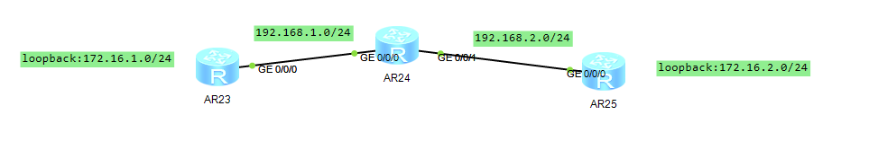

# ENSP

- 入门

  - 基本指令

    ```shell
    tab 键命令补全
    return 返回用户视图
    quit 返回上一层视图
    system-view 进入系统视图
    i？ 查看i开头的命令
    display +空格 + ？显示display后可用的参数
    sysname RouteName 修改路由器名称
    clock datetime 日期 修改日期
    display clock 显示当前时间
    clock timezone 时区
    history-command max-size 20 修改历史命令最大保存数量
    interface LoopBack 1 进入loopback1接口（loopback最大可有1024个）
    ip add IP地址 子网掩码/或者长度
    display ip interface brief 查看接口ip地址（简要信息）
    ```

  - 用户可以通过VTY(telent连接)或者console连接路由器，console只能联一个，VTY可以连接0-4个（可修改），连接可设置密码

  - 简单拓扑

    

    - cloud配置

      

    - route基本命令

      ```shell
      display version 查看路由器基本信息
      display interface g0/0/0  查看g0/0/0基本信息
      display ip routing-table 查看路由表
      display current-configuration 查看当前配置信息
      save 保存配置信息（需要返回到用户视图）
      display save-configuation 查看已保存的配置信息
      reboot 重启
      display this 显示当前接口的配置
      ```

    - 在路由器中可采用telnet+ip远程登录路由器

      ```shell
      telnet ip 远程登录
      user-interface vty 0 4 进入vty0-4接口进行配置
      user-interface con 0 进入console接口进行配置
      authentication-mode password 设置该接口的连接方式为密码登录（随后会设置密码）
      ```

      - 但是通过vty（telnet连接的用户的等级为0，只能执行最基本的命令）

        ```shell
        dis user-interface 查看所有连接接口
        user privilege level 10 设置当前用户等级为10
        ```

- 静态路由配置

  - 基本指令

    ```shell
    ip route-static ip-address {mask} {nexthop|interface-type}#配置静态路由
    display ip interface [brief] #查看路由接口
    display ip routing-table #查看路由表
    ```

    - 配置静态路由时
      - 如果时点对点链路：至少需要配置出接口
      - 采用以太网链路：至少配置下一跳IP地址（只配置IP则需要递归查找路由表，flags为RD）
      - 下一跳可以不是直连的IP地址（同样会递归查找路由表）
      - 最好是两个都写上
  
- 路由优先级

  - 外部优先级（可调整，值越小优先级越高）

    

  - 内部优先级（不可调整,当外部优先级相同时采用）

    

  - 跳数（度量值）

    - 同一协议下的优先级比较

  - 路由条目优选

    - 外部优先级---内部优先级----度量值---负载均衡

  - 最长匹配原则

    - 查找路由表
    - 目的地址和掩码做与运算
    - 比较运算结果和该路由表记录的目的网络
    - 挑选最长的匹配项

  - 缺省路由

    - 目的地址和掩码都为0的特殊路由

  - 负载均衡

    

    - 从PC3到PC4有两条链路可选（根据不同的负载均衡策略选择）
    - 浮动路由
      - 在配置静态路由的时候创建两条相同的路由表记录（但是走不同的链路而且优先级不同）
      - 当优先级高的一条链路仍然能够使用的时候，优先级低的链路不出现，直到优先级高的链路失效（优先级高的链路回来后将会顶替优先级低的）

  - ## 动态路由协议

    - RIP

      - 基于距离矢量协议
    
      - 采用UDP的应用层协议，端口为520
    
      - 适用于小型网络
    
      - 执行流程
        - 路由器启动并开启RIP
        - 向直连路由器发送路由更新请求，收到请求的路由器会将自己的路由表发送过去
        - 网络路由表收敛后周期性的发送路由更新信息（每30秒发送更新请求）
        
      - 路由表更新规则
        - 收到其他路由表
          - 当前本机没有该网络，添加
          - 有但是下一跳地址相同则更新
          - 有且下一跳地址不同但是跳数减少则更新
        - 跳数>15时认为网络不可达（避免环路）
        - 路由表收到更新后转发到其他路由器
        - 超过180秒没有发送更新路由表的路由器，设置为不可达
    
      - 版本
    
        - RIP1
          - 不支持VLSM（可变长子网掩码）和CIDR（无类别域间路由），也就是不支持子网掩码，默认认为所有网络都在同一网段下
          - 广播形式发送报文
          - 不支持认证
        - RIP2
          - 支持VLSM和CIDR
          - 支持广播和组播形式发送
          - 支持明文认证和MD5密文认证
    
      - 使用
    
        ```shell
        rip {进程号（随便，不重复就行）}#启用RIP(默认采用发送RIP1报文，接受时版本1和2都能接受)
        version 2#启用RIP2，配置后只接收或者发送指定版本的RIP报文，版本配置可以在指定接口下进行且优先级比全局更高
        network IP-address #通告网络，RIP1只能通告主类网络（ABC类，带有子网掩码的网络视为ABC类网络的子网），IP-add必须是直连网络
        dis rip {进程号} database #查看指定进程的数据库
        ```

        - network指令的含义是指定需要转发的网络
    
        - 开启RIPdebug模式
    
          ```shell
          debugging rip {进程号} #开启RIPdebug
          terminal monitor #开启监视器
          terminal terminal #开启监视器
          ```
    
        - 接口抑制

          ```shell
          slient-interface {接口号} #进入RIP进程后
          ```

          - 开启后将会不从该接口发送和RIP信息

      - 路由环路问题

        - A可到达N1网络，B可到达N2网络，RIP收敛后，B与N2网络断联，但是A中仍然保存了到达N2网络的错误的路由表记录，在之后的转发后再次发送给B，B会认为N2可通过N1到达则会更新路由表，在此之后B会发送路由表给A，A将N2跳数加一并再次转发给B，循环往复，直到跳数为16

        - 解决方法

          - 水平分割（`RIP2`自带水平分割）
    
            - A从B学习到的路由表记录将不会转发给B

              ```shell
              rip split-horizon
              ```

          - 毒性反转（RIP2默认不采用，也称为路由抑制）

            - 当A从B学习到N2网络的记录后，之后A的更新报文中N2的跳数将会被设置为16（如果B中没有N2的记录，则B仍然认为N2不可达，如果B中含有N2的记录，B则不会更新自己的路由表（B中对于N2跳数必然小于16））

            - 毒性反转的优先级高于水平分割
    
            - 配置

              ```shell
              rip poison-reverse
              ```

          - 触发更新

            - 当路由信息发生变化后立刻向直连设备发送更新报文
    
          - 以上解决方法是否开启可通过以下命令查看

            ```shell
            dis rip {进程号} interface {接口号} verbose
            ```

      - RIP计时器
    
        - 更新计时器（30s）
    
        - 老化计时器（180s）
    
          - 超过180s没有响应的路由视为不可达路由
    
        - 垃圾计时器
    
          - 超过120s没有更新的不可达路由视为垃圾被彻底删除
    
        - 抑制计时器
    
          - 当接受到cost大于16的路由时，该路由进入抑制状态，在此期间内收到任何cost小于16的路由都不接受，持续120s
    
        - 计时器设置
    
          ```shell
          timers rip 30 180 120 #分别是更新计时器，老化计时器，垃圾计时器 
          ```
    
      - RIP跳数增加量配置（metricin）
    
        ```shell
        rip metricin 2 #配置后的指定接口收到路由表信息后对所有路由信息跳数增加2（默认是1）
        rip metricout 2 #配置后RIP转发的路由表中所有跳数都为2
        ```
    
        - 以上两个命令都是在接口下配置的，需要先进入接口
        - metricin是针对自己的接收，metricout是针对向外发送
    
      - 静默接口和RIP禁止接口
    
        ```shell
        slient-interface {接口号}#禁止除单播RIP以外的报文发送，优先级更高
        undo rip output #禁止所有RIP报文发送
        undo rip input #禁止所有RIP报文接受
        ```
    
        - RIP单播更新（只针对指定IP发送RIP包）
    
          ```shell
          int g0/0/0
          peer {IP-address} #只对指定IP发送RIP报文，配置后同时发送广播和单播
          ```
    
          - peer和slient同时配置后可以只发送单播
    
      - Rip网络汇总
    
        - RIP1（RIP2只有在没有使用水平分割、毒性反转的情况下汇总）会在网络边界上做自动汇总（按照主类网络掩码）,自动汇总同样只针对自己接口的网络（对于其他路由发送的记录不影响）
    
          - 处于不同主类网络（主类网络号不同）之间的路由器称为网络边界
    
          - 或许可以这样说当路由器转发自己接口的路由记录的时候采用的子网掩码时自己的子网掩码，但是转发其他人的路由记录的时候不会改变（接受的时候是上面样子发送的时候就是什么样子）
          
          - 开启RIP2自动汇总
          
            ```shell
            summary alwawys
            ```
          
          - 人工手动汇总
          
            ```shell
            rip summary-address IP-add mask
            ```
        
      - RIP不连续网络问题
    
        - 问题如下
    
          
    
          - AR23处于网络边界，RIP自动将loopback网络汇总为172.16，AR25同理，当AR24收到两边的RIP报文后发现两边到达172网络的跳数一样，认为左右两边是负载均衡，这可能会导致本来发向172.16.1.0的包因为负载均衡发向了172.16.2.0
    
        - 解决方法
    
          - 使用RIPv2并去除所有自动汇总
    
      - RIP缺省路由
    
        - 指令
    
          ```shell
          rip #进入RIP进程 
          default-route originate [cost <跳数指定>]
          ```
    
          
    
    - OSPF
    
      - 基于链路状态协议
      - 适用于大型网络
  
  
  
  
  
  
  
  
  
  