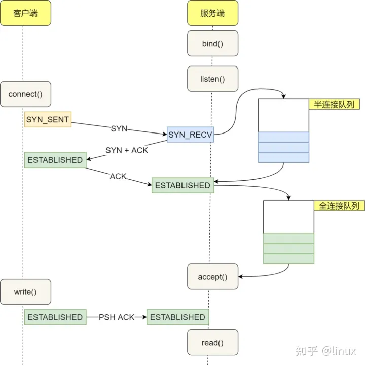
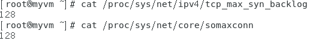

# Netty框架

- ## NIO基础

  - 三大组件
    - channel
      - FileChannel
      - DatagramChannel(UDP)
      - SocketChannel(TCP)
      - ServerSocketChannel(TCP)
    - buffer
    - selector

- ## 文件系统

  - 使用一

    ```java
    public class TestByteBuffer {
    
        public static void main(String[] args) {
            try (FileChannel channel = new FileInputStream(new File("src/main/resources/123.txt")).getChannel()) {
                //创建缓冲区，缓冲区大小为10字节（分配内存）
                ByteBuffer byteBuffer = ByteBuffer.allocate(10);
                //使用信道读取字节流,并向缓冲区中写数据,返回值是读取到的字节流的数量，如果为-1则代表没有读取任何数据
                int readLen=0;
               do{
                   //使用信道读取文件并将数据流写入缓冲区中，返回值是此次读取的字节数量，-1代表没有读取
                   readLen = channel.read(byteBuffer);
                   //缓冲区切换为读模式
                   byteBuffer.flip();
                   //hasRemaining用于返回缓冲区中是否含有未读数据
                   while (byteBuffer.hasRemaining())
                   {
                       //获取缓冲区中的数据，一次一个字节（get方法）
                       System.out.print((char) byteBuffer.get());
                   }
                   System.out.println();
                   //清空缓冲区并切换为写模式
                   byteBuffer.clear();
               }while (readLen!=-1);
    
            } catch (IOException e) {
                e.printStackTrace();
            }
        }
    }
    ```

  - Buffer基本结构

    - 三个重要属性

      - capacity(容量)
    - position(写入指针)
      - limit(写入限制)

  - 信道传输

    ```java
    public class ChannelTransfer {
        public static void main(String[] args) {
            try (
                FileChannel in = new FileInputStream("src/main/resources/123.txt").getChannel();
                FileChannel out = new FileOutputStream("src/main/resources/321.txt").getChannel();
            ) {
                in.transferTo(0,in.size(),out);//返回值为本次传输的字节数
            } catch (IOException e) {
                e.printStackTrace();
            }
        }
    }
    
    ```
  
    - 信道直接传输一次最大2g，可以通过size判断是否传输完成
  
  - Path和Paths
  
    - Paths是获取Path的工具类
  
      ```java
       Path path = Paths.get("src/main/resources/123.txt");
      ```
  
    - Path类中内置许多和文件位置有关的方法，如文件路径正常化，获取上一级目录等方法
  
  - Files
  
    - 工具类，主要使用静态方法
  
      ```java
      Path path = Paths.get("src/main/resources/123.txt");
      Files.exists(path);
      ```
  
    - 含有拷贝方法，创建目录方法，递归遍历某个目录下的所有文件等
  
      ```java
       public static void main(String[] args) throws IOException {
              Path path = Paths.get("src/main");
              Files.walkFileTree(path, new SimpleFileVisitor<>() {
                  @Override
                  public FileVisitResult visitFile(Path file, BasicFileAttributes attrs) throws IOException {
                      System.out.println(file.getFileName());
                      return super.visitFile(file, attrs);
                  }
              });
      
          }
      ```
  
      - FileVisitor中每个方法的返回值是FileVisitResult（枚举类）
  
        ```java
        public enum FileVisitResult {
        
            CONTINUE,//继续访问
        
            TERMINATE,//终止访问
        
            SKIP_SUBTREE,//跳过子树
        
            SKIP_SIBLINGS;//跳过兄弟姐妹
        }
        
        ```
  
      - 除了自己实现FileVisitor之外还可以使用jdk中的实现类SimpleFileVisitor,需要修改的方法自己覆盖就行（建议使用SimpleFileVisitor且不修改其父类调用的返回值）
  
      - 除了walkTree方法还可以使用walk方法只不过用walk会返回一个stream流
  
- ## 网络编程

  - ### 单线程堵塞模式创建服务器

    - 服务器
    
    ```java
    @Slf4j
    public class ServerIO {
    
        public static void main(String[] args) throws IOException {
            ServerSocketChannel socketChannel = ServerSocketChannel.open();
            socketChannel.bind(new InetSocketAddress(8080));
            ArrayList<SocketChannel> channels = new ArrayList<>();
            while (true)
            {
                log.info("waiting for connect...");
                SocketChannel channel = socketChannel.accept();//在这里堵塞线程
                log.info("connect successfully");
                channels.add(channel);
                for (SocketChannel c : channels) {
                    ByteBuffer buffer = ByteBuffer.allocate(16);
                    c.read(buffer);//建立链接后会在read方法堵塞
                    buffer.flip();
                    while (buffer.hasRemaining())
                    {
                        System.out.print((char) buffer.get());
                    }
                    System.out.println();
                }
            }
    
        }
    }
    
    ```
    
    - 客户端
    
    ```java
    public class Client {
        public static void main(String[] args) throws IOException {
            SocketChannel channel = SocketChannel.open();
            channel.connect(new InetSocketAddress("127.0.0.1",8080));
    
            System.out.println("waiting connect....");
        }
    }
    ```
    
    - 这种模式的服务端无法同时服务多个客户端，而且当服务端接受到客户端发送的数据后如果客户端再次发送数据，服务端将无法接受到（会执行下一次循环监听链接）
    
  - ### 单线程非堵塞服务器
  
    - 只需要设置
  
      ```java
      socketChannel.configureBlocking(false);
      ```
  
      设置了非堵塞链接后accept方法将不会堵塞并且如果没有建立链接则返回值为null，read方法也同理（没有数据返回0）
  
  - ### selector模式服务器
  
    - #### 服务器
  
      ```java
      @Slf4j
      public class SelectorServer {
          public static void main(String[] args) throws IOException {
              //创建selector用于管理channel
              Selector selector = Selector.open();
              //创建SocketChannel,设置缓冲区，设置非堵塞
              ServerSocketChannel server = ServerSocketChannel.open();
              ByteBuffer buffer = ByteBuffer.allocate(16);
              server.configureBlocking(false);
              //ServerSocketChannel向selector注册,并获取selectionkey
              SelectionKey selectionKey = server.register(selector, 0, null);
              //绑定accept事件
              selectionKey.interestOps(SelectionKey.OP_ACCEPT);
              server.bind(new InetSocketAddress(8080));
              while (true)
              {
                  //调用select方法监听事件发生,堵塞运行
                  log.info("selector waiting....");
                  selector.select();
                  log.info("selector get Event");
                  //发生事件，获取事件对应的selectionkey
                  Set<SelectionKey> keys = selector.selectedKeys();
                  log.info("keys size {}",keys.size());
                  Iterator<SelectionKey> keyIterator = keys.iterator();
                  while (keyIterator.hasNext())
                  {
                      SelectionKey key = keyIterator.next();
                      log.info("Event Type:{}",key.interestOps());
                      //根据事件类型进行不同的处理
                     if(key.interestOps()==SelectionKey.OP_ACCEPT)
                     {
                         try{
                             //连接类型获取信道
                             ServerSocketChannel channel = (ServerSocketChannel) key.channel();
                             log.info("{} Accept...",channel);
                             //监听
                             SocketChannel socketChannel = channel.accept();
                             //如果连接建立失败则取消执行该任务
                             if (socketChannel==null)
                             {
                                 key.cancel();
                             }
                             else {
                                 //设置监听后获取的连接的堵塞类型
                                 socketChannel.configureBlocking(false);
                                 //注册到selector中
                                 socketChannel.register(selector,SelectionKey.OP_READ,null);
                             }
                         }catch (Exception e)
                         {
                             e.printStackTrace();
                             //发生异常则取消执行
                             key.cancel();
                         }
                     }
                     else if (key.interestOps()==SelectionKey.OP_READ){
                          try
                          {
                              SocketChannel channel = (SocketChannel) key.channel();
                              int read = channel.read(buffer);
                              //如果没有数据可读则取消执行
                              if (read==-1)
                              {
                                  key.cancel();
                              }
                              else {
                                  buffer.flip();
                                  String s = BufferUtil.bufferToString(buffer);
                                  log.info("get message {} from {}",s,channel);
                              }
                          }catch (IOException e)
                          {
                              e.printStackTrace();
                              key.cancel();
                          }
                     }
                     //每次解决之后删除本次活跃的事件
                      keyIterator.remove();
                  }
              }
          }
      }
      
      ```
  
    - #### 客户端
  
      ```java
      public class Client {
          public static void main(String[] args) throws IOException {
              SocketChannel channel = SocketChannel.open();
              ByteBuffer buffer = ByteBuffer.allocate(16);
              try (FileChannel fileChannel = new FileInputStream("src/main/resources/123.txt").getChannel()) {
                  int read = fileChannel.read(buffer);
                  System.out.println("waiting connect....");
                  if (channel.connect(new InetSocketAddress("127.0.0.1",8080))) {
                      System.out.println("connect successfully");
                      buffer.flip();
                      channel.write(buffer);
                  }
              }catch (Exception e)
              {
                  e.printStackTrace();
              }
          }
      }
      
      ```
  
    - #### 常用方法
  
      - cancel方法（selectionkey）
  
        ```java
        key.cancel();
        ```
  
        如果发生了事件但是不处理则下次selector仍然会将该连接视为活跃连接（不在select堵塞），如果不打算处理该selectKey对应的事件应该使用cancel方法
  
    - #### selectedKeys集合元素手动删除
  
      - 在selector的selectedKeys返回的集合中不会主动删除key只会增加key，如果当key建立连接的channel执行玩任务后再次发生事件则会再次进入到建立连接的代码块中，者可能会产生异常，所以需要手动删除已经执行过的key
  
    - #### 异常处理
  
      - 如果不行进行异常处理则如果客户端的正常关闭和异常关闭都会导致服务端异常从而导致服务端程序停止
  
    - #### 消息边界问题
  
      - 目前的消息处理 
  
        ```java
        
        try
        {
            SocketChannel channel = (SocketChannel) key.channel();
            int read = channel.read(buffer);
            //如果没有数据可读则取消执行
            if (read==-1)
            {
                key.cancel();
            }
            else {
                buffer.flip();
                String s = BufferUtil.bufferToString(buffer);
                log.info("get message {} from {}",s,channel);
            }
        }catch (IOException e)
        {
            e.printStackTrace();
            key.cancel();
        }
        
        //处理Buffer的代码
        public static String bufferToString(ByteBuffer buffer)
        {
            StringBuilder stringBuffer = new StringBuilder();
            while (buffer.hasRemaining())
            {
                stringBuffer.append((char) buffer.get());
            }
            buffer.clear();
            return stringBuffer.toString();
        }
        ```
  
        - 问题一：如果数据一次读取不能完全读取可能会导致中文乱码问题，而且在消息长度不确定的情况下可能会出现半包和黏包的现象
        - 问题二：buffer如果为局部变量则出现半包现象会导致消息的丢失，如果buffer为全局变量对于多个Channel并不友好
  
      - ##### 问题一：解决方法
  
        - 固定最大消息长度
          - 缺点：浪费空间
        - 分割符分割方法
          - 缺点：效率低
  
        - TLV方式
          - 固定长度的字段用于指示后续消息长度，TLV主要是，类型，长度，数据
  
      - ##### 问题二：解决方法
  
        - 附件
          - 在selector注册时第三个参数可以作为附件与每个key相关联
  
      - ##### 改进
  
        - 读取Key注册
  
          ```java
          //创建附件
          ByteBuffer buffer = ByteBuffer.allocate(4);
          //设置监听后获取的连接的堵塞类型
          socketChannel.configureBlocking(false);
          //注册到selector中
          socketChannel.register(selector,SelectionKey.OP_READ,buffer);
          ```
  
        - 获取buffer
  
          ```java
          ByteBuffer buffer = (ByteBuffer) key.attachment();
          ```
  
        - 消息获取
  
          ```java
          public static String getMessgaeFromKey(SelectionKey key) throws IOException {
              SocketChannel channel = (SocketChannel) key.channel();
              ByteBuffer buffer = (ByteBuffer) key.attachment();
              int read = channel.read(buffer);
              if (read==-1)//无消息刻度
              {
                  key.cancel();
                  return "";
              }
              buffer.flip();
              StringBuilder s=new StringBuilder();
              while (buffer.hasRemaining())//读取并查看是否有\n
              {
                  char c = (char) buffer.get();
                  s.append(c);
                  if (c=='\n')
                  {
                      break;
                  }
              }
          
              if(s.toString().contains("\n"))//如果有\n代表已经读取了一条完整的消息
              {
                  buffer.compact();
              }
              else if (buffer.limit()==buffer.capacity())//没有\n且容量不足需要扩容
              {
                  ByteBuffer allocate = ByteBuffer.allocate(buffer.capacity() * 2);
                  allocate.put(StandardCharsets.UTF_8.encode(s.toString()));
                  key.attach(allocate);
              }
              return s.toString().endsWith("\n") ?  s.toString() : "";//返回获取的第一条消息（如果有\n则代表已经获取到了没有则代表还没读取完成）
          }
          ```
          
      
    - #### 多线程读取服务端
    
      - 服务端(监听线程，主线程)
    
        ```java
        @Slf4j
        public class ThreadServer {
        
        
            public static void main(String[] args) throws IOException {
                ServerSocketChannel channel = ServerSocketChannel.open();
                Selector selector = Selector.open();
                channel.configureBlocking(false);
                channel.bind(new InetSocketAddress(8080));
                channel.register(selector, SelectionKey.OP_ACCEPT,null);
        
                while (true)
                {
                    log.info("ThreadServer wait....");
                    selector.select();
                    Iterator<SelectionKey> keyIterator = selector.selectedKeys().iterator();
        
                    while (keyIterator.hasNext())
                    {
                        SelectionKey key = keyIterator.next();
                        log.info("ThreadServer get Connect");
                        if (key.isAcceptable())
                        {
                            ServerSocketChannel server = (ServerSocketChannel) key.channel();
                            SocketChannel socketChannel = server.accept();
                            if (socketChannel==null)
                            {
                                key.cancel();
                                continue;
                            }
                            log.info("ThreadServer get Channel : {}",socketChannel);
                            ReadThreader threader = new ReadThreader(socketChannel);
                            threader.setName("Read-worker-01");
                            threader.start();
        
                        }
                        keyIterator.remove();
                    }
                }
            }
        }
        
        ```
    
      - 工作线程（读线程）
    
        ```java
        
        @Slf4j
        public class ReadThreader extends Thread {
        
        
            public final Selector selector;
        
        
            public ReadThreader(SocketChannel socketChannel) throws IOException {
                selector=Selector.open();
                socketChannel.configureBlocking(false);
                ByteBuffer buffer=ByteBuffer.allocate(256);
                socketChannel.register(selector, SelectionKey.OP_READ,buffer);
            }
        
            @Override
            public void run() {
                log.info("ReaderThread start accept......");
                while (true)
                {
                    try {
                        selector.select();
                        Iterator<SelectionKey> keyIterator = selector.selectedKeys().iterator();
                        while (keyIterator.hasNext())
                        {
                            SelectionKey key = keyIterator.next();
                            log.info("ReaderThread get Event......");
                            if (key.isReadable())
                            {
                                try{
                                    String messgae = BufferUtil.getMessgaeFromKey(key);
                                    if (!"".equals(messgae))
                                    {
                                        log.info("get message : {} from {}",messgae,key.channel());
                                    }
                                }catch (Exception e){
                                    e.printStackTrace();
                                    key.cancel();
                                }
                            }
                            keyIterator.remove();
                        }
        
                    } catch (IOException e) {
                        throw new RuntimeException(e);
                    }
                }
            }
        }
        
        ```
    
      - 客户端
    
        ```java
        public class Client02 {
            public static void main(String[] args) throws IOException, InterruptedException {
                SocketChannel channel = SocketChannel.open();
                String[] message=new String[]{"1234","hello","fuck you"};
        
                if (channel.connect(new InetSocketAddress("127.0.0.1",8080))) {
                    StringBuilder sb=new StringBuilder();
                    for (String s : message) {
                        sb.append(s+'\n');
                    }
                    ByteBuffer buffer = StandardCharsets.UTF_8.encode(sb.toString());
                    sleep(10000);
                    channel.write(buffer);
                    channel.shutdownOutput();
                }
            }
        }
        ```
    
    - #### Stream和Channel
    
      - stream不会自动缓冲数据，channel会利用系统的缓存缓冲数据
      - stream仅支持堵塞API,channel支持堵塞和非堵塞
      - 两者都是全双工
    
    - #### IO模型
    
      - 堵塞IO
      - 非堵塞IO
      - 多路复用
      - 信号驱动
      - 异步IO
    
    - #### NIO和BIO区别
    
      - BIO
    
        
    
      - NIO
    
        ​	
    
      - ByteBuffer的分配内存方式
    
        - allocate（分配Java堆内存）
        - allocateDirect(直接分配内存空间)
    
      - TransferTo(信道之间的直接传输)
    
        - linux2.4之前
    
        
    
        - linux2.4之后（实现零拷贝）
    
          
    
          - 使用DMA传输数据（几乎无需CPU），只有少量的数据需要通过内核缓冲区传输给socket缓冲区（信息长度等）
    
    - #### 异步Channel使用
    
      ```java
      @Slf4j
      public class AsyFileReader {
          private static boolean finished=false;
          public static void main(String[] args) {
              Path path = Paths.get("src/main/resources/123.txt");
              try (AsynchronousFileChannel channel = AsynchronousFileChannel.open(path, StandardOpenOption.READ)) {
                  ByteBuffer buffer = ByteBuffer.allocate(256);
                  log.info("start reading...");
                  channel.read(buffer, 0, buffer, new CompletionHandler<Integer, ByteBuffer>() {
                      @Override//读取完成后的回调方法
                      public void completed(Integer result, ByteBuffer attachment) {
                          log.info("read completed....");
                          attachment.flip();
                          log.info("get message : {}",BufferUtil.bufferToString(buffer));
                          buffer.compact();
                          finished=true;
                      }
      
                      @Override//读取失败后的回调方法
                      public void failed(Throwable exc, ByteBuffer attachment) {
                          exc.printStackTrace();
                      }
                  });
      
                  while (!finished)//主线程开始等待IO读取线程的读取完成
                  {
                      log.info("waiting IO Result...");
                      sleep(1000);
                  }
              } catch (IOException e) {
                  e.printStackTrace();
              } catch (InterruptedException e) {
                  throw new RuntimeException(e);
              }
      
          }
      }
      
      ```
  
  ------------------------

- ## Netty入门

  - 概述

    - 异步（并不是异步IO），基于事件驱动的网络应用框架
    - 基于NIO（）
      - 相比于原生NIO，NIO需要自己构建协议，解决TCP传输问题（半包和黏包），epoll空轮询导致CPU空转100%，对API增强

  - ### 入门案例

    - 服务端

      ```java
      @Slf4j
      public class HelloNettyServer {
          public static void main(String[] args) {
              //创建服务器启动器（主要用于添加其他组件，相当于一个容器）
              new ServerBootstrap()
                  //添加group,其中包含了线程创建工厂，线程池、selector创建相关等基础类
                  .group(new NioEventLoopGroup())
                  //设置服务器ServerSocketChannel的实现类，NioServerSocketChannel是NIO方式实现，除此之外还有Epoll模式的实现，OIO(BIO)模式实现等
                  .channel(NioServerSocketChannel.class)
                  //添加worker线程的配置（类似于之前的多线程读取）
                  .childHandler(
                  //初始化对应的worker
                  new ChannelInitializer<NioSocketChannel>() {
                      @Override
                      protected void initChannel(NioSocketChannel nioSocketChannel) throws Exception {
                          //添加String解码器（字节流转String）
                          nioSocketChannel.pipeline().addLast(new StringDecoder());
                          //添加worker线程的的处理过程
                          nioSocketChannel.pipeline().addLast(
                              new ChannelInboundHandlerAdapter() {
                                  @Override//打印转换完成的数据信息
                                  public void channelRead(ChannelHandlerContext ctx, Object msg) throws Exception {
                                      log.info("get messgae : {}",msg);
                                  }
                              }
                          );
                      }
                  }
              )//绑定端口
                  .bind(8080);
          }
      }
      
      ```

    - 客户端

      ```java
      @Slf4j
      public class HelloNettyClient {
          public static void main(String[] args) throws InterruptedException {
              //创建启动器
              new Bootstrap()
                  ////添加group,其中包含了线程创建工厂，线程池、selector创建相关等基础类
                  .group(new NioEventLoopGroup())
                  //选择信道实现类
                  .channel(NioSocketChannel.class)
                  //添加客户端处理器(在连接创建时调用方法)
                  .handler(new ChannelInitializer<NioSocketChannel>() {
                      @Override
                      protected void initChannel(NioSocketChannel nioSocketChannel) throws Exception {
                          //字符串编码器添加
                          nioSocketChannel.pipeline().addLast(new StringEncoder());
                      }
                  })
                  //连接到服务器
                  .connect("127.0.0.1",8080)
                  //设置同步
                  .sync()
                  .channel()
                  //向信道中写入数据
                  .writeAndFlush("hello,Netty");
      
          }
      }
      ```

    - 流程分析（大概）

      - 服务端

        - （1）服务端创建启动器

        - （2）创建selector，线程池等

        - （3）创建ServerSocketChannel

        - （4）设置请求接受的处理器的初始化器

        - （5）绑定端口

        - （6）监听端口

        - （7）连接建立成功，调用处理器中的initChannel方法初始化处理器

        - （8）等待事件发生

        - （9）事件发生，调用对应处理器方法

      - 客户端

        - （1）客户端启动器
        - （2）创建selector，线程池等
        - （3）创建SocketChannel
        - （4）添加处理器初始化器
        - （5）连接到服务器，并调用sync方法同步堵塞直到连接建立
        - （6）连接建立，通过调用初始化器初始化处理器
        - （7）处理器发送数据（造成服务端读事件发生）

    - 步骤分析

      - 服务端

        - group方法

          创建线程设置子线程

        - channel方法

          创建NioServerSocketChannel的工厂类

        - childHandler

          设置childHandler属性值

        - 实现ChannelInitializer的initChannel方法

          向NioSocketChannel中的pipeline添加处理器（ChannelHandler），pipeline相当于Channel的包装类，除了Channel之外还包含了许多处理器（ChannelHandler）

    - Handler处理器

      - inbound为入站（读入数据）
      - outbound为出站（写出数据）
    
    - Eventloop
    
      - 每个Channel只和一个Eventloop绑定，但是一个Eventloop可以监听多个Channel
      - Eventloop即可以执行IO也可以执行其他任务，如定时任务
      - Eventloop按照Handler顺序执行IO操作，但是每一个pipeline的不同步骤可以指定不同的Eventloop
    
  - ### EventLoop解析
  
    - 源码
  
      ```java
      public interface EventLoop extends OrderedEventExecutor, EventLoopGroup {
          @Override
          EventLoopGroup parent();
      }
      ```
  
    - 继承类图
  
      
  
      - 其中Executor和ExecutorService和ScheduledExecutorService都是JDK中的类
  
        - Executor为一个简单的线程执行者
        - ExecutorService是一个简单的线程池
        - ScheduledExecutorService是ExecutorService的扩展
  
      - 以下是EventLoopGroup的定义
  
        ```java
        public interface EventExecutorGroup extends ScheduledExecutorService, Iterable<EventExecutor> 
        //EventExecutor定义
        public interface EventExecutor extends EventExecutorGroup 
        ```
  
        - EventLoopGroup中包含了多个EventLoop，同时EventLoop本质是一个单线程执行器（同时维护了一个Selector），可以使用boolean inEventLoop(Thread thread)判断一个线程是否属于该EventLoop，parent方法可以查看EventLoop的所属EventLoopGroup
        - Channel一般会调用EventLoopGroup的register方法来绑定其中一个EventLoop
        - Iterable接口保证EventExecutorGroup可以遍历所属的EventLoop
  
      - 在NioEventLoop中的run方法中调用了selector的select方法和执行任务队列中的任务
  
    - #### 基本使用
  
      - 创建
  
      ```java
      //NioEventLoopGroup可处理IO事件，普通任务，定时任务
      EventLoopGroup group=new NioEventLoopGroup();
      //只能处理普通任务和定时任务
      EventLoopGroup group2=new DefaultEventLoopGroup();
      ```
  
      - NioEventLoopGroup构造方法源码查看
  
        ```java
        public NioEventLoopGroup() {
            this(0);//0代表所需线程数量
        }
        //经过若干和构造方法调用，最终到达MultithreadEventLoopGroup的构造方法
        protected MultithreadEventLoopGroup(int nThreads, Executor executor, Object... args) {
            super(nThreads == 0 ? DEFAULT_EVENT_LOOP_THREADS : nThreads, executor, args);//如果所需线程数量为0则取DEFAULT_EVENT_LOOP_THREADS
        }
        //DEFAULT_EVENT_LOOP_THREADS的由来
        private static final int DEFAULT_EVENT_LOOP_THREADS;
        
        static {
            DEFAULT_EVENT_LOOP_THREADS = Math.max(1, SystemPropertyUtil.getInt(
                "io.netty.eventLoopThreads", NettyRuntime.availableProcessors() * 2));//从系统参数（io.netty.eventLoopThreads）和主机电脑CPU核心支持的线程数量*2中取最大值
        
            if (logger.isDebugEnabled()) {
                logger.debug("-Dio.netty.eventLoopThreads: {}", DEFAULT_EVENT_LOOP_THREADS);
            }
        }
        ```
  
      - 获取NioEventLoop
  
        ```java
        EventLoopGroup group=new NioEventLoopGroup(2);//限制EventLoopGroup数量（同时也是线程数量）
        while (true)
        {
            System.out.println(group.next());
        }
        最终输出
            io.netty.channel.nio.NioEventLoop@7fa98a66
            io.netty.channel.nio.NioEventLoop@1a451d4d
            io.netty.channel.nio.NioEventLoop@7fa98a66
            io.netty.channel.nio.NioEventLoop@1a451d4d
        ```
  
        - 会发现在不断的循环(1->2->1->2)
  
      - 执行普通任务
  
        ```java
        group.next().submit(new Runnable() {
            @Override
            public void run() {
                log.info("这是一个普通任务");
            }
        });
        //以下这种也行
        group.next().execute(new Runnable() {
            @Override
            public void run() {
                log.info("这是一个普通任务");
            }
        });
        //最终打印结果 INFO [nioEventLoopGroup-2-1] (EventLoopTest.java:19) - 这是一个普通任务
        ```
  
      - 执行定时任务
  
        ```java
        //第一个参数是Runnable,第二个参数是执行延迟（多久之后执行），第三个是周期，第四个是时间单位
        group.next().scheduleAtFixedRate(new Runnable() {
            @Override
            public void run() {
                log.info("这是一个普通任务");
            }
        },1,2, TimeUnit.SECONDS);
        ```
  
      - 执行IO任务
  
        ```java
        @Slf4j
        public class EventLoopIOTask {
            public static void main(String[] args) {
                new ServerBootstrap()
                    .group(new NioEventLoopGroup())
                    .channel(NioServerSocketChannel.class)
                    .childHandler(new ChannelInitializer<NioSocketChannel>() {
                        @Override
                        protected void initChannel(NioSocketChannel ch) throws Exception {
                            ch.pipeline().addLast(new ChannelInboundHandlerAdapter() {
                                @Override
                                public void channelRead(ChannelHandlerContext ctx, Object msg) throws Exception {
                                    ByteBuf buffer= (ByteBuf) msg;
                                    log.info("get Message {}",buffer.toString(StandardCharsets.UTF_8));
                                }
                            });
                        }
                    }).bind(8080);
            }
        }
        ```
  
        - 如果启动多个Client，会发现EventLoop按照轮询接受请求
  
      - Netty建议使用一个Group负责接受accept请求，而子group负责接受read或者write操作
  
        - 服务端
  
          ```java
          @Slf4j
          public class NettySuggestion {
              public static void main(String[] args) {
                  EventLoopGroup group= new DefaultEventLoopGroup();
                  new ServerBootstrap()
                      //第一个参数为父Group，第二个为子group
                      .group(new NioEventLoopGroup(1),new NioEventLoopGroup(2))
                      .channel(NioServerSocketChannel.class)
                      .childHandler(new ChannelInitializer<NioSocketChannel>() {
                          @Override
                          protected void initChannel(NioSocketChannel ch) throws Exception {
                              log.info("get Connection : {}",ch);
                              ch.pipeline().addLast("handler1",new ChannelInboundHandlerAdapter() {
                                  @Override
                                  public void channelRead(ChannelHandlerContext ctx, Object msg) throws Exception {
                                      ByteBuf buffer= (ByteBuf) msg;
                                      log.info("this is handler 1");
                                      log.info("context : {}",ctx);
                                      //将消息传递给下一个Handler
                                      ctx.fireChannelRead(((ByteBuf) msg).toString(StandardCharsets.UTF_8));
                                  }
                              }).addLast(group,"handler2",new ChannelInboundHandlerAdapter(){
                                  @Override
                                  public void channelRead(ChannelHandlerContext ctx, Object msg) throws Exception {
                                      log.info("this is handler2...");
                                      log.info("context : {}",ctx);
                                      log.info("a long time....");
                                      log.info("get message : {}",msg);
                                  }
                              });
                          }
                      }).bind(8080);
              }
          }
          
          ```
          
          - 初次之外，如果有需要占用较长时间的任务可以新建一个DefaultEventLoopGroup用于执行
          
          - Handler指定Group执行任务(fireChannelRead方法源码，该方法由AbstractChannelHandlerContext实现)
          
            ```java
            @Override
            public ChannelHandlerContext fireChannelRead(final Object msg) {
                invokeChannelRead(findContextInbound(MASK_CHANNEL_READ), msg);
                return this;
            }
            //invokeChannelRead方法
            static void invokeChannelRead(final AbstractChannelHandlerContext next, Object msg) {
                final Object m = next.pipeline.touch(ObjectUtil.checkNotNull(msg, "msg"), next);
                //获取下一个EventExecutor（EventLoop）
                EventExecutor executor = next.executor();
                //inEventLoop方法用于判断执行invokeChannelRead的线程和next.executor()获取的线程是否是同一个线程
                if (executor.inEventLoop()) {
                    //如果是同一个线程则在当前线程执行invokeChannelRead
                    next.invokeChannelRead(m);
                } else {
                    //不是同一个线程则通过next.executor()执行invokeChannelRead方法
                    executor.execute(new Runnable() {
                        @Override
                        public void run() {
                            next.invokeChannelRead(m);
                        }
                    });
                }
            }
            ```
    
  - ### Channel解析
  
    - 主要方法使用
  
      - write方法和writeAndFlush方法
  
        - 区别
  
          write方法写入数据后并不会直接发送，会根据条件发送数据（如果想要发送时需要调用Flush方法），writeAndFlush会立刻发送数据
  
      - ChannelFuture对象
  
        - 执行Connect方法后返回一个ChannelFuture，之后执行了同步方法后同样返回了一个ChannelFuture对象，可以通过ChannelFuture的channel方法返回channel
  
        - 如果不执行同步方法则服务端无法接受到数据
  
          - 原因
  
            - connect方法本质是异步非堵塞方法，调用connect方法的是主线程而执行连接的是EventLoop线程
  
              ```java
               INFO [nioEventLoopGroup-2-1] (HelloNettyClient.java:27) - connect successfully....
              ```
  
            - sync方法内部调用了wait等堵塞方法，也就是主线程在执行了connect异步非堵塞方法后本该继续向下运行但是在sync中堵塞直到连接建立成功
  
            - sync方法和以下代码类似
  
              ```java
              
              public static boolean isConnected=false;//成员变量
              
              while (!isConnected)
              {
                  log.info("wait for NIO thread connect....");
                  sleep(1000);
              }
              connect.channel().writeAndFlush("你好,Netty");
              ```
  
        - 获取异步处理结果
  
          - 使用addListener(回调对象)
  
            ```java
            ChannelFuture future = connect.addListener(new ChannelFutureListener() {
                @Override
                public void operationComplete(ChannelFuture future) throws Exception {
                    log.info("Client connect build successfully...");
                    future.channel().writeAndFlush("你好,Netty");
                }
            });
            log.info("keep going...");
            //结果输出
             INFO [main] (HelloNettyClient.java:44) - keep going...
             INFO [nioEventLoopGroup-2-1] (HelloNettyClient.java:27) - connect successfully....
             INFO [nioEventLoopGroup-2-1] (HelloNettyClient.java:40) - Client connect build successfully...
            
            ```
  
        - 日志Handler添加
        
          ```java
          //以下是服务端的添加，客户端的相同
          @Override
          protected void initChannel(NioSocketChannel ch) throws Exception {
              log.info("connect successfully...{}",ch.pipeline().channel());
              ch.pipeline().addLast(new LoggingHandler(LogLevel.INFO));
              ch.pipeline().addLast(new StringDecoder());
              ch.pipeline().addLast(new ChannelInboundHandlerAdapter(){
                  @Override
                  public void channelRead(ChannelHandlerContext ctx, Object msg) throws Exception {
                      log.info("get message {}",msg);
                  }
              });
          }
          //日志效果
          [nioEventLoopGroup-3-1hread][INFO ][2022-11-09 15:10:34][NettyTest.Section03.logginServer$1.initChannel(logginServer.java:24)]connect successfully...[id: 0xb285a301, L:/127.0.0.1:8080 - R:/127.0.0.1:8296]
          [nioEventLoopGroup-3-1hread][INFO ][2022-11-09 15:10:34][io.netty.util.internal.logging.AbstractInternalLogger.log(AbstractInternalLogger.java:148)][id: 0xb285a301, L:/127.0.0.1:8080 - R:/127.0.0.1:8296] REGISTERED
          [nioEventLoopGroup-3-1hread][INFO ][2022-11-09 15:10:34][io.netty.util.internal.logging.AbstractInternalLogger.log(AbstractInternalLogger.java:148)][id: 0xb285a301, L:/127.0.0.1:8080 - R:/127.0.0.1:8296] ACTIVE
          [nioEventLoopGroup-3-1hread][INFO ][2022-11-09 15:10:39][io.netty.util.internal.logging.AbstractInternalLogger.log(AbstractInternalLogger.java:148)][id: 0xb285a301, L:/127.0.0.1:8080 - R:/127.0.0.1:8296] READ: 3B
                   +-------------------------------------------------+
                   |  0  1  2  3  4  5  6  7  8  9  a  b  c  d  e  f |
          +--------+-------------------------------------------------+----------------+
          |00000000| 31 32 33                                        |123             |
          +--------+-------------------------------------------------+----------------+
          [nioEventLoopGroup-3-1hread][INFO ][2022-11-09 15:10:39][NettyTest.Section03.logginServer$1$1.channelRead(logginServer.java:30)]get message 123
          [nioEventLoopGroup-3-1hread][INFO ][2022-11-09 15:10:39][io.netty.util.internal.logging.AbstractInternalLogger.log(AbstractInternalLogger.java:148)][id: 0xb285a301, L:/127.0.0.1:8080 - R:/127.0.0.1:8296] READ COMPLETE
          
          ```
        
        - 信道关闭
        
          - 同步关闭
        
            ```java
            new Thread(()->{
                Scanner scanner = new Scanner(System.in);
                while (scanner.hasNext())
                {
                    String s = scanner.next();
                    if ("Q".equals(s))
                    {
                        break;
                    }
                    channel.writeAndFlush(s);
                }
                channel.close();
            }).start();
            ChannelFuture closeFuture = channel.closeFuture();
            closeFuture.sync();//同步堵塞直到close方法执行后
            log.info("资源释放...");
            //正常关闭，先拒绝新任务，再处理没有处理完成的任务
            group.shutdownGracefully();
            ```
        
          - 异步关闭
        
            ```java
            ChannelFuture channelFuture = channel.closeFuture();
            channelFuture.addListener(new ChannelFutureListener() {
                @Override
                public void operationComplete(ChannelFuture future) throws Exception {
                    log.info("资源释放...");
                    //正常关闭，先拒绝新任务，再处理没有处理完成的任务
                    group.shutdownGracefully();
                }
            });
            ```
        
            - shutdownGracefully方法会结束掉客户端所有进程（正常结束）
    
  - ### Future和promise
  
    - Future
  
      - 继承于JDK中的Future
      - JDK Future只能同步等待结果，Netty Future可以同步或者异步获取结果
  
    - promise
  
      - promise继承于Netty Future
      - 含有Netty Future中的功能且脱离任务存在，作为两个线程之间结果传递的容器
  
    - 主要方法
  
    - | 功能/名称    | jdk Future                     | netty Future                                                 | Promise      |
      | ------------ | ------------------------------ | ------------------------------------------------------------ | ------------ |
      | cancel       | 取消任务                       | -                                                            | -            |
      | isCanceled   | 任务是否取消                   | -                                                            | -            |
      | isDone       | 任务是否完成，不能区分成功失败 | -                                                            | -            |
      | get          | 获取任务结果，阻塞等待         | -                                                            | -            |
      | getNow       | -                              | 获取任务结果，非阻塞，还未产生结果时返回 null                | -            |
      | await        | -                              | 等待任务结束，如果任务失败，不会抛异常，而是通过 isSuccess 判断 | -            |
      | sync         | -                              | 等待任务结束，如果任务失败，抛出异常                         | -            |
      | isSuccess    | -                              | 判断任务是否成功                                             | -            |
      | cause        | -                              | 获取失败信息，非阻塞，如果没有失败，返回null                 | -            |
      | addLinstener | -                              | 添加回调，异步接收结果                                       | -            |
      | setSuccess   | -                              | -                                                            | 设置成功结果 |
      | setFailure   | -                              | -                                                            | 设置失败结果 |
  
    - JDK Future简单使用
  
      ```java
      public class JDKFuture {
          public static void main(String[] args) throws ExecutionException, InterruptedException {
              ThreadPoolExecutor pool = new ThreadPoolExecutor(
                  12, 24, 60, TimeUnit.SECONDS, new LinkedBlockingDeque<>(), new ThreadPoolExecutor.AbortPolicy()
              );
              Future<Integer> future = pool.submit(new Callable<Integer>() {
                  @Override
                  public Integer call() throws Exception {
                      sleep(1000);
                      return 50;
                  }
              });
              System.out.println(future.get());
          }
      
      }
      ```
  
    - NettyFuture简单使用
  
      ```java
      @Slf4j
      public class NettyFutrue {
          public static void main(String[] args) throws ExecutionException, InterruptedException {
              NioEventLoopGroup group = new NioEventLoopGroup();
              EventLoop eventLoop = group.next();
              Future<Integer> future = eventLoop.submit(new Callable<Integer>() {
                  @Override
                  public Integer call() throws Exception {
                      log.info("执行计算.....");
                      return 50;
                  }
              });
              log.info("wait for result....");
              //可以采用getNow方法，但是该方法是非堵塞的，如果Future没有返回值则getNow方法会返回null
              log.info("get result {}",future.get());
      		//异步方式既是调用addlistioner方法
          }
      }
      
      ```
  
    - Promise简单使用
  
      ```java
      @Slf4j
      public class NettyPromise {
      
          public static void main(String[] args) throws ExecutionException, InterruptedException {
              EventLoop eventLoop = new NioEventLoopGroup().next();
              DefaultPromise<Integer> promise = new DefaultPromise<>(eventLoop);
              new Thread(){
                  @Override
                  public void run() {
                      log.info("执行计算....");
                      try {
                         // int a=1/0;
                          sleep(1000);
                          promise.setSuccess(100);
                      } catch (InterruptedException e) {
                          //计算失败则设置错误结果（将异常作为参数传入）
                          promise.setFailure(e);
                          throw new RuntimeException(e);
                      }
      
                  }
      
              }.start();
      
              log.info("wait for result....");
              log.info("get result {}",promise.get());
          }
      
      }
      
      ```
  
      - promise相当于线程之间的共享内存
    
  - ### Handler和PipeLine
  
    - pipeline
  
      - 通过Channel获取Pipeline
  
      - addlast方法
  
        - 将一个handler添加在head处理器之后，tail之前
  
      - 执行顺序
  
        - inboundHandler从head向tail
        - outboundHandler从tail向head
  
      - handler执行链源码
  
        - 在ChannelInboundHandlerAdapter类中原始channelRead方法
  
        ```java
        @Skip
        @Override
        public void channelRead(ChannelHandlerContext ctx, Object msg) throws Exception {
            ctx.fireChannelRead(msg);
        }
        ```
  
      - OutBoundHandler执行问题
  
        ```java
        @Override
        protected void initChannel(NioSocketChannel ch) throws Exception {
            ch.pipeline().addLast(new StringDecoder());
            ch.pipeline().addLast(new ChannelInboundHandlerAdapter(){
                @Override
                public void channelRead(ChannelHandlerContext ctx, Object msg) throws Exception {
                    log.info("get message {}",msg);
                    log.info("this inboundhandler....");
                    //ctx.writeAndFlush("echo: "+msg);
                    ch.writeAndFlush("echo: "+msg);
                    super.channelRead(ctx, msg);
                }
            });
            ch.pipeline().addLast(new ChannelOutboundHandlerAdapter(){
                @Override
                public void write(ChannelHandlerContext ctx, Object msg, ChannelPromise promise) throws Exception {
                    log.info("this outboundhandler.....");
                }
            });
        }
        ```
  
        - 如果最终pipeline的handler链为 head -> inhandler -> outhandler->tail
          - ChannelHandlerContext的writeAndFlush方法将从当前handler（inhandler向前查找outhandler类型的handler）
          - Channel的writeAndFlush方法将会从tail向前查找
  
      - 调试专用Channel（EmbeddedChannel）
  
        ```java
        @Slf4j
        public class TestEmbeddedChannel {
        
            public static void main(String[] args) {
                ChannelInboundHandlerAdapter h1 = new ChannelInboundHandlerAdapter() {
                    @Override
                    public void channelRead(ChannelHandlerContext ctx, Object msg) throws Exception {
                        log.info("read.......");
                        super.channelRead(ctx, msg);
                    }
                };
        
        
                ChannelOutboundHandlerAdapter h2 = new ChannelOutboundHandlerAdapter() {
                    @Override
                    public void write(ChannelHandlerContext ctx, Object msg, ChannelPromise promise) throws Exception {
                        log.info("write......");
                        super.write(ctx, msg, promise);
                    }
                };
        
                EmbeddedChannel channel = new EmbeddedChannel(h1, h2);
                channel.writeInbound(StandardCharsets.UTF_8.encode("hello"));//模拟外部传入数据
                channel.writeOutbound(StandardCharsets.UTF_8.encode("hi"));//模拟内部向外写出数据
            }
        }
        
        ```
  
  - #### ByteBuf
  
    - 创建
  
      ````java
      //不指定初始容量
              ByteBuf buf = ByteBufAllocator.DEFAULT.buffer();
              //指定初始容量
              ByteBuf byteBuf = ByteBufAllocator.DEFAULT.buffer(256);
      ````
  
      ByteBuf可以自动扩容
  
      - 扩容规则
  
        如果写入大小<512，则选择下一个为16的倍数
  
        如果>512，则选择下一个2^n
  
    - 堆内存创建和直接内存创建
  
      ```java
      //不指定初始容量，默认初始为256
      ByteBuf buf = ByteBufAllocator.DEFAULT.buffer();
      //指定初始容量
      ByteBuf byteBuf = ByteBufAllocator.DEFAULT.buffer(256);
      //指定最大容量和初始容量，最大容量不指定默认是int最大值
      ByteBuf buffer = ByteBufAllocator.DEFAULT.buffer(256, 1000);
      ```
  
    - 池化Buffer
  
      ```shell
      #参数添加，默认为开启池化
      -Dio.netty.allocator.type={unpooled | pooled}
      ```
  
    - 无需切换读写模式，由两个指针标记读写
  
    - 重要方法
  
      方法列表，省略一些不重要的方法
  
      | 方法签名                                                     | 含义                   | 备注                                                  |
      | ------------------------------------------------------------ | ---------------------- | ----------------------------------------------------- |
      | writeBoolean(boolean value)                                  | 写入 boolean 值        | 用一字节 01\|00 代表 true\|false                      |
      | writeByte(int value)                                         | 写入 byte 值           |                                                       |
      | writeShort(int value)                                        | 写入 short 值          |                                                       |
      | writeInt(int value)                                          | 写入 int 值            | Big Endian，即 0x250，写入后 00 00 02 50,大端写入     |
      | writeIntLE(int value)                                        | 写入 int 值            | Little Endian，即 0x250，写入后 50 02 00 00，小端写入 |
      | writeLong(long value)                                        | 写入 long 值           |                                                       |
      | writeChar(int value)                                         | 写入 char 值           |                                                       |
      | writeFloat(float value)                                      | 写入 float 值          |                                                       |
      | writeDouble(double value)                                    | 写入 double 值         |                                                       |
      | writeBytes(ByteBuf src)                                      | 写入 netty 的 ByteBuf  |                                                       |
      | writeBytes(byte[] src)                                       | 写入 byte[]            |                                                       |
      | writeBytes(ByteBuffer src)                                   | 写入 nio 的 ByteBuffer |                                                       |
      | int writeCharSequence(CharSequence sequence, Charset charset) | 写入字符串             |                                                       |
  
    - 读取方式
  
      读取后的空间为废弃空间，可以通过resetReaderInder方法还原到上次的读取指针，或者通过get方法获取，该方法不会影响读取指针
  
    - 内存回收
  
      内存回收主要依靠引用计数方法，每个缓冲区初始计数值为1，调用release方法计数加一，调用retain方法，这些方法来自于ByteBuf实现的ReferenceCounted接口
  
      一般依靠headhandler或者tailHandler释放缓冲区，但是最好在自定义的handler中处理缓冲区，由最后一个使用缓冲区的handler处理缓冲区 
  
      - tailHandler(TailContext类)源码
  
        ```java
        @Override
        public void channelRead(ChannelHandlerContext ctx, Object msg) {
            onUnhandledInboundMessage(ctx, msg);
        }
        //onUnhandledInboundMessage方法
        protected void onUnhandledInboundMessage(ChannelHandlerContext ctx, Object msg) {
            onUnhandledInboundMessage(msg);
            if (logger.isDebugEnabled()) {
                logger.debug("Discarded message pipeline : {}. Channel : {}.",
                             ctx.pipeline().names(), ctx.channel());
            }
        }
        //onUnhandledInboundMessage方法
        protected void onUnhandledInboundMessage(Object msg) {
            try {
                logger.debug(
                    "Discarded inbound message {} that reached at the tail of the pipeline. " +
                    "Please check your pipeline configuration.", msg);
            } finally {
                ReferenceCountUtil.release(msg);
            }
        }
        //release方法
        public static boolean release(Object msg) {
            if (msg instanceof ReferenceCounted) {
                return ((ReferenceCounted) msg).release();
            }
            return false;
        }
        ```
  
      - headHandler源码（HeadContext）
  
        ```java
        @Override
        public void write(ChannelHandlerContext ctx, Object msg, ChannelPromise promise) {
            unsafe.write(msg, promise);
        }
        //write是抽象方法，在AbstractChannel的实现中调用了ReferenceCountUtil.release(msg);
        ```
  
    - slice方法
  
      - 对原始的Buffer进行切片，切片后的Buffer并不需要复制而是使用了源Buffer的内存
  
      ```java
      @Slf4j
      public class Slient {
          public static void main(String[] args) {
              ByteBuf buffer = ByteBufAllocator.DEFAULT.buffer();
              buffer.writeCharSequence("abcdefghijklmn", StandardCharsets.UTF_8);
              log.info("buffer before slice buffer {}",buffer.toString(StandardCharsets.UTF_8));
              ByteBuf buf = buffer.slice(4, 4);
              log.info("buffer after slice buffer {}",buf.toString(StandardCharsets.UTF_8));
              buf.setByte(1,100);//当切片后的buffer中内容改变后原先的buffer中的内容也已经改变
              log.info("buffer after change {}",buffer.toString(StandardCharsets.UTF_8));
          }
      
      
      ```
  
      - 但是被切片分出的buffer之后不能再次写入内容（容量固定），同时如果原先的buffer调用realse方法后切片后的buffer无法使用
      
    - composite方法
    
      - 将两个缓冲区合再一起，但是并没有复制操作，存储地址不会改变
    
      ```java
      public class CompositeTest {
          public static void main(String[] args) {
              ByteBuf b1 = ByteBufAllocator.DEFAULT.buffer();
              b1.writeCharSequence("hello,", StandardCharsets.UTF_8);
              ByteBuf b2 = ByteBufAllocator.DEFAULT.buffer();
              b2.writeCharSequence("netty",StandardCharsets.UTF_8);
              CompositeByteBuf components = ByteBufAllocator.DEFAULT.compositeDirectBuffer();
              //第一个参数为是否添加写入指针（从添加了Components之后的末端作为写入指针的位置），对于缓冲区而言可读区域是从读取指针开始到写入指针为止，如果第一个参数为false（默认为false），则写入指针为0，调用ToString方法将无法输出值
              CompositeByteBuf byteBufs = components.addComponents(true,b1, b2);
              System.out.println(byteBufs.toString());
          }
      }
      
      ```
    
    - Unpooled工具类
    
      - 底层采用CompositeByteBuf，可以包装多个非池化缓冲区
    
      这里仅介绍其跟【零拷贝】相关的 wrappedBuffer 方法，可以用来包装 ByteBuf
    
      ```java
      ByteBuf buf1 = ByteBufAllocator.DEFAULT.buffer(5);
      buf1.writeBytes(new byte[]{1, 2, 3, 4, 5});
      ByteBuf buf2 = ByteBufAllocator.DEFAULT.buffer(5);
      buf2.writeBytes(new byte[]{6, 7, 8, 9, 10});
      
      // 当包装 ByteBuf 个数超过一个时, 底层使用了 CompositeByteBuf
      ByteBuf buf3 = Unpooled.wrappedBuffer(buf1, buf2);
      System.out.println(ByteBufUtil.prettyHexDump(buf3));
      ```
    
      输出
    
      ```
               +-------------------------------------------------+
               |  0  1  2  3  4  5  6  7  8  9  a  b  c  d  e  f |
      +--------+-------------------------------------------------+----------------+
      |00000000| 01 02 03 04 05 06 07 08 09 0a                   |..........      |
      +--------+-------------------------------------------------+----------------+
      ```
    
      也可以用来包装普通字节数组，底层也不会有拷贝操作
    
      ```java
      ByteBuf buf4 = Unpooled.wrappedBuffer(new byte[]{1, 2, 3}, new byte[]{4, 5, 6});
      System.out.println(buf4.getClass());
      System.out.println(ByteBufUtil.prettyHexDump(buf4));
      ```
    
      输出
    
      ```
      class io.netty.buffer.CompositeByteBuf
               +-------------------------------------------------+
               |  0  1  2  3  4  5  6  7  8  9  a  b  c  d  e  f |
      +--------+-------------------------------------------------+----------------+
      |00000000| 01 02 03 04 05 06                               |......          |
      +--------+-------------------------------------------------+----------------+
      ```
    

- ## Netty进阶

  - ### 黏包和半包

    - 黏包案例

      ```java
      public static void main(String[] args) throws InterruptedException {
          Channel channel = new Bootstrap()
              .group(new NioEventLoopGroup())
              .channel(NioSocketChannel.class)
              .handler(new ChannelInitializer<NioSocketChannel>() {
                  @Override
                  protected void initChannel(NioSocketChannel ch) throws Exception {
                      ch.pipeline().addLast(new ChannelInboundHandlerAdapter(){
                          //连接建立完成后触发
                          @Override
                          public void channelActive(ChannelHandlerContext ctx) throws Exception {
                              for (int i = 0; i < 10; i++) {
                                  ByteBuf buffer = ByteBufAllocator.DEFAULT.buffer(16);
                                  buffer.writeBytes(new byte[]{1,2,3,4,5,6,7,8,9,10,11,12,13,14,15,16});
                                  ctx.writeAndFlush(buffer);
                              }
                          }
                      });
                  }
              }).connect("127.0.0.1",8080).sync().channel();
      }
      ```

      - 最终服务端却是一次接受到160个字节

      - 如果使用以下代码可以复现半包现象(option方法)

        ```java
        Channel channel = new Bootstrap()
                        .group(new NioEventLoopGroup())
                        .channel(NioSocketChannel.class)
                        .option(ChannelOption.SO_RCVBUF,10)	
        ```

      - 黏包解决方法（一）：短连接（不推荐）

        ```java
        客户端
            @Slf4j
            public class SolveClient {
                public static void main(String[] args) {
                    for (int i = 0; i < 6; i++) {
                        send();
                    }
                    log.info("send ending....");
                }
        
                private static void send() {
                    NioEventLoopGroup group = new NioEventLoopGroup();
                    try {
                        Channel channel = new Bootstrap()
                            .group(group)
                            .channel(NioSocketChannel.class)
                            .handler(new ChannelInitializer<NioSocketChannel>() {
                                @Override
                                protected void initChannel(NioSocketChannel ch) throws Exception {
                                    ch.pipeline().addLast(new ChannelInboundHandlerAdapter(){
                                        //连接建立完成后触发
                                        @Override
                                        public void channelActive(ChannelHandlerContext ctx) throws Exception {
        
                                            ByteBuf buffer = ByteBufAllocator.DEFAULT.buffer(16);
                                            buffer.writeBytes(new byte[]{1,2,3,4,5,6,7,8,9,10,11,12,13,14,15,16});
                                            ctx.writeAndFlush(buffer);
                                            ctx.channel().close();
                                        }
                                    });
                                }
                            }).connect("127.0.0.1",8080).sync().channel();
                    } catch (InterruptedException e) {
                        throw new RuntimeException(e);
                    }
                    finally {
                        group.shutdownGracefully();
                    }
                }
        
        
            }
        
        ```
        
      - 黏包解决方式（二）：设置服务器缓冲区大小为固定大小
      
        ```java
        new ServerBootstrap()
            .group(new NioEventLoopGroup())
            .channel(NioServerSocketChannel.class)
            //设置服务器缓冲区大小，三个参数分别为最小值，初始值，最大值
            .childOption(ChannelOption.RCVBUF_ALLOCATOR,new AdaptiveRecvByteBufAllocator(16,16,16))
        ```
      
        - 但是这种方式会产生半包
        
      - 黏包半包解决方法（三）FixedLengthFrameDecoder类
      
        - 固定长度数据包解决
      
          ```java
          @Slf4j
          public class FrameDecoderTestServer {
              public static void main(String[] args) {
                  new ServerBootstrap()
                      .group(new NioEventLoopGroup(1),new NioEventLoopGroup())
                      .channel(NioServerSocketChannel.class)
                      .childHandler(new ChannelInitializer<NioSocketChannel>() {
                          @Override
                          protected void initChannel(NioSocketChannel ch) throws Exception {
                              ch.pipeline().addLast(new LoggingHandler(LogLevel.INFO));
                              //指定消息长度为3
                              ch.pipeline().addLast(new FixedLengthFrameDecoder(3));
                              ch.pipeline().addLast(new ChannelInboundHandlerAdapter(){
                                  @Override
                                  public void channelRead(ChannelHandlerContext ctx, Object msg) throws Exception {
                                      ByteBuf buf = (ByteBuf) msg;
                                      byte[] bytes = buf.toString(StandardCharsets.UTF_8).getBytes(StandardCharsets.UTF_8);
                                      log.info("get message {}",bytes);2 
                                  }
                              });
                          }
                      }).bind(8080);
              }
          }
          
          ```
      
          - 通过固定消息长度来截取数据，如果当前消息长度大于最长长度则会截取并保存多余的部分，如果消息长度小于指定消息长度同样会保存等待下一次发送
          - 被截取后的消息发送给下一个handler处理器，所以logginghandler如果在FixedLengthFrameDecoder之前则loggingHandler能够获取完整的消息
      
        - 黏包半包解决方案（四）分割符
      
          - LineBasedFrameDecoder采用的是分割符解决,本身支持\r或者\n作为换行符
      
            ```java
            public class LineBasedFrameDecoderTestServer {
                public static void main(String[] args) {
                    new ServerBootstrap()
                        .group(new NioEventLoopGroup(1),new NioEventLoopGroup())
                        .channel(NioServerSocketChannel.class)
                        .childHandler(new ChannelInitializer<NioSocketChannel>() {
                            @Override
                            protected void initChannel(NioSocketChannel ch) throws Exception {
                                ChannelPipeline pipeline = ch.pipeline();
                                //创建LineBasedFrameDecoder需要指定消息最大长度，一旦超过这个长度时还没有找到换行符则抛出异常
                                pipeline.addLast(new LineBasedFrameDecoder(10));
                                pipeline.addLast(new LoggingHandler(LogLevel.INFO));
                            }
                        }).bind(8080);
                }
            }
            ```
      
          - 除了LineBasedFrameDecoder之外还可以使用DelimiterBasedFrameDecoder自定义分割符
      
            ```java
            public class LineBasedFrameDecoderTestServer {
                public static void main(String[] args) {
                    new ServerBootstrap()
                        .group(new NioEventLoopGroup(1),new NioEventLoopGroup())
                        .channel(NioServerSocketChannel.class)
                        .childHandler(new ChannelInitializer<NioSocketChannel>() {
                            @Override
                            protected void initChannel(NioSocketChannel ch) throws Exception {
                                ChannelPipeline pipeline = ch.pipeline();
                                //创建LineBasedFrameDecoder需要指定消息最大长度，一旦超过这个长度时还没有找到换行符则抛出异常
                                //pipeline.addLast(new LineBasedFrameDecoder(10));
                                ByteBuf buffer = ByteBufAllocator.DEFAULT.buffer();
                                buffer.writeBytes("$".getBytes(StandardCharsets.UTF_8));
                                pipeline.addLast(new DelimiterBasedFrameDecoder(10,buffer));
                                pipeline.addLast(new LoggingHandler(LogLevel.INFO));
                            }
                        }).bind(8080);
                }
            }
            
            ```
      
        - 黏包半包解决方法（五）基于长度字段的解码器
      
          - LengthFieldBasedFrameDecoder
      
            - 构造方法
      
              ```java
              
              public LengthFieldBasedFrameDecoder(
                  int maxFrameLength, //消息最长长度
                  int lengthFieldOffset //指定消息长度字段的偏移量（也就是该消息的长度指定字段从哪开始读）
                  , int lengthFieldLength) //指定消息长度字段的长度
              
              public LengthFieldBasedFrameDecoder(
                  int maxFrameLength//同上
                  , int lengthFieldOffset//同上
                  , int lengthFieldLength//同上
                  ,int lengthAdjustment//长度域的偏移量矫正。 如果长度域的值，除了包含有效数据域的长度外，还包含了其他域（如长度域自身）长度，那么，就需要进行矫正。矫正的值为：包长 - 长度域的值 – 长度域偏移 – 长度域长。
                  , int initialBytesToStrip//该消息头部需要剥离的字节数
                  , boolean failFast) {//如果为true，当length字段指定的长度超过maxFrameLength时抛出异常，如果为false则当整个消息长度超过maxFrameLength时抛出异常
              ```
      
          - 使用
      
            - 假设消息格式如下
      
            ```java
            总长度<=32
            头（4bit）-length字段（4bit）-序号（4bit）-消息正文（？）
            ```
      
    
  - #### Netty自定义协议
  
    - 协议所需要素
  
      - 魔数（用于标记协议）
      - 版本号（方便协议升级）
      - 序列化算法指定（如果JSON等）
      - 指令类型（如登录等）
      - 请求序号（便于全双工通信）
      - 正文长度
      - 消息正文
  
    - 案例（聊天室协议）
  
      - 创建解码器和编码器的集合（ByteToMessageCodec<Message>类，将Byte转换为其泛型）
  
        ```java
        @Slf4j
        public class MessageCodec extends ByteToMessageCodec<Message> {
        
        
            @Override
            public void encode(ChannelHandlerContext ctx, Message message, ByteBuf buf) throws Exception {
                //写入魔数(4字节)
                buf.writeBytes(new byte[]{1,0,2,6});
                //写入版本号（2字节）
                buf.writeByte(1);
                buf.writeByte(0);
                //写入序列化算法指定(1字节)
                buf.writeByte(SerializableMethodName.JDK.getValue());
                //指令类型（1字节）
                buf.writeByte(message.getMessageType());
                //请求序号(4)
                buf.writeInt(1);
                ByteArrayOutputStream os = new ByteArrayOutputStream();
                ObjectOutputStream oos = new ObjectOutputStream(os);
                oos.writeObject(message);
                byte[] bytes = os.toByteArray();
                //正文长度(4)
                buf.writeInt(bytes.length);
                //消息本体(前面共16)
                //样式：
                // 01 00 02 06
                // 01 00
                // 00
                // 00
                // 00 00 00 01
                // 00 00 00 e6
                buf.writeBytes(bytes);
            }
        
            @Override
            public void decode(ChannelHandlerContext ctx, ByteBuf buf, List<Object> list) throws Exception {
                //魔数
                int mn = buf.readInt();
                log.debug("magic number :{}",mn);
                //版本
                byte version = buf.readByte();
                buf.readByte();
                log.debug("version number :{}",version);
                //序列化算法指定
                byte serName = buf.readByte();
                log.debug("serName  :{}",serName);
                //指令类型
                byte msgType = buf.readByte();
                log.debug("msgType  :{}",msgType);
                //请求序号
                int seq = buf.readInt();
                log.debug("seq  :{}",seq);
                //正文长度
                int len = buf.readInt();
                log.debug("len  :{}",len);
                //正文
                byte[] msg = new byte[len];
                buf.readBytes(msg);
                if (serName== SerializableMethodName.JDK.getValue()) {
                    Message message = new SerializeUtil<Message>().JDKSerial(msg);
                    log.info("Message : {}",message);
                    list.add(message);
                }
                else {
                    Message message = new SerializeUtil<Message>().JSON(msg);
                    log.info("Message : {}",message);
                    list.add(message);
                }
            }
        }
        ```
        
        - 在该解码器之前还需要配置LengthFieldBasedFrameDecoder解决半包和黏包问题
        
          ```java
          //魔数（4）-版本号（2）-序列化算法（1）-指令类型（1）-请求序号(4)-正文长度(4)-消息本体
          EmbeddedChannel channel = new EmbeddedChannel(
              new LoggingHandler(LogLevel.DEBUG),
              new LengthFieldBasedFrameDecoder(1024,12,4,0,0),
              new MessageCodec());
          ```
      
    - @sharable注解
    
      - 如果将信道中的handler抽取成为一个变量为多个信道使用，可能会产生多线程并发问题，如解决半包和黏包问题的LengthFieldBasedFrameDecoder在上次请求中发现了半包就会将内容保存直到下次请求，但是如果此时多线程调用了LengthFieldBasedFrameDecoder可能会导致上次的内容受损。
        - Netty中可以直接多线程环境下使用的Handler都添加了sharable注解标记，如果logginHandler类上标注了sharable，如ByteToMessageCodec类不允许子类上标注sharable注解（在构造方法上检查了是否含有sharable注解），如果需要sharable注解标记可以使用MessageToMessageCodec(该类的使用基本和ByteToMessageCodec类似)
    
  
- ## Netty优化

  - ### 参数优化

    - 连接时间优化（CONNECT_TIMEOUT_MILLIS）单位为毫秒

      - 主要作用于客户端
      
      - 属于SocketChannel的参数

      - 当客户端建立连接时如果超过该时长还没有建立连接则会抛出timeout异常

      - 与SO_TIMEOUT的区别

        - 主要作用于阻塞IO中，用于指定accept方法或者read方法等的等待时间，对于Netty的非堵塞方法不管用
      
      - 使用
      
        - 客户端使用
      
        ```java
        new Bootstrap()
            .group(new NioEventLoopGroup())
            .option(ChannelOption.CONNECT_TIMEOUT_MILLIS,2000)
            .channel(NioSocketChannel.class)
            .handler(new ChannelInitializer<NioSocketChannel>() {
                @Override
                protected void initChannel(NioSocketChannel ch) throws Exception {
        
                }
            }).connect("127.0.0.1",8080).sync().channel();
        ```
      
        - 服务端使用
      
          ```java
          
          new ServerBootstrap()
              .group(new NioEventLoopGroup())
              .channel(NioServerSocketChannel.class)
              //给ServerSocketChannel配置参数
              // .option()
              //给SocketChannel配置参数
              .childOption(ChannelOption.CONNECT_TIMEOUT_MILLIS,2000);
          ```
          
        
      - 源码
      
        - 在底层（AbstractNioChannel类）采用定时任务检查连接是否超过指定时间
      
    - SO_BACKLOG(属于ServerSocketChannel)
    
      - Socket连接流程图
    
        
    
        - 如果同时有多个连接建立，这些连接会先进入全连接队列中，等待ServerSocket调用accept方法的调取（调取后该连接会从队列中删除）
    
        - 在Linux2.2之前，backlog大小包括了两个队列的大小，在2.2之后分别使用以下参数来控制大小
    
          - 半连接队列大小
    
            - /proc/sys/net/ipv4/tcp_max_syn_backlog指定，在syncookies启用的情况下，逻辑上没有最大值限制，这个设置被忽略
    
          - 全连接大小
    
            - 通过/proc/sys/net/core/somaxconn指定，在使用listen方法时内核会根据传入的backlog参数和系统参数做比较取二者的小值
            - 如果全连接队列满了则server将抛出一个拒绝连接的错误到client
    
            
    
          - 所以在程序中需要设置backlog参数同时在linux配置文件中也需要设置backlog大小
    
        - 参数使用
    
          ```java
          new ServerBootstrap()
              .group(new NioEventLoopGroup())
              .channel(NioServerSocketChannel.class)
              //给ServerSocketChannel配置参数
              // .option()
              //给SocketChannel配置参数
              .option(ChannelOption.SO_BACKLOG,1000);
          ```
    
          - 在ServerSocket中使用bind方法时可以传入backlog参数
    
        - 参数默认值源码查看
    
          - backlog参数在bind方法中调用所以找到bind方法的调用位置
    
            ```java
            
            //在ServerSocketChannel中
            @SuppressJava6Requirement(reason = "Usage guarded by java version check")
            @Override
            protected void doBind(SocketAddress localAddress) throws Exception {
                if (PlatformDependent.javaVersion() >= 7) {
                    javaChannel().bind(localAddress, config.getBacklog());
                } else {
                    javaChannel().socket().bind(localAddress, config.getBacklog());
                }
            }
            ```
    
            - 很明显backlog参数来自于config(成员变量)
    
              ```java
              //ServerSocketChannelConfig是一个接口此时我们查看Nio的实现类NioServerSocketChannelConfig
              private final ServerSocketChannelConfig config;
              //其中定义了以下方法，该方法的实现类中含有DefaultServerSocketChannelConfig，该类是NioServerSocketChannelConfig的父类
              int getBacklog();
              //DefaultServerSocketChannelConfig getBacklog方法
              
              @Override
              public int getBacklog() {
                  return backlog;
              }
              //成员变量
              private volatile int backlog = NetUtil.SOMAXCONN;
              
              ```
    
              - NetUtil中的SOMAXCONN
    
                ```java
                public static final int SOMAXCONN;
                
                //初始化该参数方法
                SOMAXCONN = AccessController.doPrivileged(new SoMaxConnAction());
                //SoMaxConnAction的run方法中
                 int somaxconn = PlatformDependent.isWindows() ? 200 : 128;
                ```
    
                - 如果是windows系统则backlog为200，否则设置为128