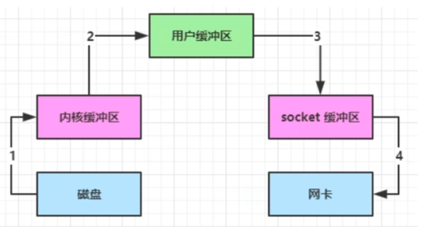
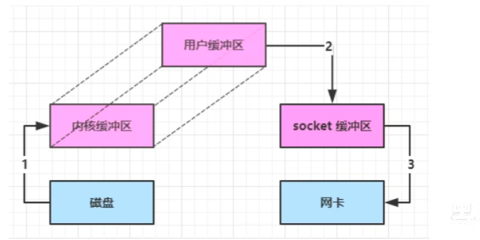
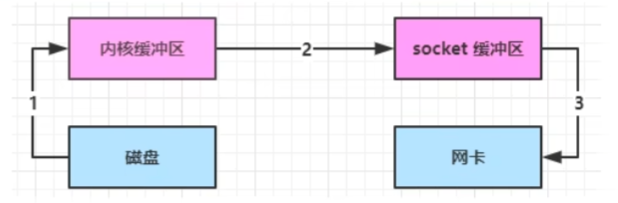
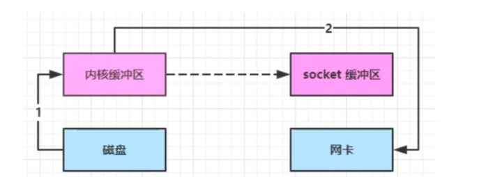
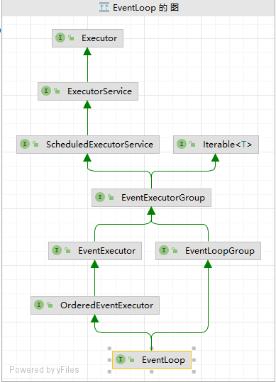

# Netty框架

- ## NIO基础

  - 三大组件
    - channel
      - FileChannel
      - DatagramChannel(UDP)
      - SocketChannel(TCP)
      - ServerSocketChannel(TCP)
    - buffer
    - selector

- ## 文件系统

  - 使用一

    ```java
    public class TestByteBuffer {
    
        public static void main(String[] args) {
            try (FileChannel channel = new FileInputStream(new File("src/main/resources/123.txt")).getChannel()) {
                //创建缓冲区，缓冲区大小为10字节（分配内存）
                ByteBuffer byteBuffer = ByteBuffer.allocate(10);
                //使用信道读取字节流,并向缓冲区中写数据,返回值是读取到的字节流的数量，如果为-1则代表没有读取任何数据
                int readLen=0;
               do{
                   //使用信道读取文件并将数据流写入缓冲区中，返回值是此次读取的字节数量，-1代表没有读取
                   readLen = channel.read(byteBuffer);
                   //缓冲区切换为读模式
                   byteBuffer.flip();
                   //hasRemaining用于返回缓冲区中是否含有未读数据
                   while (byteBuffer.hasRemaining())
                   {
                       //获取缓冲区中的数据，一次一个字节（get方法）
                       System.out.print((char) byteBuffer.get());
                   }
                   System.out.println();
                   //清空缓冲区并切换为写模式
                   byteBuffer.clear();
               }while (readLen!=-1);
    
            } catch (IOException e) {
                e.printStackTrace();
            }
        }
    }
    ```

  - Buffer基本结构

    - 三个重要属性

      - capacity(容量)
    - position(写入指针)
      - limit(写入限制)

  - 信道传输

    ```java
    public class ChannelTransfer {
        public static void main(String[] args) {
            try (
                FileChannel in = new FileInputStream("src/main/resources/123.txt").getChannel();
                FileChannel out = new FileOutputStream("src/main/resources/321.txt").getChannel();
            ) {
                in.transferTo(0,in.size(),out);//返回值为本次传输的字节数
            } catch (IOException e) {
                e.printStackTrace();
            }
        }
    }
    
    ```
  
    - 信道直接传输一次最大2g，可以通过size判断是否传输完成
  
  - Path和Paths
  
    - Paths是获取Path的工具类
  
      ```java
       Path path = Paths.get("src/main/resources/123.txt");
      ```
  
    - Path类中内置许多和文件位置有关的方法，如文件路径正常化，获取上一级目录等方法
  
  - Files
  
    - 工具类，主要使用静态方法
  
      ```java
      Path path = Paths.get("src/main/resources/123.txt");
      Files.exists(path);
      ```
  
    - 含有拷贝方法，创建目录方法，递归遍历某个目录下的所有文件等
  
      ```java
       public static void main(String[] args) throws IOException {
              Path path = Paths.get("src/main");
              Files.walkFileTree(path, new SimpleFileVisitor<>() {
                  @Override
                  public FileVisitResult visitFile(Path file, BasicFileAttributes attrs) throws IOException {
                      System.out.println(file.getFileName());
                      return super.visitFile(file, attrs);
                  }
              });
      
          }
      ```
  
      - FileVisitor中每个方法的返回值是FileVisitResult（枚举类）
  
        ```java
        public enum FileVisitResult {
        
            CONTINUE,//继续访问
        
            TERMINATE,//终止访问
        
            SKIP_SUBTREE,//跳过子树
        
            SKIP_SIBLINGS;//跳过兄弟姐妹
        }
        
        ```
  
      - 除了自己实现FileVisitor之外还可以使用jdk中的实现类SimpleFileVisitor,需要修改的方法自己覆盖就行（建议使用SimpleFileVisitor且不修改其父类调用的返回值）
  
      - 除了walkTree方法还可以使用walk方法只不过用walk会返回一个stream流
  
- ## 网络编程

  - ### 单线程堵塞模式创建服务器

    - 服务器
    
    ```java
    @Slf4j
    public class ServerIO {
    
        public static void main(String[] args) throws IOException {
            ServerSocketChannel socketChannel = ServerSocketChannel.open();
            socketChannel.bind(new InetSocketAddress(8080));
            ArrayList<SocketChannel> channels = new ArrayList<>();
            while (true)
            {
                log.info("waiting for connect...");
                SocketChannel channel = socketChannel.accept();//在这里堵塞线程
                log.info("connect successfully");
                channels.add(channel);
                for (SocketChannel c : channels) {
                    ByteBuffer buffer = ByteBuffer.allocate(16);
                    c.read(buffer);//建立链接后会在read方法堵塞
                    buffer.flip();
                    while (buffer.hasRemaining())
                    {
                        System.out.print((char) buffer.get());
                    }
                    System.out.println();
                }
            }
    
        }
    }
    
    ```
    
    - 客户端
    
    ```java
    public class Client {
        public static void main(String[] args) throws IOException {
            SocketChannel channel = SocketChannel.open();
            channel.connect(new InetSocketAddress("127.0.0.1",8080));
    
            System.out.println("waiting connect....");
        }
    }
    ```
    
    - 这种模式的服务端无法同时服务多个客户端，而且当服务端接受到客户端发送的数据后如果客户端再次发送数据，服务端将无法接受到（会执行下一次循环监听链接）
    
  - ### 单线程非堵塞服务器
  
    - 只需要设置
  
      ```java
      socketChannel.configureBlocking(false);
      ```
  
      设置了非堵塞链接后accept方法将不会堵塞并且如果没有建立链接则返回值为null，read方法也同理（没有数据返回0）
  
  - ### selector模式服务器
  
    - #### 服务器
  
      ```java
      @Slf4j
      public class SelectorServer {
          public static void main(String[] args) throws IOException {
              //创建selector用于管理channel
              Selector selector = Selector.open();
              //创建SocketChannel,设置缓冲区，设置非堵塞
              ServerSocketChannel server = ServerSocketChannel.open();
              ByteBuffer buffer = ByteBuffer.allocate(16);
              server.configureBlocking(false);
              //ServerSocketChannel向selector注册,并获取selectionkey
              SelectionKey selectionKey = server.register(selector, 0, null);
              //绑定accept事件
              selectionKey.interestOps(SelectionKey.OP_ACCEPT);
              server.bind(new InetSocketAddress(8080));
              while (true)
              {
                  //调用select方法监听事件发生,堵塞运行
                  log.info("selector waiting....");
                  selector.select();
                  log.info("selector get Event");
                  //发生事件，获取事件对应的selectionkey
                  Set<SelectionKey> keys = selector.selectedKeys();
                  log.info("keys size {}",keys.size());
                  Iterator<SelectionKey> keyIterator = keys.iterator();
                  while (keyIterator.hasNext())
                  {
                      SelectionKey key = keyIterator.next();
                      log.info("Event Type:{}",key.interestOps());
                      //根据事件类型进行不同的处理
                     if(key.interestOps()==SelectionKey.OP_ACCEPT)
                     {
                         try{
                             //连接类型获取信道
                             ServerSocketChannel channel = (ServerSocketChannel) key.channel();
                             log.info("{} Accept...",channel);
                             //监听
                             SocketChannel socketChannel = channel.accept();
                             //如果连接建立失败则取消执行该任务
                             if (socketChannel==null)
                             {
                                 key.cancel();
                             }
                             else {
                                 //设置监听后获取的连接的堵塞类型
                                 socketChannel.configureBlocking(false);
                                 //注册到selector中
                                 socketChannel.register(selector,SelectionKey.OP_READ,null);
                             }
                         }catch (Exception e)
                         {
                             e.printStackTrace();
                             //发生异常则取消执行
                             key.cancel();
                         }
                     }
                     else if (key.interestOps()==SelectionKey.OP_READ){
                          try
                          {
                              SocketChannel channel = (SocketChannel) key.channel();
                              int read = channel.read(buffer);
                              //如果没有数据可读则取消执行
                              if (read==-1)
                              {
                                  key.cancel();
                              }
                              else {
                                  buffer.flip();
                                  String s = BufferUtil.bufferToString(buffer);
                                  log.info("get message {} from {}",s,channel);
                              }
                          }catch (IOException e)
                          {
                              e.printStackTrace();
                              key.cancel();
                          }
                     }
                     //每次解决之后删除本次活跃的事件
                      keyIterator.remove();
                  }
              }
          }
      }
      
      ```
  
    - #### 客户端
  
      ```java
      public class Client {
          public static void main(String[] args) throws IOException {
              SocketChannel channel = SocketChannel.open();
              ByteBuffer buffer = ByteBuffer.allocate(16);
              try (FileChannel fileChannel = new FileInputStream("src/main/resources/123.txt").getChannel()) {
                  int read = fileChannel.read(buffer);
                  System.out.println("waiting connect....");
                  if (channel.connect(new InetSocketAddress("127.0.0.1",8080))) {
                      System.out.println("connect successfully");
                      buffer.flip();
                      channel.write(buffer);
                  }
              }catch (Exception e)
              {
                  e.printStackTrace();
              }
          }
      }
      
      ```
  
    - #### 常用方法
  
      - cancel方法（selectionkey）
  
        ```java
        key.cancel();
        ```
  
        如果发生了事件但是不处理则下次selector仍然会将该连接视为活跃连接（不在select堵塞），如果不打算处理该selectKey对应的事件应该使用cancel方法
  
    - #### selectedKeys集合元素手动删除
  
      - 在selector的selectedKeys返回的集合中不会主动删除key只会增加key，如果当key建立连接的channel执行玩任务后再次发生事件则会再次进入到建立连接的代码块中，者可能会产生异常，所以需要手动删除已经执行过的key
  
    - #### 异常处理
  
      - 如果不行进行异常处理则如果客户端的正常关闭和异常关闭都会导致服务端异常从而导致服务端程序停止
  
    - #### 消息边界问题
  
      - 目前的消息处理 
  
        ```java
        
        try
        {
            SocketChannel channel = (SocketChannel) key.channel();
            int read = channel.read(buffer);
            //如果没有数据可读则取消执行
            if (read==-1)
            {
                key.cancel();
            }
            else {
                buffer.flip();
                String s = BufferUtil.bufferToString(buffer);
                log.info("get message {} from {}",s,channel);
            }
        }catch (IOException e)
        {
            e.printStackTrace();
            key.cancel();
        }
        
        //处理Buffer的代码
        public static String bufferToString(ByteBuffer buffer)
        {
            StringBuilder stringBuffer = new StringBuilder();
            while (buffer.hasRemaining())
            {
                stringBuffer.append((char) buffer.get());
            }
            buffer.clear();
            return stringBuffer.toString();
        }
        ```
  
        - 问题一：如果数据一次读取不能完全读取可能会导致中文乱码问题，而且在消息长度不确定的情况下可能会出现半包和黏包的现象
        - 问题二：buffer如果为局部变量则出现半包现象会导致消息的丢失，如果buffer为全局变量对于多个Channel并不友好
  
      - ##### 问题一：解决方法
  
        - 固定最大消息长度
          - 缺点：浪费空间
        - 分割符分割方法
          - 缺点：效率低
  
        - TLV方式
          - 固定长度的字段用于指示后续消息长度，TLV主要是，类型，长度，数据
  
      - ##### 问题二：解决方法
  
        - 附件
          - 在selector注册时第三个参数可以作为附件与每个key相关联
  
      - ##### 改进
  
        - 读取Key注册
  
          ```java
          //创建附件
          ByteBuffer buffer = ByteBuffer.allocate(4);
          //设置监听后获取的连接的堵塞类型
          socketChannel.configureBlocking(false);
          //注册到selector中
          socketChannel.register(selector,SelectionKey.OP_READ,buffer);
          ```
  
        - 获取buffer
  
          ```java
          ByteBuffer buffer = (ByteBuffer) key.attachment();
          ```
  
        - 消息获取
  
          ```java
          public static String getMessgaeFromKey(SelectionKey key) throws IOException {
              SocketChannel channel = (SocketChannel) key.channel();
              ByteBuffer buffer = (ByteBuffer) key.attachment();
              int read = channel.read(buffer);
              if (read==-1)//无消息刻度
              {
                  key.cancel();
                  return "";
              }
              buffer.flip();
              StringBuilder s=new StringBuilder();
              while (buffer.hasRemaining())//读取并查看是否有\n
              {
                  char c = (char) buffer.get();
                  s.append(c);
                  if (c=='\n')
                  {
                      break;
                  }
              }
          
              if(s.toString().contains("\n"))//如果有\n代表已经读取了一条完整的消息
              {
                  buffer.compact();
              }
              else if (buffer.limit()==buffer.capacity())//没有\n且容量不足需要扩容
              {
                  ByteBuffer allocate = ByteBuffer.allocate(buffer.capacity() * 2);
                  allocate.put(StandardCharsets.UTF_8.encode(s.toString()));
                  key.attach(allocate);
              }
              return s.toString().endsWith("\n") ?  s.toString() : "";//返回获取的第一条消息（如果有\n则代表已经获取到了没有则代表还没读取完成）
          }
          ```
          
      
    - #### 多线程读取服务端
    
      - 服务端(监听线程，主线程)
    
        ```java
        @Slf4j
        public class ThreadServer {
        
        
            public static void main(String[] args) throws IOException {
                ServerSocketChannel channel = ServerSocketChannel.open();
                Selector selector = Selector.open();
                channel.configureBlocking(false);
                channel.bind(new InetSocketAddress(8080));
                channel.register(selector, SelectionKey.OP_ACCEPT,null);
        
                while (true)
                {
                    log.info("ThreadServer wait....");
                    selector.select();
                    Iterator<SelectionKey> keyIterator = selector.selectedKeys().iterator();
        
                    while (keyIterator.hasNext())
                    {
                        SelectionKey key = keyIterator.next();
                        log.info("ThreadServer get Connect");
                        if (key.isAcceptable())
                        {
                            ServerSocketChannel server = (ServerSocketChannel) key.channel();
                            SocketChannel socketChannel = server.accept();
                            if (socketChannel==null)
                            {
                                key.cancel();
                                continue;
                            }
                            log.info("ThreadServer get Channel : {}",socketChannel);
                            ReadThreader threader = new ReadThreader(socketChannel);
                            threader.setName("Read-worker-01");
                            threader.start();
        
                        }
                        keyIterator.remove();
                    }
                }
            }
        }
        
        ```
    
      - 工作线程（读线程）
    
        ```java
        
        @Slf4j
        public class ReadThreader extends Thread {
        
        
            public final Selector selector;
        
        
            public ReadThreader(SocketChannel socketChannel) throws IOException {
                selector=Selector.open();
                socketChannel.configureBlocking(false);
                ByteBuffer buffer=ByteBuffer.allocate(256);
                socketChannel.register(selector, SelectionKey.OP_READ,buffer);
            }
        
            @Override
            public void run() {
                log.info("ReaderThread start accept......");
                while (true)
                {
                    try {
                        selector.select();
                        Iterator<SelectionKey> keyIterator = selector.selectedKeys().iterator();
                        while (keyIterator.hasNext())
                        {
                            SelectionKey key = keyIterator.next();
                            log.info("ReaderThread get Event......");
                            if (key.isReadable())
                            {
                                try{
                                    String messgae = BufferUtil.getMessgaeFromKey(key);
                                    if (!"".equals(messgae))
                                    {
                                        log.info("get message : {} from {}",messgae,key.channel());
                                    }
                                }catch (Exception e){
                                    e.printStackTrace();
                                    key.cancel();
                                }
                            }
                            keyIterator.remove();
                        }
        
                    } catch (IOException e) {
                        throw new RuntimeException(e);
                    }
                }
            }
        }
        
        ```
    
      - 客户端
    
        ```java
        public class Client02 {
            public static void main(String[] args) throws IOException, InterruptedException {
                SocketChannel channel = SocketChannel.open();
                String[] message=new String[]{"1234","hello","fuck you"};
        
                if (channel.connect(new InetSocketAddress("127.0.0.1",8080))) {
                    StringBuilder sb=new StringBuilder();
                    for (String s : message) {
                        sb.append(s+'\n');
                    }
                    ByteBuffer buffer = StandardCharsets.UTF_8.encode(sb.toString());
                    sleep(10000);
                    channel.write(buffer);
                    channel.shutdownOutput();
                }
            }
        }
        ```
    
    - #### Stream和Channel
    
      - stream不会自动缓冲数据，channel会利用系统的缓存缓冲数据
      - stream仅支持堵塞API,channel支持堵塞和非堵塞
      - 两者都是全双工
    
    - #### IO模型
    
      - 堵塞IO
      - 非堵塞IO
      - 多路复用
      - 信号驱动
      - 异步IO
    
    - #### NIO和BIO区别
    
      - BIO
    
        
    
      - NIO
    
        ​	
    
      - ByteBuffer的分配内存方式
    
        - allocate（分配Java堆内存）
        - allocateDirect(直接分配内存空间)
    
      - TransferTo(信道之间的直接传输)
    
        - linux2.4之前
    
        
    
        - linux2.4之后（实现零拷贝）
    
          
    
          - 使用DMA传输数据（几乎无需CPU），只有少量的数据需要通过内核缓冲区传输给socket缓冲区（信息长度等）
    
    - #### 异步Channel使用
    
      ```java
      @Slf4j
      public class AsyFileReader {
          private static boolean finished=false;
          public static void main(String[] args) {
              Path path = Paths.get("src/main/resources/123.txt");
              try (AsynchronousFileChannel channel = AsynchronousFileChannel.open(path, StandardOpenOption.READ)) {
                  ByteBuffer buffer = ByteBuffer.allocate(256);
                  log.info("start reading...");
                  channel.read(buffer, 0, buffer, new CompletionHandler<Integer, ByteBuffer>() {
                      @Override//读取完成后的回调方法
                      public void completed(Integer result, ByteBuffer attachment) {
                          log.info("read completed....");
                          attachment.flip();
                          log.info("get message : {}",BufferUtil.bufferToString(buffer));
                          buffer.compact();
                          finished=true;
                      }
      
                      @Override//读取失败后的回调方法
                      public void failed(Throwable exc, ByteBuffer attachment) {
                          exc.printStackTrace();
                      }
                  });
      
                  while (!finished)//主线程开始等待IO读取线程的读取完成
                  {
                      log.info("waiting IO Result...");
                      sleep(1000);
                  }
              } catch (IOException e) {
                  e.printStackTrace();
              } catch (InterruptedException e) {
                  throw new RuntimeException(e);
              }
      
          }
      }
      
      ```
  
  ------------------------

- ## Netty入门

  - 概述

    - 异步（并不是异步IO），基于事件驱动的网络应用框架
    - 基于NIO（）
      - 相比于原生NIO，NIO需要自己构建协议，解决TCP传输问题（半包和黏包），epoll空轮询导致CPU空转100%，对API增强

  - ### 入门案例

    - 服务端

      ```java
      @Slf4j
      public class HelloNettyServer {
          public static void main(String[] args) {
              //创建服务器启动器（主要用于添加其他组件，相当于一个容器）
              new ServerBootstrap()
                  //添加group,其中包含了线程创建工厂，线程池、selector创建相关等基础类
                  .group(new NioEventLoopGroup())
                  //设置服务器ServerSocketChannel的实现类，NioServerSocketChannel是NIO方式实现，除此之外还有Epoll模式的实现，OIO(BIO)模式实现等
                  .channel(NioServerSocketChannel.class)
                  //添加worker线程的配置（类似于之前的多线程读取）
                  .childHandler(
                  //初始化对应的worker
                  new ChannelInitializer<NioSocketChannel>() {
                      @Override
                      protected void initChannel(NioSocketChannel nioSocketChannel) throws Exception {
                          //添加String解码器（字节流转String）
                          nioSocketChannel.pipeline().addLast(new StringDecoder());
                          //添加worker线程的的处理过程
                          nioSocketChannel.pipeline().addLast(
                              new ChannelInboundHandlerAdapter() {
                                  @Override//打印转换完成的数据信息
                                  public void channelRead(ChannelHandlerContext ctx, Object msg) throws Exception {
                                      log.info("get messgae : {}",msg);
                                  }
                              }
                          );
                      }
                  }
              )//绑定端口
                  .bind(8080);
          }
      }
      
      ```

    - 客户端

      ```java
      @Slf4j
      public class HelloNettyClient {
          public static void main(String[] args) throws InterruptedException {
              //创建启动器
              new Bootstrap()
                  ////添加group,其中包含了线程创建工厂，线程池、selector创建相关等基础类
                  .group(new NioEventLoopGroup())
                  //选择信道实现类
                  .channel(NioSocketChannel.class)
                  //添加客户端处理器(在连接创建时调用方法)
                  .handler(new ChannelInitializer<NioSocketChannel>() {
                      @Override
                      protected void initChannel(NioSocketChannel nioSocketChannel) throws Exception {
                          //字符串编码器添加
                          nioSocketChannel.pipeline().addLast(new StringEncoder());
                      }
                  })
                  //连接到服务器
                  .connect("127.0.0.1",8080)
                  //设置同步
                  .sync()
                  .channel()
                  //向信道中写入数据
                  .writeAndFlush("hello,Netty");
      
          }
      }
      ```

    - 流程分析（大概）

      - 服务端

        - （1）服务端创建启动器

        - （2）创建selector，线程池等

        - （3）创建ServerSocketChannel

        - （4）设置请求接受的处理器的初始化器

        - （5）绑定端口

        - （6）监听端口

        - （7）连接建立成功，调用处理器中的initChannel方法初始化处理器

        - （8）等待事件发生

        - （9）事件发生，调用对应处理器方法

      - 客户端

        - （1）客户端启动器
        - （2）创建selector，线程池等
        - （3）创建SocketChannel
        - （4）添加处理器初始化器
        - （5）连接到服务器，并调用sync方法同步堵塞直到连接建立
        - （6）连接建立，通过调用初始化器初始化处理器
        - （7）处理器发送数据（造成服务端读事件发生）

    - 步骤分析

      - 服务端

        - group方法

          创建线程设置子线程

        - channel方法

          创建NioServerSocketChannel的工厂类

        - childHandler

          设置childHandler属性值

        - 实现ChannelInitializer的initChannel方法

          向NioSocketChannel中的pipeline添加处理器（ChannelHandler），pipeline相当于Channel的包装类，除了Channel之外还包含了许多处理器（ChannelHandler）

    - Handler处理器

      - inbound为入站（读入数据）
      - outbound为出站（写出数据）
    
    - Eventloop
    
      - 每个Channel只和一个Eventloop绑定，但是一个Eventloop可以监听多个Channel
      - Eventloop即可以执行IO也可以执行其他任务，如定时任务
      - Eventloop按照Handler顺序执行IO操作，但是每一个pipeline的不同步骤可以指定不同的Eventloop
    
  - ### EventLoop解析
  
    - 源码
  
      ```java
      public interface EventLoop extends OrderedEventExecutor, EventLoopGroup {
          @Override
          EventLoopGroup parent();
      }
      ```
  
    - 继承类图
  
      
  
      - 其中Executor和ExecutorService和ScheduledExecutorService都是JDK中的类
  
        - Executor为一个简单的线程执行者
        - ExecutorService是一个简单的线程池
        - ScheduledExecutorService是ExecutorService的扩展
  
      - 以下是EventLoopGroup的定义
  
        ```java
        public interface EventExecutorGroup extends ScheduledExecutorService, Iterable<EventExecutor> 
        //EventExecutor定义
        public interface EventExecutor extends EventExecutorGroup 
        ```
  
        - EventLoopGroup中包含了多个EventLoop，同时EventLoop本质是一个单线程执行器（同时维护了一个Selector），可以使用boolean inEventLoop(Thread thread)判断一个线程是否属于该EventLoop，parent方法可以查看EventLoop的所属EventLoopGroup
        - Channel一般会调用EventLoopGroup的register方法来绑定其中一个EventLoop
        - Iterable接口保证EventExecutorGroup可以遍历所属的EventLoop
  
      - 在NioEventLoop中的run方法中调用了selector的select方法和执行任务队列中的任务
  
    - #### 基本使用
  
      - 创建
  
      ```java
      //NioEventLoopGroup可处理IO事件，普通任务，定时任务
      EventLoopGroup group=new NioEventLoopGroup();
      //只能处理普通任务和定时任务
      EventLoopGroup group2=new DefaultEventLoopGroup();
      ```
  
      - NioEventLoopGroup构造方法源码查看
  
        ```java
        public NioEventLoopGroup() {
            this(0);//0代表所需线程数量
        }
        //经过若干和构造方法调用，最终到达MultithreadEventLoopGroup的构造方法
        protected MultithreadEventLoopGroup(int nThreads, Executor executor, Object... args) {
            super(nThreads == 0 ? DEFAULT_EVENT_LOOP_THREADS : nThreads, executor, args);//如果所需线程数量为0则取DEFAULT_EVENT_LOOP_THREADS
        }
        //DEFAULT_EVENT_LOOP_THREADS的由来
        private static final int DEFAULT_EVENT_LOOP_THREADS;
        
        static {
            DEFAULT_EVENT_LOOP_THREADS = Math.max(1, SystemPropertyUtil.getInt(
                "io.netty.eventLoopThreads", NettyRuntime.availableProcessors() * 2));//从系统参数（io.netty.eventLoopThreads）和主机电脑CPU核心支持的线程数量*2中取最大值
        
            if (logger.isDebugEnabled()) {
                logger.debug("-Dio.netty.eventLoopThreads: {}", DEFAULT_EVENT_LOOP_THREADS);
            }
        }
        ```
  
      - 获取NioEventLoop
  
        ```java
        EventLoopGroup group=new NioEventLoopGroup(2);//限制EventLoopGroup数量（同时也是线程数量）
        while (true)
        {
            System.out.println(group.next());
        }
        最终输出
            io.netty.channel.nio.NioEventLoop@7fa98a66
            io.netty.channel.nio.NioEventLoop@1a451d4d
            io.netty.channel.nio.NioEventLoop@7fa98a66
            io.netty.channel.nio.NioEventLoop@1a451d4d
        ```
  
        - 会发现在不断的循环(1->2->1->2)
  
      - 执行普通任务
  
        ```java
        group.next().submit(new Runnable() {
            @Override
            public void run() {
                log.info("这是一个普通任务");
            }
        });
        //以下这种也行
        group.next().execute(new Runnable() {
            @Override
            public void run() {
                log.info("这是一个普通任务");
            }
        });
        //最终打印结果 INFO [nioEventLoopGroup-2-1] (EventLoopTest.java:19) - 这是一个普通任务
        ```
  
      - 执行定时任务
  
        ```java
        //第一个参数是Runnable,第二个参数是执行延迟（多久之后执行），第三个是周期，第四个是时间单位
        group.next().scheduleAtFixedRate(new Runnable() {
            @Override
            public void run() {
                log.info("这是一个普通任务");
            }
        },1,2, TimeUnit.SECONDS);
        ```
  
      - 执行IO任务
  
        ```java
        @Slf4j
        public class EventLoopIOTask {
            public static void main(String[] args) {
                new ServerBootstrap()
                    .group(new NioEventLoopGroup())
                    .channel(NioServerSocketChannel.class)
                    .childHandler(new ChannelInitializer<NioSocketChannel>() {
                        @Override
                        protected void initChannel(NioSocketChannel ch) throws Exception {
                            ch.pipeline().addLast(new ChannelInboundHandlerAdapter() {
                                @Override
                                public void channelRead(ChannelHandlerContext ctx, Object msg) throws Exception {
                                    ByteBuf buffer= (ByteBuf) msg;
                                    log.info("get Message {}",buffer.toString(StandardCharsets.UTF_8));
                                }
                            });
                        }
                    }).bind(8080);
            }
        }
        ```
  
        - 如果启动多个Client，会发现EventLoop按照轮询接受请求
  
      - Netty建议使用一个Group负责接受accept请求，而子group负责接受read或者write操作
  
        - 服务端
  
          ```java
          @Slf4j
          public class NettySuggestion {
              public static void main(String[] args) {
                  EventLoopGroup group= new DefaultEventLoopGroup();
                  new ServerBootstrap()
                      //第一个参数为父Group，第二个为子group
                      .group(new NioEventLoopGroup(1),new NioEventLoopGroup(2))
                      .channel(NioServerSocketChannel.class)
                      .childHandler(new ChannelInitializer<NioSocketChannel>() {
                          @Override
                          protected void initChannel(NioSocketChannel ch) throws Exception {
                              log.info("get Connection : {}",ch);
                              ch.pipeline().addLast("handler1",new ChannelInboundHandlerAdapter() {
                                  @Override
                                  public void channelRead(ChannelHandlerContext ctx, Object msg) throws Exception {
                                      ByteBuf buffer= (ByteBuf) msg;
                                      log.info("this is handler 1");
                                      log.info("context : {}",ctx);
                                      //将消息传递给下一个Handler
                                      ctx.fireChannelRead(((ByteBuf) msg).toString(StandardCharsets.UTF_8));
                                  }
                              }).addLast(group,"handler2",new ChannelInboundHandlerAdapter(){
                                  @Override
                                  public void channelRead(ChannelHandlerContext ctx, Object msg) throws Exception {
                                      log.info("this is handler2...");
                                      log.info("context : {}",ctx);
                                      log.info("a long time....");
                                      log.info("get message : {}",msg);
                                  }
                              });
                          }
                      }).bind(8080);
              }
          }
          
          ```
          
          - 初次之外，如果有需要占用较长时间的任务可以新建一个DefaultEventLoopGroup用于执行
          
          - Handler指定Group执行任务(fireChannelRead方法源码，该方法由AbstractChannelHandlerContext实现)
          
            ```java
            @Override
            public ChannelHandlerContext fireChannelRead(final Object msg) {
                invokeChannelRead(findContextInbound(MASK_CHANNEL_READ), msg);
                return this;
            }
            //invokeChannelRead方法
            static void invokeChannelRead(final AbstractChannelHandlerContext next, Object msg) {
                final Object m = next.pipeline.touch(ObjectUtil.checkNotNull(msg, "msg"), next);
                //获取下一个EventExecutor（EventLoop）
                EventExecutor executor = next.executor();
                //inEventLoop方法用于判断执行invokeChannelRead的线程和next.executor()获取的线程是否是同一个线程
                if (executor.inEventLoop()) {
                    //如果是同一个线程则在当前线程执行invokeChannelRead
                    next.invokeChannelRead(m);
                } else {
                    //不是同一个线程则通过next.executor()执行invokeChannelRead方法
                    executor.execute(new Runnable() {
                        @Override
                        public void run() {
                            next.invokeChannelRead(m);
                        }
                    });
                }
            }
            ```
    
  - ### Channel解析
  
    - 主要方法使用
  
      - write方法和writeAndFlush方法
  
        - 区别
  
          write方法写入数据后并不会直接发送，会根据条件发送数据（如果想要发送时需要调用Flush方法），writeAndFlush会立刻发送数据
  
      - ChannelFuture对象
  
        - 执行Connect方法后返回一个ChannelFuture，之后执行了同步方法后同样返回了一个ChannelFuture对象，可以通过ChannelFuture的channel方法返回channel
  
        - 如果不执行同步方法则服务端无法接受到数据
  
          - 原因
  
            - connect方法本质是异步非堵塞方法，调用connect方法的是主线程而执行连接的是EventLoop线程
  
              ```java
               INFO [nioEventLoopGroup-2-1] (HelloNettyClient.java:27) - connect successfully....
              ```
  
            - sync方法内部调用了wait等堵塞方法，也就是主线程在执行了connect异步非堵塞方法后本该继续向下运行但是在sync中堵塞直到连接建立成功
  
            - sync方法和以下代码类似
  
              ```java
              
              public static boolean isConnected=false;//成员变量
              
              while (!isConnected)
              {
                  log.info("wait for NIO thread connect....");
                  sleep(1000);
              }
              connect.channel().writeAndFlush("你好,Netty");
              ```
  
        - 获取异步处理结果
  
          - 使用addListener(回调对象)
  
            ```java
            ChannelFuture future = connect.addListener(new ChannelFutureListener() {
                @Override
                public void operationComplete(ChannelFuture future) throws Exception {
                    log.info("Client connect build successfully...");
                    future.channel().writeAndFlush("你好,Netty");
                }
            });
            log.info("keep going...");
            //结果输出
             INFO [main] (HelloNettyClient.java:44) - keep going...
             INFO [nioEventLoopGroup-2-1] (HelloNettyClient.java:27) - connect successfully....
             INFO [nioEventLoopGroup-2-1] (HelloNettyClient.java:40) - Client connect build successfully...
            
            ```
  
        - 日志Handler添加
        
          ```java
          //以下是服务端的添加，客户端的相同
          @Override
          protected void initChannel(NioSocketChannel ch) throws Exception {
              log.info("connect successfully...{}",ch.pipeline().channel());
              ch.pipeline().addLast(new LoggingHandler(LogLevel.INFO));
              ch.pipeline().addLast(new StringDecoder());
              ch.pipeline().addLast(new ChannelInboundHandlerAdapter(){
                  @Override
                  public void channelRead(ChannelHandlerContext ctx, Object msg) throws Exception {
                      log.info("get message {}",msg);
                  }
              });
          }
          //日志效果
          [nioEventLoopGroup-3-1hread][INFO ][2022-11-09 15:10:34][NettyTest.Section03.logginServer$1.initChannel(logginServer.java:24)]connect successfully...[id: 0xb285a301, L:/127.0.0.1:8080 - R:/127.0.0.1:8296]
          [nioEventLoopGroup-3-1hread][INFO ][2022-11-09 15:10:34][io.netty.util.internal.logging.AbstractInternalLogger.log(AbstractInternalLogger.java:148)][id: 0xb285a301, L:/127.0.0.1:8080 - R:/127.0.0.1:8296] REGISTERED
          [nioEventLoopGroup-3-1hread][INFO ][2022-11-09 15:10:34][io.netty.util.internal.logging.AbstractInternalLogger.log(AbstractInternalLogger.java:148)][id: 0xb285a301, L:/127.0.0.1:8080 - R:/127.0.0.1:8296] ACTIVE
          [nioEventLoopGroup-3-1hread][INFO ][2022-11-09 15:10:39][io.netty.util.internal.logging.AbstractInternalLogger.log(AbstractInternalLogger.java:148)][id: 0xb285a301, L:/127.0.0.1:8080 - R:/127.0.0.1:8296] READ: 3B
                   +-------------------------------------------------+
                   |  0  1  2  3  4  5  6  7  8  9  a  b  c  d  e  f |
          +--------+-------------------------------------------------+----------------+
          |00000000| 31 32 33                                        |123             |
          +--------+-------------------------------------------------+----------------+
          [nioEventLoopGroup-3-1hread][INFO ][2022-11-09 15:10:39][NettyTest.Section03.logginServer$1$1.channelRead(logginServer.java:30)]get message 123
          [nioEventLoopGroup-3-1hread][INFO ][2022-11-09 15:10:39][io.netty.util.internal.logging.AbstractInternalLogger.log(AbstractInternalLogger.java:148)][id: 0xb285a301, L:/127.0.0.1:8080 - R:/127.0.0.1:8296] READ COMPLETE
          
          ```
        
        - 信道关闭
        
          - 同步关闭
        
            ```java
            new Thread(()->{
                Scanner scanner = new Scanner(System.in);
                while (scanner.hasNext())
                {
                    String s = scanner.next();
                    if ("Q".equals(s))
                    {
                        break;
                    }
                    channel.writeAndFlush(s);
                }
                channel.close();
            }).start();
            ChannelFuture closeFuture = channel.closeFuture();
            closeFuture.sync();//同步堵塞直到close方法执行后
            log.info("资源释放...");
            //正常关闭，先拒绝新任务，再处理没有处理完成的任务
            group.shutdownGracefully();
            ```
        
          - 异步关闭
        
            ```java
            ChannelFuture channelFuture = channel.closeFuture();
            channelFuture.addListener(new ChannelFutureListener() {
                @Override
                public void operationComplete(ChannelFuture future) throws Exception {
                    log.info("资源释放...");
                    //正常关闭，先拒绝新任务，再处理没有处理完成的任务
                    group.shutdownGracefully();
                }
            });
            ```
        
            - shutdownGracefully方法会结束掉客户端所有进程（正常结束）

