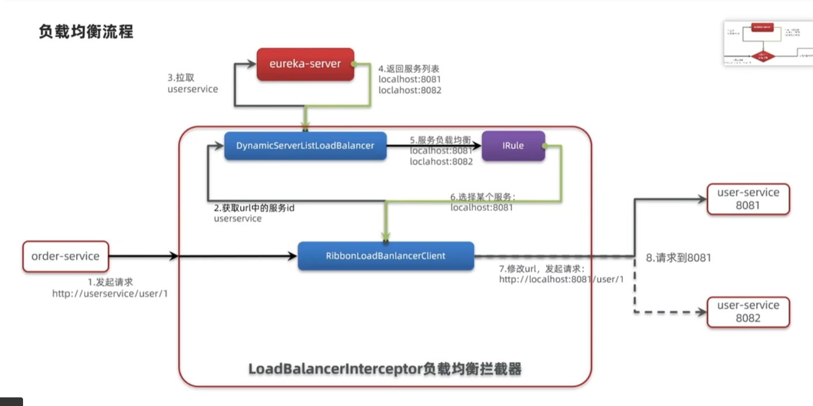
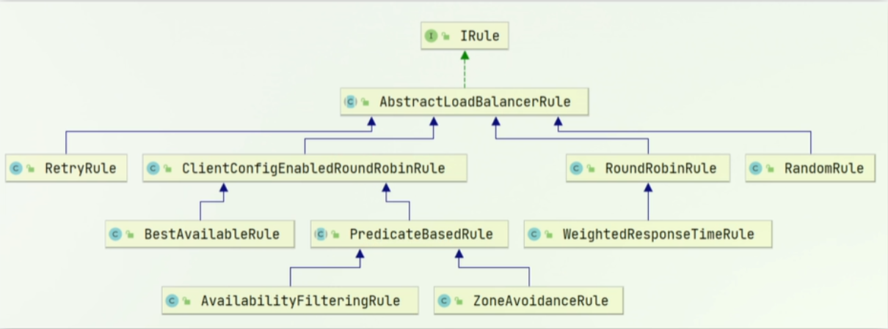
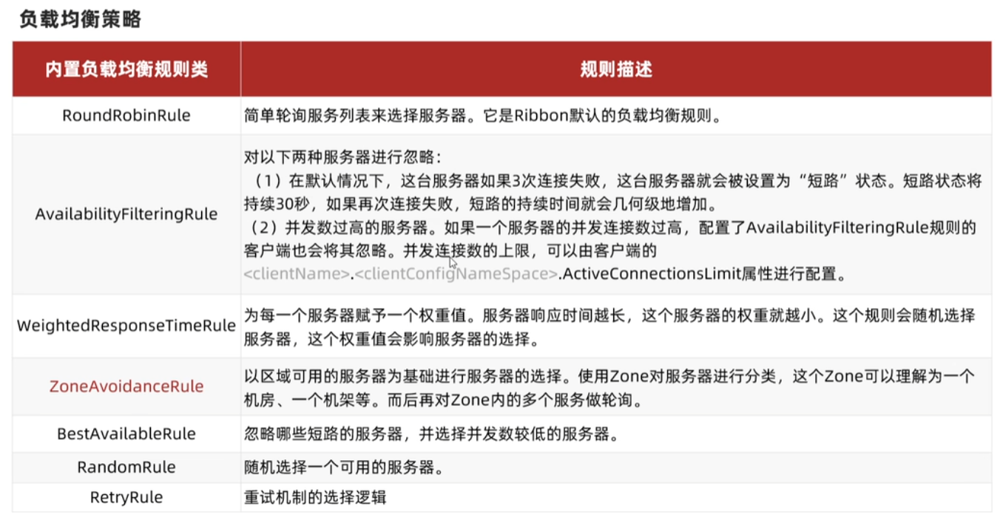
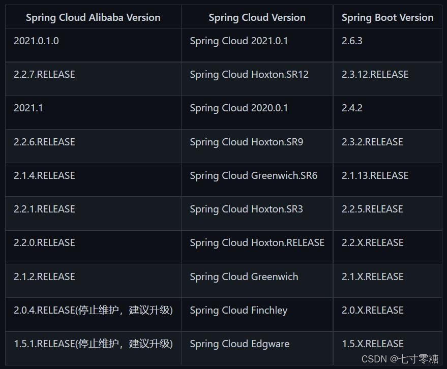
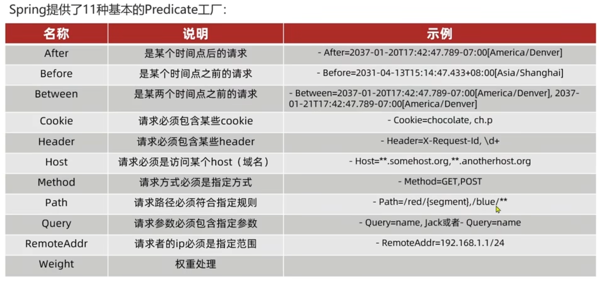

# SpringCloud

- ## 微服务

  - 将单一功能做成一个Springboot项目

  - 不同服务之间通过Http请求互相调用

    - 通过RestTemplate进行远程调用

      ```java
      String url="http://localhost:8081/user/"+userId;
      TbUser user = restTemplate.getForObject(url, TbUser.class);
      ```
    
  - ### 基本概念
  
    - 服务提供者
      - 在一次业务中被其他微服务调用的服务
    - 服务消费者
      - 在一次业务中调用的其他微服务的服务
  
- ## Eureka注册中心

  - ### 直接的远程调用存在的问题

    - 服务消费者如何知道服务提供者的地址信息
    - 如果由多个服务提供者，消费者应该如何选择
    - 消费者如何得知服务提供者的健康状态

  - ### Eureka基本概念

    - Eureka注册中心
      - 记录客户端服务信息
      - 定时检测服务状态
    - Eureka客户端
      - 消费者
        - 从注册中心寻找提供者
      - 提供者
        - 启动时向Eureka发送自己的服务信息

  - ### Eureka搭建

    - 创建一个新模块EurekaServer

      ```java
      
      @SpringBootApplication
      @EnableEurekaServer//开启EurekaServer服务
      public class EurekaServerApplication {
      
          public static void main(String[] args) {
              SpringApplication.run(EurekaServerApplication.class, args);
          }
      
      }
      
      ```

    - 主工程添加Springcloud依赖

      ```xml
      <properties>
          <java.version>1.8</java.version>
          <project.build.sourceEncoding>UTF-8</project.build.sourceEncoding>
          <project.reporting.outputEncoding>UTF-8</project.reporting.outputEncoding>
          <spring-boot.version>2.3.7.RELEASE</spring-boot.version>
          <spring-cloud.version>Hoxton.SR12</spring-cloud.version>
      </properties>
      
      
      <dependency>
          <groupId>org.springframework.cloud</groupId>
          <artifactId>spring-cloud-dependencies</artifactId>
          <version>${spring-cloud.version}</version>
          <type>pom</type>
          <scope>import</scope>
      </dependency>
      ```

      - 这里要注意springboot版本和cloud版本的兼容性
      - 版本对应https://blog.csdn.net/segegefe/article/details/125244457

    - 添加Eureka依赖

      ```xml
      <dependency>
          <groupId>org.springframework.cloud</groupId>
          <artifactId>spring-cloud-starter-netflix-eureka-client</artifactId>
      </dependency>
      ```

    - 配置Eureka

      ```yaml
      server:
        port: 8761
      spring:
        application:
          name: EurekaServer
      eureka:
        client:
          service-url:
            dafault-Zone: http://localhost:8761/eureka
      #注意以下两个配置需要添加否则启动报错，具体原因可参考#https://blog.csdn.net/qq_46444216/article/details/121621233中的评论
      #虽然报错但是并不影响使用
          register-with-eureka: false # 表示自己就是注册中心，不用注册自己
          fetch-registry: false # 表示自己就是注册中心，不用去注册中心获取其他服务的地址
      ```

      - Eureka会将自己作为一个微服务注册到Eureka中（可以通过配置取消）

  - ### Eureka服务注册

    - 在需要注册服务的模块中添加Eureka客户端依赖

    ```xml
    <!-- https://mvnrepository.com/artifact/org.springframework.cloud/spring-cloud-starter-netflix-eureka-client -->
    <dependency>
        <groupId>org.springframework.cloud</groupId>
        <artifactId>spring-cloud-starter-netflix-eureka-client</artifactId>
    </dependency>
    
    ```

    - 在需要注册的模块中添加配置文件

      ```yaml
      
      spring:
        application:
          name: orderServer
      eureka:
        client:
          service-url:
            dafault-Zone: http://localhost:8761/eureka
      ```

  - ### Eureka服务拉取

    - 在RestTemplate的注入方法上添加注解@LoadBalanced,为服务做负载均衡

      ```java
      @Bean
      @LoadBalanced
      public RestTemplate getRestTemple()
      {
          return new RestTemplate();
      }
      ```

      - @LoadBalanced实现负载均衡具体原理可看https://blog.csdn.net/zero__007/article/details/83720972?utm_medium=distribute.pc_relevant.none-task-blog-2~default~baidujs_baidulandingword~default-0-83720972-blog-109227929.t5_layer_eslanding_s_randoms&spm=1001.2101.3001.4242.1&utm_relevant_index=3

    - 使用RestTemplate发起请求

      ```java
      String url="http://UserServer:8081/user/"+userId;
      TbUser user = restTemplate.getForObject(url, TbUser.class);
      ```

  - ### Ribbon负载均衡
  
    - Eureka的负载均衡主要由Ribbon实现
  
    - #### 原理
  
      - 消费者提供URL向Ribbon发起请求
  
        ```java
        String url="http://UserServer:8081/user/"+userId;
        ```
  
        - @LoadBalanced标记该RestTemplate发起的http请求将被Ribbon拦截，拦截的具体动作由一个LoadBalancerInterceptor拦截器拦截
        - 拦截器截取url中的服务名称并在Eureka中查找（将服务名称发送给）
        - RibbonLoadBalancerClient根据具体的负载均衡策略进行负载均衡
  
      - Ribbon通过URL在Eureka服务中心里查找具体服务
  
      - Eureka服务中心返回服务列表，Ribbon再次发起请求
  
        
  
      - ##### IRule接口（负载均衡策略）（已废弃）
  
        - https://ask.csdn.net/questions/7718783（之后不再使用IRule接口）
  
        
  
        - 具体作用参加下表
  
          
  
        - 调整负载均衡策略
  
          - 方法一：添加一个IRule的bean
        
            ```java
            @Bean
            public IRule changeIRule()
            {
                return new RandomRule();
            }
            ```
  
          - 方法二：通过配置文件形式
        
            ```yaml
            #userservice是服务名称
            userservice:
            	ribbon:
            		NFLoadBalancerRuleClassName: com.netflix.loadbalancer.RandomRule
            ```
  
    - #### 懒加载
  
      - Ribbon默认采用懒加载，第一次访问才会去创建LoadBalanceClient，请求时间会较长
  
      - 通过配置文件可以设置饥饿加载从而降低第一次访问的耗时
    
        ```yaml
        ribbon: 
        	eager-load:
        		enabled: true #开启饥饿加载
        		clients: userservice #指定饥饿加载的服务
        ```
  
- ## Nacos注册中心

  - 阿里巴巴的产品，是一个springcloud组件，在国内较受欢迎，功能比Eureka更加全面

  - ### Nacos安装与配置（Linux）

    - 安装Maven

    - 安装JDK

      - 在配置JDK环境时如果在/etc/profile文件中配置无效的话可以在~/bashrc中配置

    - 安装Mysql

      - 这里建议安装5.7，不需要8，8太麻烦

    - 安装Nacos（直接从官网下载后解压缩即可）
    
      - Nacos版本和springboot、springcloud、springcloudalibaba版本同样有联系，需谨慎选择
    
    - 启动Nacos(切换到Nacos的bin目录下)
    
      ```shell
      sh startup.sh -m standalone
      ```
      
    - 启动后通过浏览器访问nacos页面
    
      ```url
      http://192.168.10.10/nacos/index.html
      ```
    
    - 具体教程https://blog.csdn.net/qq_46112274/article/details/123117926
    
    - 登录默认密码和账号为nacos
    
  - ### Nacos服务注册

    - 在springcloud commons中定义了服务注册和发现相关的接口，nacos同样实现了这些接口

    - 添加springcloud alibaba依赖

      - 版本对应图

        

      - 注释掉Eureka-client依赖并添加nacos客户端依赖

        ```xml
        <dependency>
            <groupId>com.alibaba.cloud</groupId>
            <artifactId>spring-cloud-starter-alibaba-nacos-discovery</artifactId>
        </dependency>
        <!--如果使用RestTemple则需要添加该依赖-->
        <dependency>
            <groupId>org.springframework.cloud</groupId>
            <artifactId>spring-cloud-loadbalancer</artifactId>
        </dependency>
        ```
      
      - 配置文件nacos
      
        ```yaml
        spring:
        	cloud:
            	nacos:
              		server-addr: localhost:8848
        ```
    
  - ### Nacos服务集群配置

    - **配置文件**

      ```yaml
      spring:
      	cloud:
      		nacos:
      			server-addr: localhost:8848
      			discovery:
              		cluster-name: GUANGDONG
      ```

    - **负载均衡**

      - 同集群优先：此时采用的负载均衡政策是轮询并没有遵守同集群优先的原则，可以通过配置文件或者Bean注入修改负载均衡政策，修改的政策类为com.alibaba.cloud.nacos.ribbon.NacosRule
      - 权重：可以通过网页设置每个节点的权重，权重越高优先级越高

    - **环境隔离**

      - Nacos支持创建不同的namespace来达到多环境开发的效果

      - namespace的添加可以直接在页面中添加，添加后可以获取到namespace的id

      - 添加配置文件

        ```yaml
        spring:
            cloud:
                nacos:
                    server-addr: localhost:8848
                    discovery:
                        cluster-name: GUANGDONG
                        namespace: 7d302589-ab2e-466b-9345-fd4d0c3c2092 #namespace id
        
        ```

      - 不同namespace之间无法访问

  - ### Nacos和Eureka对比

    - 相同点

      - 服务提供者注册服务
      - 服务消费者消费时向注册中心发起请求获取服务列表，该列表同时由缓存负责每次消费者发起请求时会先在缓存中查找，找不到才会在注册中心中拉取服务

    - 不同点

      - Nacos将服务划分为临时实例和非临时实例，临时实例每隔一段时间向Nacos发送信号，非临时实例不发送信号而是由Nacos向非临时实例发送信号，如果没有收到回应，临时实例会被直接剔除，非临时实例会被标识为不健康

        ```yaml
        spring:
            cloud:
                nacos:
                    server-addr: localhost:8848
                    discovery:
                        cluster-name: GUANGDONG
                        namespace: 7d302589-ab2e-466b-9345-fd4d0c3c2092 #namespace id
                        ephemeral: false #配置非临时实例
        ```

      - Eureka对于服务列表缓存的维护采用的是每隔一段时间进行服务拉取，Nacos采用的是服务拉取+服务推送（每隔一段时间将服务推送至服务列表缓存）
    
  - ### Nacos配置管理

    - 配置统一管理热更新

      - 在页面中添加配置，date ID指的是配置文件的名称，一般以服务名-环境名称.后缀名 命名

      - 读取nacos配置文件以完善application.yml，但是要使nacos配置文件先于application.yml文件读取，就会导致无法获取Nacos的地址，这是由于Nacos的地址在application.yml中，此时采用bootstrap.yml配置文件，该配置文件优先级高于application.yml

        - 引入Nacos-config管理依赖

          ```xml
          <dependency>
              <groupId>com.alibaba.cloud</groupId>
              <artifactId>spring-cloud-starter-alibaba-nacos-config</artifactId>
          </dependency>
          
          ```
        
        - 配置bootstrap.yml文件
        
          ```yaml
          spring:
            application:
              name: userserver
            profiles:
              active: dev
            cloud:
              nacos:
                server-addr: localhost:8848
                config:
                  file-extension: yaml
          ```
        
          - 配置三要素（服务名称、环境名称、后缀名）和nacos地址
        
        - 配置热更新
        
          - 方式一：添加注解@RefreshScope在主启动类上，也可以添加在需要配置文件的类上
          - 方式二： 使用@ConfigurationProperties注解向实体类中注入属性可以直接完成热更新
        
        - 启动服务
    
    - 多环境配置
    
      - 每次微服务启动时会读取多个配置文件
    
        - 服务名称-环境.后缀
        - 服务名称.后缀
          - 该配置文件与环境无关，所以一些与环境无关的配置可以放置在这里，这些变量会被多环境读取
    
      
      - 多种配置优先级：当前环境配置>多环境配置>本地配置
    
  - Nacos集群搭建

    - 修改cluster.conf.example为cluster.conf并添加集群信息（各个节点的端口号）

- ## HTTP客户端Feign

  - RestTemlpate存在的问题

    - url参数复杂难以维护

  - ### Feign客户端

    - 声明式http客户端

    - 使用

      - 添加依赖

        ```xml
        <dependency>
            <groupId>org.springframework.cloud</groupId>
            <artifactId>spring-cloud-starter-openfeign</artifactId>
        </dependency>
        ```

      - 在主应用类上添加注解@EnableFeignClients

      - 编写一个接口作为http客户端

      ```java
      @FeignClient("UserServer")//ur中的服务名称
      public interface OrderClient {
      
          @GetMapping("/user/{uid}")//定义请求URL
          TbUser getUserById(@PathVariable("uid") Long uid);//定义参数和返回类型
      
      }
      ```

      - 实际上就是用实体类来代替原先的URL
      - 除此之外Feign还在内部实现了负载均衡（使用了Ribbon）

  - ### Feign配置

    - feign.Logger.Level

      - 修改日志级别：NONE，BASIC,HEADERS,FULL
      - 这里需要修改springboot本身的日志级别为debug才可以看到

    - feign.codec.Decoder

      - 响应结果解析器，将远程调用的结果做解析如将json解析为java对象

    - feign.codec.Encoder

      - 请求参数编码

    - feign.Contract

      - 支持的注解格式

    - feign.Retryer

      - 请求失败的重试机制

    - feign配置的两种方式

      - 基于配置文件

        - 全局生效

          ```yaml
          feign:
          	client:
          		config:
          			default:
          				loggerLevel: FULL
          ```

        - 局部生效

          ```yaml
          feign:
          	client:
          		config:
          			userservice:
          				loggerLevel: FULL
          ```

      - 基于注解

        - 声明一个bean

          ```java
          public class FeignConfig {
              @Bean
              public Logger.Level loggerLevel()
              {
                  return Logger.Level.FULL;
              }
          }
          
          ```

        - 如果采用全局配置则修改@EnableFeignClients(defaultConfiguration = FeignConfig.class)

        - 如果采用局部配置则修改@FeignClient(value="UserServer",configuration=FeignConfig.class)

  - ### Feign性能优化

    - Feign底层客户端实现

      - URLConnection：默认实现，不支持连接池
      - Apache HttpClient：支持连接池
      - OKHttp：支持连接池

    - 优化

      - 添加HttpClient的支持

        ```xml
        <dependency>
            <groupId>io.github.openfeign</groupId>
            <artifactId>feign-httpclient</artifactId>
        </dependency>
        ```

      - 配置feignClient

        ```yaml
        feign:
          httpclient:
            enabled: true
            max-connections: 200
            max-connections-per-route: 50
        ```

  - ### Feign最佳规范

    - 方法一：使Feign客户端和Controller继承相同接口
    - 方法二：将Feign客户端，实体类，Feign默认配置全部独立到一个模块
  
- ## 统一网关Gateway

  - 网关作用

    - 权限认证
    - 服务路由、负载均衡
    - 请求限流

  - 网关主要实现

    - gateway
      - 基于spring5中的webflux属于响应式编程
    - zuul
      - 基于Servlet属于阻塞式编程

  - ### 快速入门

    - 添加依赖

      ```xml
      <dependency>
          <groupId>org.springframework.cloud</groupId>
          <artifactId>spring-cloud-starter-gateway</artifactId>
      </dependency>
      <dependency>
          <groupId>com.alibaba.cloud</groupId>
          <artifactId>spring-cloud-starter-alibaba-nacos-discovery</artifactId>
      </dependency>
      ```

    - 编写配置文件

      ```yaml
      server:
        port: 80
      spring:
        application:
          name: Gateway
        cloud:
          nacos:
            server-addr: localhost:8848
          gateway:
            routes:
              - id: UserServer #服务名称
                uri: lb://UserServer #lb代表负载均衡
                predicates: #路由断言，符合规则的才允许访问
                  - Path=/user/** #按照路径匹配
              - id: OrderServer #服务名称
                uri: lb://OrderServer #lb代表负载均衡
                predicates: #路由断言，符合规则的才允许访问
                  - Path=/order/** #按照路径匹配
      
      
      ```
      
      - 启动服务后通过80端口可直接访问其他服务，gateway同样起到了请求转发的作用
    
  - ### 断言工厂
  
    - 在配置文件中编写的规则会被断言工厂解析为条件判断
  
    - spring cloud提供了11种断言工厂
  
      
  
- ### 网关过滤器GatewayFilter

  - 在spring cloud当中提供了31种过滤器工厂，具体可以在springcloud官方网站中查找并通过配置文件配置

  - 全局过滤器GlobalFilter

    - 普通过滤器和默认过滤器只能通过配置文件配置，全局过滤器可以通过代码逻辑控制

    ```java
    //@Order(-1) 通过注解设置过滤器优先级，也可以选择实现Ordered接口来设置优先级
    @Component
    public class authFilter implements GlobalFilter , Ordered {
    
       /*
              exchange 代表request和response等请求相关参数，chain用于给请求放行
       */
        @Override
        public Mono<Void> filter(ServerWebExchange exchange, GatewayFilterChain chain) {
            if(exchange.getRequest().getHeaders().get("Token")==null)
            {
               // return exchange.getResponse().setComplete();直接拒绝访问
                //拒绝访问并添加状态码
                ServerHttpResponse response = exchange.getResponse();
                response.setStatusCode(HttpStatus.UNAUTHORIZED);
                return response.setComplete();
            }
    
            return chain.filter(exchange);//放行
    
        }
    
        
        //同样是设置过滤器优先级
        @Override
        public int getOrder() {
            return -1;
        }
    }
    
    ```

  - 过滤器执行顺序

    - 默认过滤器和路由过滤器按照声明顺序order值从一开始递增
    - 如果默认过滤器和路由过滤器和GlobalFilter Order值相同则以默认过滤器->路由过滤->GlobalFilter 的顺序执行

- ### 网关跨域问题处理

  - 跨域问题

    - 浏览器禁止域名不同，域名相同端口不同请求的发起者与服务端发起ajax请求

  - 解决方法

    - CORS

      - 通过网关配置让浏览器允许跨域

        ```yaml
        spring:
          cloud:
            nacos:
              server-addr: localhost:8848
            gateway:
              globalcors:
                add-to-simple-url-handler-mapping: true #允许跨域
                cors-configurations:
                  '[/**]':
                    allowedOrigins: #允许哪些网站的跨域请求
                      - "http://localhost:8081"
                      - "http://localhost:8080"
                    allowedMethods #允许跨域ajax的请求方式
                    - "GET"
                    allowedHeaders: "*" #是否允许请求中携带头消息
                    allowCredentials: true #是否允许携带cookie
                    maxAge: 360000 #这次跨域检测的有效期
        ```

      - 更多跨域请求方法解决可以看https://blog.csdn.net/weixin_44273388/article/details/123388290
