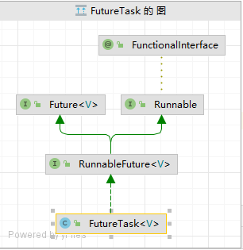
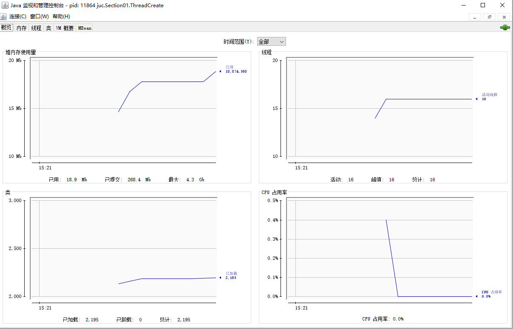

# JUC并发编程

- ## 线程创建和运行

  - 创建方式

    - Thread创建

      ```java
      Thread thread = new Thread(){
          @Override
          public void run() {
              System.out.println("this is a thread");
          }
      };
      thread.start();
      ```

    - Runnable接口创建(也可以使用lamdba表达式简化)

      ```java
      Runnable runnable = new Runnable() {
          @Override
          public void run() {
              System.out.println("this is a runnable");
          }
      };
      new Thread(runnable).start();
      ```

    ### Thread和Runnable的区别

    - #### Thread创建(源码，无runnable接口作为参数)

      - 执行构造方法

        ```java
        public Thread() {
            this(null, null, "Thread-" + nextThreadNum(), 0);
        }
        
        public Thread(ThreadGroup group, Runnable target, String name,
                      long stackSize) {
            this(group, target, name, stackSize, null, true);
        }
        ```

      - 构造方法

        ```java
        private Thread(ThreadGroup g, Runnable target, String name,
                       long stackSize, AccessControlContext acc,
                       boolean inheritThreadLocals) {
            if (name == null) {//名称不为null
                throw new NullPointerException("name cannot be null");
            }
        
            this.name = name;//设置名称
        
            Thread parent = currentThread();//设置父类线程
            SecurityManager security = System.getSecurityManager();//安全管理器
            if (g == null) {//group为null
                if (security != null) {//有安全管理器
                    g = security.getThreadGroup();//安全管理器获取group
                }
                if (g == null) {
                    g = parent.getThreadGroup();//如果安全管理器没有group则从父类线程获取
                }
            }
        
            g.checkAccess();
        
            if (security != null) {
                if (isCCLOverridden(getClass())) {
                    security.checkPermission(
                        SecurityConstants.SUBCLASS_IMPLEMENTATION_PERMISSION);
                }
            }
        
            g.addUnstarted();//未启动线程数量加一
        
            this.group = g;
            this.daemon = parent.isDaemon();//设置守护进程
            this.priority = parent.getPriority();//设置优先级
            if (security == null || isCCLOverridden(parent.getClass()))
                this.contextClassLoader = parent.getContextClassLoader();
            else
                this.contextClassLoader = parent.contextClassLoader;
            this.inheritedAccessControlContext =
                acc != null ? acc : AccessController.getContext();
            this.target = target;
            setPriority(priority);//线程优先级检查（当前线程优先级不能大于线程组（如果有的话）的最大优先级）
            //如果该线程可继承父线程的ThreadLoacl且父类的inheritableThreadLocals不为空则设置子线程的inheritThreadLocals
            if (inheritThreadLocals && parent.inheritableThreadLocals != null)
                this.inheritableThreadLocals =
                ThreadLocal.createInheritedMap(parent.inheritableThreadLocals);
            /* Stash the specified stack size in case the VM cares */
            this.stackSize = stackSize;
        
            /* Set thread ID */
            this.tid = nextThreadID();
        }
        ```

    - #### 使用Runnable接口创建线程

      ```java
      private Thread(ThreadGroup g, Runnable target, String name,
                     long stackSize, AccessControlContext acc,
                     boolean inheritThreadLocals) {
         //和上一个一样
          this.target = target;//类型为Runnable的成员变量
      //和上一个一样
      }
      ```

      - run方法

        ```java
        public void run() {
            if (target != null) {
                target.run();
            }
        }
        
        ```

        如果创建线程没有覆盖run方法则默认调用内部Runnable接口的中的run方法，如果覆写则调用覆写过后的方法

  - ### 第三种创建线程的方法（FutureTask）

    - #### FutureTask类

      

      - Future接口(用于返回运行结果)

        ```java
        public interface Future<V> {
        
            boolean cancel(boolean mayInterruptIfRunning);
        
            boolean isCancelled();
        
            boolean isDone();
        
            V get() throws InterruptedException, ExecutionException;
        
            V get(long timeout, TimeUnit unit)
                throws InterruptedException, ExecutionException, TimeoutException;
        }
        
        ```

      - FutureTask的构造方法

    
      ```java
      FutureTask<String> task = new FutureTask<>(new Callable<String>() {
          @Override
          public String call() throws Exception {
              System.out.println("123");
              return "123";
          }
      });
      
      new Thread(task).start();
      try {
          System.out.println(task.get());//调用get方法堵塞当前线程等待FutureTask返回结果
      } catch (InterruptedException | ExecutionException e) {
          throw new RuntimeException(e);
      }
      ```
    
      - 内部成员变量Callable<?>
    
        ```java
        @FunctionalInterface
        public interface Callable<V> {
        
            V call() throws Exception;
        }
        ```
    
      - Run方法
    
        调用内部Callable中的call方法并将结果存到成员变量中
    
      - 线程状态查看
    
        ```shell
        jps #查看所有java进程
        jstack pid #查看某个进程下的所有线程
        jconsole #查看某个进程中的线程执行状态,该指令会弹出图形化界面
        ```
    
        - jconsole(可以远程查看java程序)
    
          
    
  
