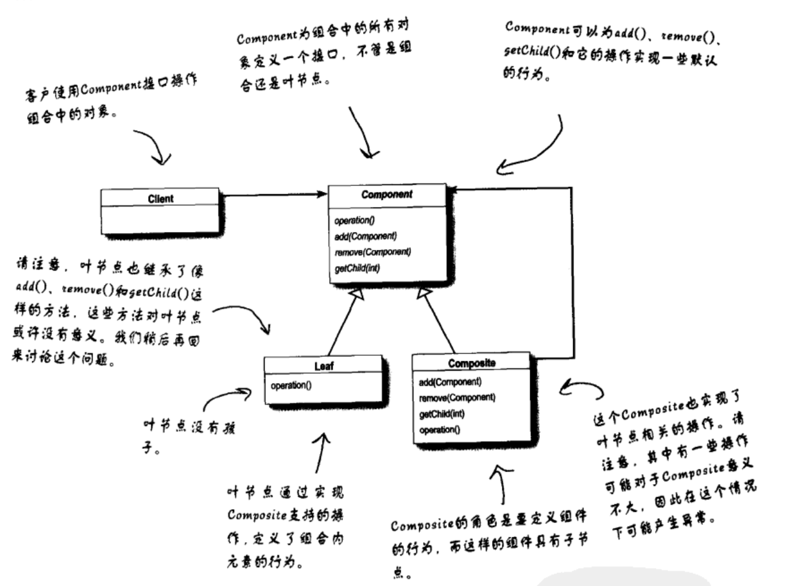
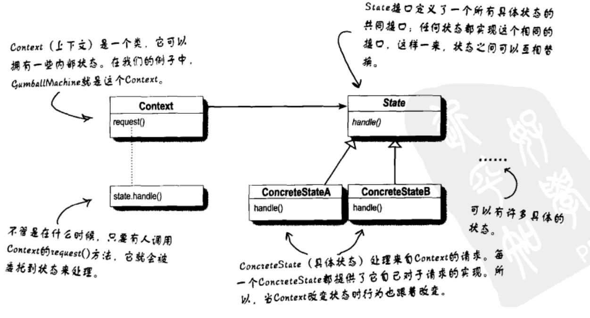

# 设计模式

- ## 策略模式

  - 把不变的功能封装出来，会改变的部分部分去除并封装，以便之后改动和扩充
  - 将一组算法族封装起来，通过组合方式实现不同类的行为
  - 多用组合少用继承
    - 组合可以将行为委托给其他类，比继承更加具有灵活性

- ## 观察者模式

  - 类似于报纸订阅，只要订阅者订阅报纸，报纸发布后就会自动送到订阅者手中，订阅者为观察者，出版者为主题
  - 观察者模式定义了对象之间的一对多依赖，这样来，当一个对象改变状态时它的所有依赖者都会收到通知并自动更新
  - 主题无需关心订阅者是什么类只知道订阅者都实现了共同的订阅者接口，这也大概是松耦合
  - java中有内置的观测者接口和主题接口(jdk9之后过时了，新版的观测者似乎是Flow类（JUC）)

- ##  装饰模式

  - 开闭原则（尽量遵守）
    - 对扩展开放，对修改封闭
  
- ## 工厂模式

  - 依赖倒置原则

    - https://blog.csdn.net/li1358159/article/details/123306664
    - 针对接口编程

  - 工厂方法模式

    - 将工厂方法（create方法）抽象出来形成一个接口，将产品本身抽象出来形成一个公共的父类，产品可以有很多子类，工厂接口能有很多实现类工厂，每种工厂能创建不同的产品（和产品的子类一一对应）

      

  - 抽象工厂模式

    - 抽象一个工厂接口，该接口能够创造所有产品，工厂的实现能根据需求创建不同的产品，产品能够有很多产品接口，每个接口都能有很多实现类，对应不同的工厂

      

  - ## 单例模式

    - 安全的初始化对象

  - ## 命令模式

    - 方法调用的封装
      - 将发出请求的对象和执行请求的对象分割
    - 将命令封装为一个类
    - 类似于线程池和任务对象，线程池无需了解任务设计的具体细节只需要执行

  - ## 适配器模式和外观模式

    - 适配器

      - 类似于转换器，又或者是代理

        

      - 

      - 实现了客户端所需的接口后同时结合需要适配器的对象并完成两者之间的功能转换，客户端并不知道有适配器的参与只需要了解自己所需要接口的调用

      - 类适配器

        - 

        - java中用不了（不支持多继承）

    - 外观模式

      - 将复杂的方法调用用一个类进行封装

        

    - 最少知识原则（墨忒耳法则）

      - 减少类的交互，只留下必要的加护

  - ## 模板方法模式

    - 将具有相同步骤的代码抽象化，将具体步骤实现交给子类

    - 如bean的生命周期方法

      ```java
      
      void beanProcess()
      {
          Bean bean=new Bean();
          init(bean);
          work(bean);
          die(bean);
      }
      //以下方法交给子类实现
      void init(Bean bean);
      void work(Bean bean);
      void die(Bean bean);
      ```

    - 钩子

      - 模板方法中步骤的默认实现
      
    - 好莱坞原则
    
      - 依赖腐败
        - 高层组件依赖底层组件，底层组件又依赖高层组件，高层组件依赖边侧组件，边侧组件依赖底层组件
      - 防止依赖腐败，要求底层组件不要直接调用高层组件，尽量高层组件调用底层组件，尽量避免明显的环形依赖
    
    - 模板方法实例
    
      - Arrays.sort
        - 对于实现了comparable接口的类都可以排序
    
  - ## 迭代器和组合模式
  
    - 迭代器
  
      - 使用迭代器管理不同集合的遍历
  
        
  
      - 单一职责
  
        - 一个类一个只有一个引起变化（代码变化）的原因
        - 内聚
          - 当一个模块或者一个类被设计只支持一组相关功能称为具有高内聚
  
    - 组合模式
      - 允许将对象组合称为树形结构来实现整体\部分层次结构，组合能让客户以一致的方式处理个别对象以及对象组合
      - 集合中的元素可以是普通的item也可以是一个集合（有点像树）
      - 
      - Component提供默认的方法实现（抛出RuntimeException），如果子类允许该操作则重写该方法否则使用默认抛出异常
  
  - ## 状态模式
  
    - 不同状态下的不同行为封装到不同的状态类中，实现一个公共的状态接口，完成多种状态方法调用
  
      
  
  - ## 代理模式
  
    - 远程代理
  
      - 不同JVM之间的方法调用
  
      - 假设当前有一个调用方A，被调用方B，A和B在不同的JVM上（又或者不同机器上），此时一个代理对象Proxy（和A在同一个地方），Proxy与B通过网络通信并在A面前假装成B对象，就好像A调用B的方法就是本地调用一样
  
      - 
  
      - 虚拟代理
  
        - 对于某些创建需要巨大开销的类，使用一个代理类延迟初始化该类的初始化，到方法调用时再创建，创建后将请求交给真正的类
  
      - JDK动态代理
  
        
    
  - ## 复合模式
  
    - 多个模式一起使用
    - MVC模式
  
  - ## 剩下的模式
  
    - 桥接模式
      
      - 使用组合代替继承
      
    - 生成器模式（建造者模式）
      
      - 调用不同的方法描述你想要的对象最后通过build方法创建
      
    - 责任链模式
      - 请求过滤器
      
    - 蝇量模式（享元模式）
      - 用一个类来管理多个同类型的对象实例，记录这些对象实例的所有状态
      - 减少对象重复创建
      - 典型应用：连接池等
      
    - 解释器模式
      - 
      
    - 中介者模式
      - 多个对象之间互相调用可能会导致对象关系过于复杂，使用一个类作为中心类，中心接受所有其他类的请求并转发到具体类上
      
    - 备忘录模式
      - 存储对象某个时间点的状态，类似于游戏存档
      - 采用序列化更好
      
    - 原型模式
    
      - 用于创建重复对象
    
        - 传统创造
    
        ```java
        
        public class Sleep {
            
            String name;
            int age;
        
            public Sleep(String name, int age) {
                this.name = name;
                this.age = age;
            }
        }
        
        Sleep s1 = new Sleep("zhangsan", 1);
        Sleep s2 = new Sleep("zhangsan", 1);
        Sleep s3 = new Sleep("zhangsan", 1);
        Sleep s4 = new Sleep("zhangsan", 1);
        Sleep s5 = new Sleep("zhangsan", 1);
        ```
    
        - 原型者模式创造
    
          ```java
          public class Sleep implements  Cloneable{
          
              String name;
              int age;
          
              public Sleep(String name, int age) {
                  this.name = name;
                  this.age = age;
              }
          
              @Override
              protected Object clone() throws CloneNotSupportedException {
                  return new Sleep(name, age);
              }
          }
          //使用clone创建
          ```
    
          
    
    - 访问者模式
      - 创建一个访问者接口，其中有一些关于数据结构A的访问操作
      
      - 数据结构A中含有一个accept方法用于接受一个访问者
      
      - 有点类似于模板方法
      
        ```java
        interface Visitor
        {
            void visitedOpA(Object data);
            void visitedOpB(Object data);
        }
        
        class A{
            void accecpt(Visitor v)
            {
                //执行准备好数据
                v.visitedOpA(data);
                v.visitedOpB(data);
            }
        }
        ```
      
        - 将数据操作和执行解耦合，数据的访问操作实现交给专门的类实现，数据本身无需关心访问的操作只需要准备好相应数据
      
      - 实际应用
      
        - 文件树遍历
          - 遍历期间操作（比如记录文件名称，记录文件数量等）无需文件树关心，文件树只负责调用相应操作


